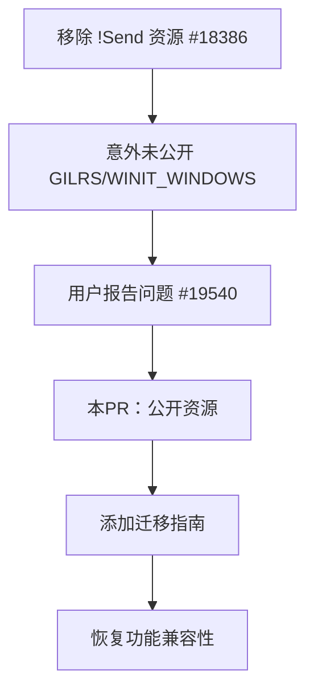

+++
title = "#19575 Make `GILRS` and `WINIT_WINDOWS` public"
date = "2025-06-12T00:00:00"
draft = false
template = "pull_request_page.html"
in_search_index = false

[extra]
current_language = "zh-cn"
available_languages = {"en" = { name = "English", url = "/pull_request/bevy/2025-06/pr-19575-en-20250612" }, "zh-cn" = { name = "中文", url = "/pull_request/bevy/2025-06/pr-19575-zh-cn-20250612" }}
labels = ["A-ECS", "A-Windowing", "C-Usability", "P-Regression"]
+++

# PR分析：公开 `GILRS` 和 `WINIT_WINDOWS` 资源

## Basic Information
- **Title**: Make `GILRS` and `WINIT_WINDOWS` public
- **PR Link**: https://github.com/bevyengine/bevy/pull/19575
- **Author**: joshua-holmes
- **Status**: MERGED
- **Labels**: A-ECS, A-Windowing, C-Usability, S-Ready-For-Final-Review, P-Regression
- **Created**: 2025-06-11T01:09:10Z
- **Merged**: 2025-06-12T20:23:01Z
- **Merged By**: alice-i-cecile

## Description Translation
移除 `!Send` 资源后，`GILRS` 和 `WINIT_WINDOWS` 未被公开，这是一个破坏性变更（breaking change）。这在[该 PR 的评论](https://github.com/bevyengine/bevy/pull/18386#issuecomment-2954209010)中被提出。本 PR 将它们公开。

修复 #19540。

## The Story of This Pull Request

### 问题和背景
在之前的 PR #18386 中，Bevy 移除了 `!Send` 资源的使用。`!Send` 资源是指不能安全跨线程发送的资源类型。移除这些资源后，原本使用 `NonSendMut` 参数访问的 `GILRS`（游戏手柄输入库）和 `WINIT_WINDOWS`（窗口管理）资源被替换为线程局部存储（thread-local storage）。然而，在替换过程中，这些线程局部变量没有被标记为 `pub`，导致外部代码无法访问它们。这是一个回归问题（regression），因为它破坏了之前能正常工作的代码，违反了向后兼容性原则。

具体来说，问题 #19540 报告了这个破坏性变更：开发者升级 Bevy 后，发现无法访问这些资源。在原始 PR #18386 的评论中，也有用户指出这个潜在问题。由于这些资源对处理输入和窗口管理至关重要，这个变更影响了依赖它们的游戏和应用。

### 解决方案
解决方案直接明了：将 `GILRS` 和 `WINIT_WINDOWS` 线程局部变量标记为 `pub`，使它们成为公开可访问的。这个修改恢复了之前的功能，同时保持了使用线程局部存储作为临时解决方案的设计。

在实现上，没有复杂的逻辑变更，主要是可见性修饰符的调整：
1. 在 `bevy_gilrs` 中，将 `GILRS` 的声明从 `static` 改为 `pub static`
2. 在 `bevy_winit` 中，将 `WINIT_WINDOWS` 改为 `pub static` 并添加文档注释
3. 新增迁移指南文档，解释如何正确使用这些资源

### 实现细节
关键实现点在于线程局部变量的可见性修改。在 `bevy_gilrs` 中：

```diff
thread_local! {
-    static GILRS: RefCell<Option<gilrs::Gilrs>> = const { RefCell::new(None) };
+    pub static GILRS: RefCell<Option<gilrs::Gilrs>> = const { RefCell::new(None) };
}
```

在 `bevy_winit` 中，除了公开变量外，还添加了说明其临时性的文档：

```diff
thread_local! {
-    static WINIT_WINDOWS: RefCell<WinitWindows> = const { RefCell::new(WinitWindows::new()) };
+    /// Temporary storage of WinitWindows data to replace usage of `!Send` resources...
+    pub static WINIT_WINDOWS: RefCell<WinitWindows> = const { RefCell::new(WinitWindows::new()) };
}
```

### 技术考量
这个 PR 引入了重要的技术文档 - 迁移指南 `replace_non_send_resources.md`。该文档详细解释了：
1. 哪些资源被替换（`Gilrs`, `WinitWindows`, `AccessKitAdapters`）
2. 如何安全访问线程局部数据：
   ```rust
   // 不可变访问
   WINIT_WINDOWS.with_borrow(|winit_windows| { /* ... */ });
   
   // 可变访问
   WINIT_WINDOWS.with_borrow_mut(|winit_windows| { /* ... */ });
   ```
3. 如何使用 `NonSendMarker` 确保系统在主线程运行：
   ```rust
   fn my_system(_non_send_marker: NonSendMarker) {
       ACCESS_KIT_ADAPTERS.with_borrow_mut(|adapters| { /* ... */ });
   }
   ```

文档特别强调：虽然线程局部存储是线程安全的，但它们只能从主线程访问。其他线程访问会导致未初始化数据，这是无意义的。

### 影响
这个 PR 解决了重要的回归问题：
1. 恢复了被意外移除的 API 访问能力
2. 提供了明确的迁移指南，帮助开发者过渡
3. 保持了临时解决方案的架构一致性
4. 修复了 Issue #19540 报告的具体问题

从工程角度看，这个 PR 展示了如何正确处理破坏性变更的后续问题：快速识别回归，最小化修复，并提供清晰的文档指导。

## Visual Representation



## Key Files Changed

### 1. `crates/bevy_gilrs/src/lib.rs`
**变更说明**：将 `GILRS` 线程局部变量从私有改为公开，解决游戏手柄输入资源无法访问的问题。

**代码变更**：
```diff
 thread_local! {
-    static GILRS: RefCell<Option<gilrs::Gilrs>> = const { RefCell::new(None) };
+    pub static GILRS: RefCell<Option<gilrs::Gilrs>> = const { RefCell::new(None) };
 }
```

### 2. `crates/bevy_winit/src/lib.rs`
**变更说明**：将 `WINIT_WINDOWS` 改为公开并添加文档注释，解释其作为临时解决方案的性质。

**代码变更**：
```diff
 thread_local! {
-    static WINIT_WINDOWS: RefCell<WinitWindows> = const { RefCell::new(WinitWindows::new()) };
+    /// Temporary storage of WinitWindows data to replace usage of `!Send` resources...
+    pub static WINIT_WINDOWS: RefCell<WinitWindows> = const { RefCell::new(WinitWindows::new()) };
 }
```

### 3. `release-content/migration-guides/replace_non_send_resources.md`
**变更说明**：新增迁移指南文档，详细说明如何迁移使用被移除的 `!Send` 资源的代码。

**关键内容**：
```markdown
## NonSend Resources Replaced

被替换的资源：
* `Gilrs` → `bevy_gilrs::GILRS`
* `WinitWindows` → `bevy_winit::WINIT_WINDOWS`
* `AccessKitAdapters` → `bevy_winit::ACCESS_KIT_ADAPTERS`

访问模式：
```rust
// 不可变访问
WINIT_WINDOWS.with_borrow(|winit_windows| { /* ... */ });

// 可变访问
WINIT_WINDOWS.with_borrow_mut(|winit_windows| { /* ... */ });
```

使用 NonSendMarker 确保主线程执行：
```rust
use bevy_ecs::system::NonSendMarker;

fn my_system(_non_send_marker: NonSendMarker) {
    ACCESS_KIT_ADAPTERS.with_borrow_mut(|adapters| { /* ... */ });
}
```
```

## Further Reading
1. [原始移除 !Send 资源的 PR #18386](https://github.com/bevyengine/bevy/pull/18386) - 了解背景变更
2. [相关 issue #19540](https://github.com/bevyengine/bevy/issues/19540) - 问题详细描述
3. [Rust 线程局部存储文档](https://doc.rust-lang.org/std/macro.thread_local.html) - 理解技术基础
4. [Bevy 非发送资源设计讨论 #17667](https://github.com/bevyengine/bevy/issues/17667) - 长期解决方案进展