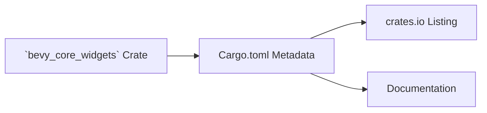

+++
title = "#19578 Fix `bevy_core_widgets` crate description typo"
date = "2025-06-11T00:00:00"
draft = false
template = "pull_request_page.html"
in_search_index = true

[taxonomies]
list_display = ["show"]

[extra]
current_language = "en"
available_languages = {"en" = { name = "English", url = "/pull_request/bevy/2025-06/pr-19578-en-20250611" }, "zh-cn" = { name = "中文", url = "/pull_request/bevy/2025-06/pr-19578-zh-cn-20250611" }}
labels = ["C-Docs", "D-Trivial", "A-UI"]
+++

## Fix `bevy_core_widgets` crate description typo

### Basic Information
- **Title**: Fix `bevy_core_widgets` crate description typo
- **PR Link**: https://github.com/bevyengine/bevy/pull/19578
- **Author**: lewiszlw
- **Status**: MERGED
- **Labels**: C-Docs, D-Trivial, A-UI, S-Ready-For-Final-Review
- **Created**: 2025-06-11T09:20:07Z
- **Merged**: 2025-06-11T22:49:07Z
- **Merged By**: alice-i-cecile

### Description Translation
Fix `bevy_core_widgets` crate description typo.

### The Story of This Pull Request
The PR addresses a minor but noticeable issue in Bevy's documentation metadata. The crate description for `bevy_core_widgets` contained a typographical error where the phrase "for B Bevy Engine" appeared instead of the correct "for Bevy Engine". This description appears in package metadata visible on crates.io and in documentation, making accuracy important for professional presentation.

The problem was straightforward: an extra 'B' character appeared before "Bevy Engine" in the crate's Cargo.toml description field. This type of metadata typo doesn't affect runtime behavior but impacts the project's professional appearance and clarity for users browsing crate documentation. The author identified this through routine code inspection.

The solution required a minimal but precise change: removing the erroneous 'B' character from the description string in the Cargo.toml manifest file. The implementation consists of a single-character deletion in the package metadata. No alternatives were needed since this was a clear-cut correction of a typographical error.

The change fits cleanly into Bevy's documentation practices. While trivial, such fixes maintain the project's standards for attention to detail in all aspects of the codebase, including metadata. The fix was reviewed and merged quickly due to its non-controversial nature and clear benefit to documentation quality.

### Visual Representation


### Key Files Changed
**File**: `crates/bevy_core_widgets/Cargo.toml`

**Change**: Corrected typo in crate description metadata  
**Reason**: Improve professionalism and clarity of package documentation  

**Code Diff**:
```diff
diff --git a/crates/bevy_core_widgets/Cargo.toml b/crates/bevy_core_widgets/Cargo.toml
index 21540a9787787..1627ff9a29540 100644
--- a/crates/bevy_core_widgets/Cargo.toml
+++ b/crates/bevy_core_widgets/Cargo.toml
@@ -2,7 +2,7 @@
 name = "bevy_core_widgets"
 version = "0.16.0-dev"
 edition = "2024"
-description = "Unstyled common widgets for B Bevy Engine"
+description = "Unstyled common widgets for Bevy Engine"
 homepage = "https://bevyengine.org"
 repository = "https://github.com/bevyengine/bevy"
 license = "MIT OR Apache-2.0"
```

### Further Reading
- [Cargo Manifest Format Documentation](https://doc.rust-lang.org/cargo/reference/manifest.html)
- [Bevy Engine UI Documentation](https://github.com/bevyengine/bevy/tree/main/crates/bevy_ui)
- [Rust Packaging Best Practices](https://doc.rust-lang.org/cargo/reference/publishing.html)