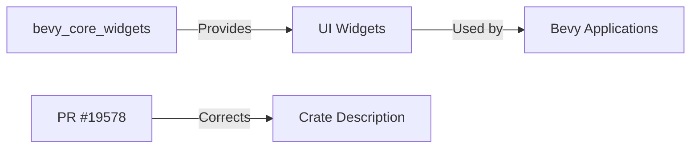

+++
title = "#19578 Fix `bevy_core_widgets`  crate description typo"
date = "2025-06-11T00:00:00"
draft = false
template = "pull_request_page.html"
in_search_index = false

[extra]
current_language = "zh-cn"
available_languages = {"en" = { name = "English", url = "/pull_request/bevy/2025-06/pr-19578-en-20250611" }, "zh-cn" = { name = "中文", url = "/pull_request/bevy/2025-06/pr-19578-zh-cn-20250611" }}
labels = ["C-Docs", "D-Trivial", "A-UI"]
+++

# Fix `bevy_core_widgets`  crate description typo

## Basic Information
- **Title**: Fix `bevy_core_widgets`  crate description typo
- **PR Link**: https://github.com/bevyengine/bevy/pull/19578
- **Author**: lewiszlw
- **Status**: MERGED
- **Labels**: C-Docs, D-Trivial, A-UI, S-Ready-For-Final-Review
- **Created**: 2025-06-11T09:20:07Z
- **Merged**: 2025-06-11T22:49:07Z
- **Merged By**: alice-i-cecile

## Description Translation
修复 `bevy_core_widgets` crate 描述中的拼写错误。

## The Story of This Pull Request

这个 PR 解决了一个简单的文档问题。在 `bevy_core_widgets` crate 的 `Cargo.toml` 文件中，description 字段存在拼写错误。原描述为 "Unstyled common widgets for B Bevy Engine"，其中开头的 "B" 属于多余字符，导致描述不专业且可能引起用户困惑。

问题虽小但影响项目专业性。crate 描述是用户首次接触项目的重要信息，错误的描述会降低信任度。在开源生态中，精确的元数据对 crate 发现和使用至关重要。Lewiszlw 在审查代码时发现了这个拼写错误并决定修复。

解决方案简单直接：删除多余的 "B" 字符，使描述变为正确的 "Unstyled common widgets for Bevy Engine"。这个修改不需要架构变更或功能调整，纯粹是文档修正。考虑到修改的微小性和低风险，作者直接提交了 PR 而没有讨论替代方案。

修改后，crate 描述更准确地反映了其用途——为 Bevy Engine 提供无样式的通用 UI 组件。这种小修复虽然简单，但对维护项目专业形象很重要，展示了社区对细节的关注。

## Visual Representation



## Key Files Changed

### `crates/bevy_core_widgets/Cargo.toml`
**修改说明**：修复 crate 描述中的拼写错误，删除多余的 "B" 字符。

**代码变更**：
```toml
# Before:
description = "Unstyled common widgets for B Bevy Engine"

# After:
description = "Unstyled common widgets for Bevy Engine"
```

这个修改直接实现了 PR 的目标，确保 crate 描述准确且专业。

## Further Reading
1. [Cargo Manifest Format Specification](https://doc.rust-lang.org/cargo/reference/manifest.html)
2. [Bevy UI System Documentation](https://docs.rs/bevy_ui/latest/bevy_ui/)
3. [Rust API Guidelines on Crate Metadata](https://rust-lang.github.io/api-guidelines/documentation.html#crate-sets-html_root_url-appropriately-c-html-root)

## Full Code Diff
```diff
diff --git a/crates/bevy_core_widgets/Cargo.toml b/crates/bevy_core_widgets/Cargo.toml
index 21540a9787787..1627ff9a29540 100644
--- a/crates/bevy_core_widgets/Cargo.toml
+++ b/crates/bevy_core_widgets/Cargo.toml
@@ -2,7 +2,7 @@
 name = "bevy_core_widgets"
 version = "0.16.0-dev"
 edition = "2024"
-description = "Unstyled common widgets for B Bevy Engine"
+description = "Unstyled common widgets for Bevy Engine"
 homepage = "https://bevyengine.org"
 repository = "https://github.com/bevyengine/bevy"
 license = "MIT OR Apache-2.0"
```