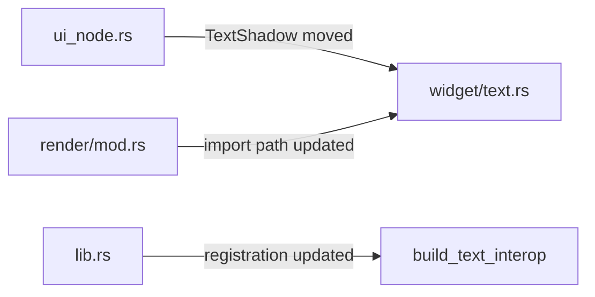

+++
title = "#19579 Move `TextShadow` to `text` widget module"
date = "2025-06-29T00:00:00"
draft = false
template = "pull_request_page.html"
in_search_index = true

[taxonomies]
list_display = ["show"]

[extra]
current_language = "en"
available_languages = {"en" = { name = "English", url = "/pull_request/bevy/2025-06/pr-19579-en-20250629" }, "zh-cn" = { name = "中文", url = "/pull_request/bevy/2025-06/pr-19579-zh-cn-20250629" }}
labels = ["D-Trivial", "A-UI", "C-Code-Quality", "A-Text"]
+++

# Move `TextShadow` to `text` widget module

## Basic Information
- **Title**: Move `TextShadow` to `text` widget module
- **PR Link**: https://github.com/bevyengine/bevy/pull/19579
- **Author**: ickshonpe
- **Status**: MERGED
- **Labels**: D-Trivial, A-UI, C-Code-Quality, S-Ready-For-Final-Review, A-Text
- **Created**: 2025-06-11T09:56:54Z
- **Merged**: 2025-06-29T17:56:06Z
- **Merged By**: alice-i-cecile

## Description Translation
# Objective

It's odd that `TextShadow` is accessible by importing `bevy::ui::*` but `Text` isn't.

Move the `TextShadow` component to `text` widget module and move its type registration to the `build_text_interop` function.

## The Story of This Pull Request

The core issue was an inconsistency in Bevy's UI module structure. Developers could access the `TextShadow` component through a wildcard import (`bevy::ui::*`), but the related `Text` component wasn't included in this import scope. This inconsistency created confusion about where text-related components should be located and how they should be accessed.

To resolve this, we moved the `TextShadow` component from its original location in `ui_node.rs` to the `widget/text.rs` module where the `Text` component already resides. This change groups all text-related UI components together, improving code organization and discoverability. The implementation required several coordinated changes across the codebase:

First, we removed the `TextShadow` definition from `ui_node.rs` since it no longer belonged in the general UI node module. This component was specifically tied to text rendering, not general UI node behavior.

```rust
// Before in ui_node.rs:
/// Adds a shadow behind text
#[derive(Component, Copy, Clone, Debug, PartialEq, Reflect)]
#[reflect(Component, Default, Debug, Clone, PartialEq)]
pub struct TextShadow {
    pub offset: Vec2,
    pub color: Color,
}
```

Next, we added `TextShadow` to `widget/text.rs`, placing it immediately after the `Text` component definition. This creates a logical grouping where developers working with text components can find all related functionality in one place:

```rust
// After in widget/text.rs:
#[derive(Component, Copy, Clone, Debug, PartialEq, Reflect)]
#[reflect(Component, Default, Debug, Clone, PartialEq)]
pub struct TextShadow {
    pub offset: Vec2,
    pub color: Color,
}
```

We then updated the type registration process. Previously, `TextShadow` was registered in the main `UiPlugin` setup. We moved its registration to the `build_text_interop` function alongside the `Text` component's registration. This centralizes text-related type registration:

```rust
// In lib.rs:
fn build_text_interop(app: &mut App) {
    use widget::{Text, TextShadow};
    
    app.register_type::<Text>()
        .register_type::<TextShadow>();
}
```

Import references needed updating throughout the codebase. In `render/mod.rs`, we modified the import path to reference `TextShadow` from its new location in the widget module:

```rust
// Before:
use crate::{..., TextShadow};

// After:
use crate::widget::TextShadow;
```

Finally, we added a migration guide to document this change for users. The guide clearly states where `TextShadow` has been moved and helps users update their imports:

```markdown
---
title: `TextShadow` has been moved to `bevy::ui::widget::text`
---

`TextShadow` has been moved to `bevy::ui::widget::text`.
```

This change improves code organization by colocating related components. Developers working with text rendering now have a single module (`widget/text`) containing both the core text component and its associated shadow effect. The change also eliminates the inconsistency where `TextShadow` was more broadly accessible than `Text` through wildcard imports.

## Visual Representation



## Key Files Changed

1. **`crates/bevy_ui/src/ui_node.rs`**  
   Removed `TextShadow` component definition  
   ```diff
   - /// Adds a shadow behind text
   - #[derive(Component, Copy, Clone, Debug, PartialEq, Reflect)]
   - #[reflect(Component, Default, Debug, Clone, PartialEq)]
   - pub struct TextShadow {
   -     pub offset: Vec2,
   -     pub color: Color,
   - }
   ```

2. **`crates/bevy_ui/src/widget/text.rs`**  
   Added `TextShadow` component definition  
   ```diff
   + /// Adds a shadow behind text
   + #[derive(Component, Copy, Clone, Debug, PartialEq, Reflect)]
   + #[reflect(Component, Default, Debug, Clone, PartialEq)]
   + pub struct TextShadow {
   +     pub offset: Vec2,
   +     pub color: Color,
   + }
   ```

3. **`crates/bevy_ui/src/lib.rs`**  
   Updated type registration and prelude  
   ```diff
   - .register_type::<TextShadow>()
   + .register_type::<TextShadow>(); // In build_text_interop
   ```

4. **`crates/bevy_ui/src/render/mod.rs`**  
   Updated import path  
   ```diff
   - use crate::{..., TextShadow};
   + use crate::widget::TextShadow;
   ```

5. **`release-content/migration-guides/textshadow_is_moved_to_widget_text_module.md`**  
   Added migration documentation  
   ```markdown
   ---
   title: `TextShadow` has been moved to `bevy::ui::widget::text`
   ---
   `TextShadow` has been moved to `bevy::ui::widget::text`.
   ```

## Further Reading
- [Bevy UI Components Documentation](https://docs.rs/bevy_ui/latest/bevy_ui/)
- [Bevy Migration Guide Structure](https://github.com/bevyengine/bevy/blob/main/docs/migration_guides.md)
- [Rust Module System Best Practices](https://doc.rust-lang.org/book/ch07-02-defining-modules-to-control-scope-and-privacy.html)