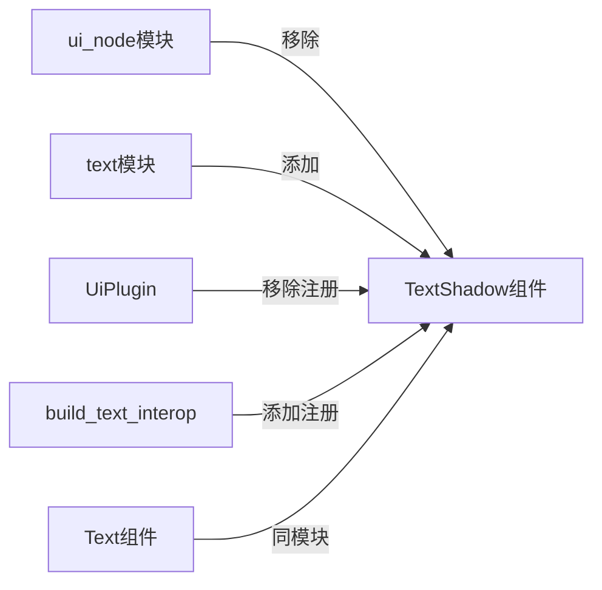

+++
title = "#19579 Move `TextShadow` to `text` widget module"
date = "2025-06-29T00:00:00"
draft = false
template = "pull_request_page.html"
in_search_index = false

[extra]
current_language = "zh-cn"
available_languages = {"en" = { name = "English", url = "/pull_request/bevy/2025-06/pr-19579-en-20250629" }, "zh-cn" = { name = "中文", url = "/pull_request/bevy/2025-06/pr-19579-zh-cn-20250629" }}
labels = ["D-Trivial", "A-UI", "C-Code-Quality", "A-Text"]
+++

# Move `TextShadow` to `text` widget module

## Basic Information
- **Title**: Move `TextShadow` to `text` widget module
- **PR Link**: https://github.com/bevyengine/bevy/pull/19579
- **Author**: ickshonpe
- **Status**: MERGED
- **Labels**: D-Trivial, A-UI, C-Code-Quality, S-Ready-For-Final-Review, A-Text
- **Created**: 2025-06-11T09:56:54Z
- **Merged**: 2025-06-29T17:56:06Z
- **Merged By**: alice-i-cecile

## Description Translation
在Bevy UI系统中，`TextShadow`组件可以通过导入`bevy::ui::*`访问，但`Text`组件却不能，这种设计不一致。

将`TextShadow`组件移动到`text`部件模块，并将其类型注册转移到`build_text_interop`函数中。

## The Story of This Pull Request

### 问题背景
在Bevy UI模块的组织结构中，存在一个不一致的设计问题：`TextShadow`组件（文本阴影）位于`ui_node`模块中，而相关的`Text`组件（文本）却位于`widget/text`模块中。这导致了以下问题：

1. 导入不一致性：开发者可以通过`bevy::ui::*`导入访问`TextShadow`，但无法直接访问`Text`
2. 逻辑分组错误：`TextShadow`在概念上属于文本渲染功能，但被放置在通用UI节点模块
3. 类型注册位置不合理：`TextShadow`的反射注册在`UiPlugin`中，而文本相关的其他类型注册在`build_text_interop`函数中

这种设计不符合代码组织的"高内聚"原则，增加了理解UI文本系统的认知负担。

### 解决方案
PR采取直接的重构方案：
1. 将`TextShadow`组件定义从`ui_node.rs`移动到`text.rs`
2. 将类型注册从`UiPlugin`移到文本相关的`build_text_interop`函数
3. 更新所有相关导入路径
4. 添加迁移指南文档

这种改动保持了组件功能不变，只是调整了其在代码库中的位置，使其与相关组件逻辑分组更合理。

### 实现细节
核心实现包含以下技术点：

1. **组件迁移**：`TextShadow`完整定义（包括文档注释、属性和默认实现）被移动到`widget/text`模块中
   
2. **类型注册调整**：
   ```rust
   // Before in UiPlugin:
   .register_type::<TextShadow>()
   
   // After in build_text_interop:
   .register_type::<Text>()
   .register_type::<TextShadow>();
   ```
   这种调整将所有文本相关类型的注册集中到同一位置

3. **导入更新**：所有使用`TextShadow`的地方更新了导入路径：
   ```rust
   // Before:
   use crate::{..., TextShadow};
   
   // After:
   use crate::widget::{..., TextShadow};
   ```

4. **预导出更新**：在`prelude`中同时导出`Text`和`TextShadow`
   ```rust
   // Before:
   pub use crate::widget::{Text, TextUiReader, TextUiWriter};
   
   // After:
   pub use crate::widget::{Text, TextShadow, TextUiReader, TextUiWriter};
   ```

### 技术影响
1. **API一致性**：解决了导入不一致问题，现在`Text`和`TextShadow`都可通过相同路径访问
2. **代码组织优化**：文本相关组件集中在单一模块，符合"关注点分离"原则
3. **维护性提升**：类型注册位置与组件定义位置保持一致，降低未来维护成本
4. **向后兼容处理**：通过迁移指南明确通知用户组件位置变更

迁移指南文档简洁明了：
```markdown
---
title: `TextShadow` has been moved to `bevy::ui::widget::text`
pull_requests: []
---

`TextShadow` has been moved to `bevy::ui::widget::text`.
```

## Visual Representation



## Key Files Changed

### `crates/bevy_ui/src/ui_node.rs`
- **变更类型**：移除代码
- **原因**：`TextShadow`不再属于通用UI节点
- **代码变更**：
```rust
// 删除的TextShadow定义
/// Adds a shadow behind text
///
/// Not supported by `Text2d`
#[derive(Component, Copy, Clone, Debug, PartialEq, Reflect)]
#[reflect(Component, Default, Debug, Clone, PartialEq)]
pub struct TextShadow {
    /// Shadow displacement in logical pixels
    /// With a value of zero the shadow will be hidden directly behind the text
    pub offset: Vec2,
    /// Color of the shadow
    pub color: Color,
}

impl Default for TextShadow {
    fn default() -> Self {
        Self {
            offset: Vec2::splat(4.),
            color: Color::linear_rgba(0., 0., 0., 0.75),
        }
    }
}
```

### `crates/bevy_ui/src/widget/text.rs`
- **变更类型**：添加代码
- **原因**：`TextShadow`属于文本部件
- **代码变更**：
```rust
// 添加的TextShadow定义
/// Adds a shadow behind text
///
/// Not supported by `Text2d`
#[derive(Component, Copy, Clone, Debug, PartialEq, Reflect)]
#[reflect(Component, Default, Debug, Clone, PartialEq)]
pub struct TextShadow {
    /// Shadow displacement in logical pixels
    /// With a value of zero the shadow will be hidden directly behind the text
    pub offset: Vec2,
    /// Color of the shadow
    pub color: Color,
}

impl Default for TextShadow {
    fn default() -> Self {
        Self {
            offset: Vec2::splat(4.),
            color: Color::linear_rgba(0., 0., 0., 0.75),
        }
    }
}
```

### `crates/bevy_ui/src/lib.rs`
- **变更类型**：注册位置调整
- **原因**：集中文本相关类型注册
- **代码变更**：
```diff
// 预导出更新
-    pub use crate::widget::{Text, TextUiReader, TextUiWriter};
+    pub use crate::widget::{Text, TextShadow, TextUiReader, TextUiWriter};

// 注册位置变更
-            .register_type::<TextShadow>()
...
fn build_text_interop(app: &mut App) {
     app.register_type::<TextLayoutInfo>()
         .register_type::<TextNodeFlags>()
-        .register_type::<Text>();
+        .register_type::<Text>()
+        .register_type::<TextShadow>();
}
```

### `release-content/migration-guides/textshadow_is_moved_to_widget_text_module.md`
- **变更类型**：新增文件
- **原因**：通知用户组件位置变更
- **内容**：
```markdown
---
title: `TextShadow` has been moved to `bevy::ui::widget::text`
pull_requests: []
---

`TextShadow` has been moved to `bevy::ui::widget::text`.
```

### `crates/bevy_ui/src/render/mod.rs`
- **变更类型**：导入路径更新
- **原因**：适应`TextShadow`的新位置
- **代码变更**：
```diff
- use crate::widget::{ImageNode, ViewportNode};
+ use crate::widget::{ImageNode, TextShadow, ViewportNode};
...
use crate::{
     BackgroundColor, BorderColor, BoxShadowSamples, CalculatedClip, ComputedNode,
-    ComputedNodeTarget, Outline, ResolvedBorderRadius, TextShadow, UiAntiAlias,
+    ComputedNodeTarget, Outline, ResolvedBorderRadius, UiAntiAlias,
};
```

## Further Reading
1. [Bevy UI 系统架构](https://bevyengine.org/learn/book/getting-started/ui/)
2. [ECS 中的组件设计原则](https://github.com/SanderMertens/ecs-faq#component-design)
3. [Rust 模块系统最佳实践](https://doc.rust-lang.org/book/ch07-02-defining-modules-to-control-scope-and-privacy.html)