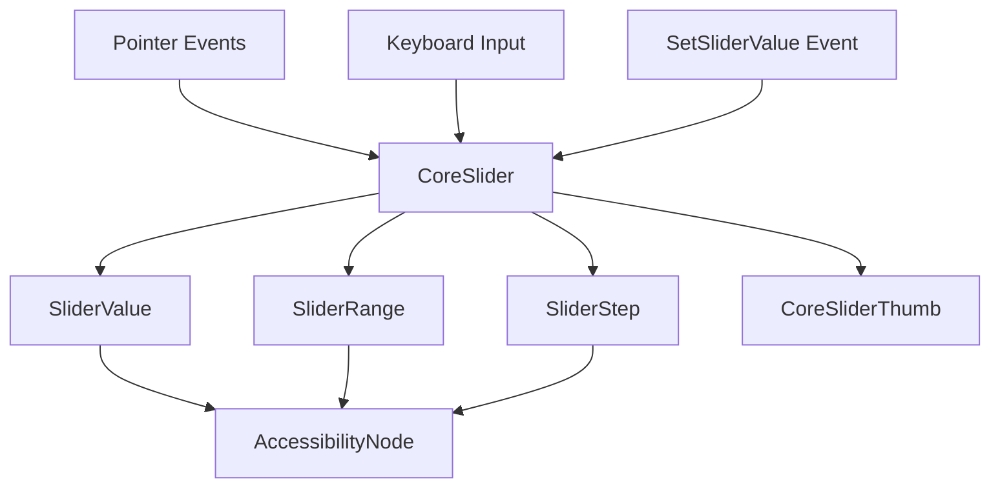

+++
title = "#19584 Core slider"
date = "2025-06-15T00:00:00"
draft = false
template = "pull_request_page.html"
in_search_index = true

[taxonomies]
list_display = ["show"]

[extra]
current_language = "en"
available_languages = {"en" = { name = "English", url = "/pull_request/bevy/2025-06/pr-19584-en-20250615" }, "zh-cn" = { name = "中文", url = "/pull_request/bevy/2025-06/pr-19584-zh-cn-20250615" }}
labels = ["C-Feature", "A-UI", "X-Contentious"]
+++

# Core slider

## Basic Information
- **Title**: Core slider
- **PR Link**: https://github.com/bevyengine/bevy/pull/19584
- **Author**: viridia
- **Status**: MERGED
- **Labels**: C-Feature, A-UI, S-Ready-For-Final-Review, M-Needs-Release-Note, X-Contentious
- **Created**: 2025-06-11T16:42:22Z
- **Merged**: 2025-06-15T01:14:20Z
- **Merged By**: alice-i-cecile

## Description Translation
This is part of the "core widgets" effort: #19236. 

This PR adds the "core slider" widget to the collection.

Tested using examples `core_widgets` and `core_widgets_observers`.

## The Story of This Pull Request

### The Problem and Context
Bevy's existing UI widgets lacked a standardized slider component. As part of the core widgets initiative (#19236), we needed a flexible, headless slider implementation that could serve as a foundation for styled UI components. The requirements included:
- Support for both internal and external state management
- Accessibility compliance
- Flexible interaction models (drag, step, snap)
- Keyboard navigation support
- Decoupled visual representation from interaction logic

### The Solution Approach
The implementation introduces a `CoreSlider` component that manages slider behavior without imposing visual styling. Key design decisions:
1. **State Management**: Sliders can either manage their own value internally or use an external callback system (`on_change`) for controlled components
2. **Interaction Models**: Three track-click behaviors implemented via `TrackClick` enum:
   - `Drag`: Clicking anywhere on track allows immediate dragging
   - `Step`: Increments/decrements value by step size
   - `Snap`: Jumps directly to clicked position
3. **Accessibility**: Integrated with AccessKit to provide proper ARIA attributes
4. **Composition**: Uses marker components (`CoreSliderThumb`) to identify slider parts without enforcing hierarchy

### The Implementation
The slider implementation consists of several key components:
- **Core Components**: `CoreSlider`, `SliderValue`, `SliderRange`, `SliderStep`
- **State Tracking**: `CoreSliderDragState` manages drag offset and active state
- **Event Handlers**: Multiple observers handle pointer events, keyboard input, and value changes

```rust
// Core slider component with callback and behavior configuration
#[derive(Component, Debug, Default)]
pub struct CoreSlider {
    pub on_change: Option<SystemId<In<f32>>>,
    pub track_click: TrackClick,
}
```

The drag calculation accounts for thumb size to prevent overhang and ensure precise positioning:
```rust
// In slider_on_drag handler
let thumb_size = ... // Measure thumb width
let slider_width = ((node.size().x - thumb_size) * node.inverse_scale_factor).max(1.0);
let span = range.span();
let new_value = if span > 0. {
    range.clamp(drag.offset + (distance.x * span) / slider_width)
} else {
    range.start() + span * 0.5
};
```

Keyboard support allows arrow key navigation and home/end shortcuts:
```rust
// In slider_on_key_input
let new_value = match event.key_code {
    KeyCode::ArrowLeft => range.clamp(value.0 - step.0),
    KeyCode::ArrowRight => range.clamp(value.0 + step.0),
    KeyCode::Home => range.start(),
    KeyCode::End => range.end(),
    _ => return,
};
```

### Technical Insights
1. **State Management Pattern**: The `on_change` callback pattern enables both self-managed and externally controlled sliders
2. **Accessibility Integration**: Automatic ARIA attribute updates via observers:
```rust
fn slider_on_insert_value(trigger: On<Insert, SliderValue>, mut world: DeferredWorld) {
    let mut entity = world.entity_mut(trigger.target().unwrap());
    let value = entity.get::<SliderValue>().unwrap().0;
    if let Some(mut accessibility) = entity.get_mut::<AccessibilityNode>() {
        accessibility.set_numeric_value(value.into());
    }
}
```
3. **Coordinate Transformation**: Properly handles UI scaling and coordinate systems during drag calculations
4. **External Control**: `SetSliderValue` event allows gamepad or other external input control

### The Impact
1. **New Widget**: Adds a foundational slider component to Bevy's core widgets
2. **Examples**: Demonstrates usage in both immediate-mode (`core_widgets`) and observer-based (`core_widgets_observers`) patterns
3. **Accessibility**: Improves UI accessibility with proper ARIA attributes
4. **Flexibility**: Supports various interaction models and state management approaches
5. **Pattern Demonstration**: Shows how to build headless widgets that separate behavior from presentation

## Visual Representation



## Key Files Changed

### `crates/bevy_core_widgets/src/core_slider.rs` (+509/-0)
Added new module implementing the core slider functionality. Contains:
- Slider component definitions (`CoreSlider`, `SliderValue`, etc.)
- Event handlers for pointer, keyboard, and drag interactions
- Accessibility integration
- Plugin registration

Key implementation:
```rust
pub(crate) fn slider_on_drag(
    mut trigger: On<Pointer<Drag>>,
    mut q_slider: Query<(...)>,
    q_thumb: Query<&ComputedNode, With<CoreSliderThumb>>,
    q_children: Query<&Children>,
    mut commands: Commands,
    ui_scale: Res<UiScale>,
) {
    // Drag handling implementation
}
```

### `examples/ui/core_widgets.rs` (+233/-32)
Updated example to demonstrate slider usage with external state management. Added:
- Slider creation function
- Style updating systems
- State management resource

Key addition:
```rust
fn slider(min: f32, max: f32, value: f32, on_change: Option<SystemId<In<f32>>>) -> impl Bundle {
    (
        // Slider container setup
        CoreSlider {
            on_change,
            track_click: TrackClick::Snap,
        },
        SliderValue(value),
        SliderRange::new(min, max),
        // Visual elements
        Children::spawn(( ... ))
    )
}
```

### `examples/ui/core_widgets_observers.rs` (+271/-42)
Updated observer-based example with slider support. Added:
- Slider-specific observers for state changes
- Visual update systems
- External state management

Key observer:
```rust
fn slider_on_change_value(
    trigger: On<Insert, SliderValue>,
    sliders: Query<(Entity, &SliderValue, &SliderRange), With<DemoSlider>>,
    children: Query<&Children>,
    mut thumbs: Query<(&mut Node, Has<DemoSliderThumb>), Without<DemoSlider>>,
) {
    // Update thumb position when value changes
}
```

### `release-content/release-notes/headless-widgets.md` (+8/-4)
Updated release notes to document the new slider widget and its features:
```markdown
- `CoreSlider` is a standard slider, which lets you edit an `f32` value in a given range.

That being said, the choice of internal or external state management is up to you: if the widget
has an `on_change` callback that is not `None`, then the callback is used. If the callback
is `None`, however, the widget will update its own state.
```

### `crates/bevy_core_widgets/src/lib.rs` (+10/-1)
Added slider module to the core widgets crate:
```rust
pub use core_slider::{
    CoreSlider, CoreSliderDragState, CoreSliderPlugin, CoreSliderThumb, SetSliderValue,
    SliderRange, SliderStep, SliderValue, TrackClick,
};
```

## Further Reading
1. [Bevy Observer System Documentation](https://docs.rs/bevy_ecs/latest/bevy_ecs/observer/index.html)
2. [AccessKit Documentation](https://accesskit.dev/)
3. [Headless UI Component Patterns](https://headlessui.com/)
4. [ARIA Slider Role Documentation](https://developer.mozilla.org/en-US/docs/Web/Accessibility/ARIA/Roles/slider_role)