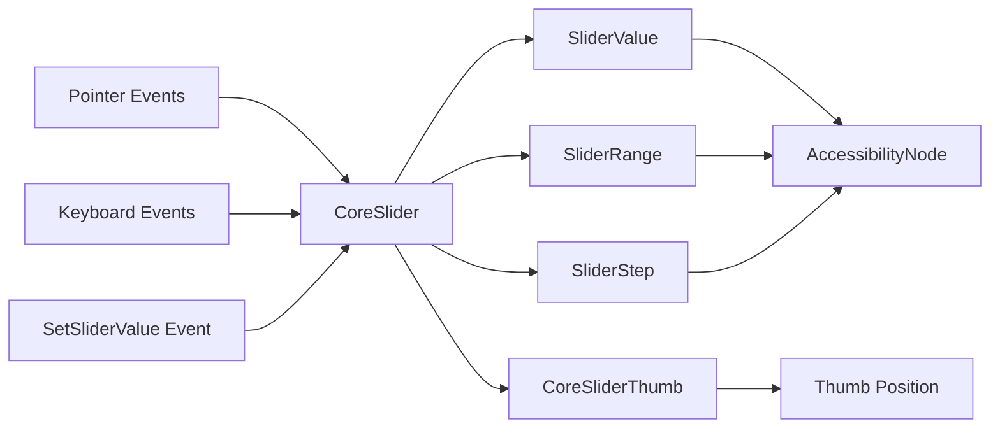

+++
title = "#19584 Core slider"
date = "2025-06-15T00:00:00"
draft = false
template = "pull_request_page.html"
in_search_index = false

[extra]
current_language = "zh-cn"
available_languages = {"en" = { name = "English", url = "/pull_request/bevy/2025-06/pr-19584-en-20250615" }, "zh-cn" = { name = "中文", url = "/pull_request/bevy/2025-06/pr-19584-zh-cn-20250615" }}
+++

# Core slider

## 基本资讯
- **标题**: Core slider
- **PR链接**: https://github.com/bevyengine/bevy/pull/19584
- **作者**: viridia
- **状态**: MERGED
- **标签**: C-Feature, A-UI, S-Ready-For-Final-Review, M-Needs-Release-Note, X-Contentious
- **创建时间**: 2025-06-11T16:42:22Z
- **合并时间**: 2025-06-15T01:14:20Z
- **合并者**: alice-i-cecile

## 描述翻译
### 目标 (Objective)
这是"core widgets"工作的一部分: #19236。

### 解决方案 (Solution)
此PR将"core slider"部件添加到集合中。

### 测试 (Testing)
使用示例`core_widgets`和`core_widgets_observers`进行了测试。

## 这个PR的故事

### 问题和背景
作为"core widgets"计划(#19236)的一部分，Bevy需要实现一个无样式的核心滑块部件。现有UI系统缺乏灵活、可复用的滑块控件，开发者需要创建自定义滑块时面临重复工作。核心滑块应满足以下要求：
1. 支持内部状态管理(自动更新值)和外部状态管理(通过回调)
2. 提供精确的拖拽计算逻辑
3. 实现无障碍访问支持
4. 允许自定义轨道点击行为
5. 与Bevy现有UI系统和事件机制集成

### 解决方案方法
开发者选择实现一个完全无样式的`CoreSlider`组件，其核心逻辑与视觉表现分离。关键设计决策包括：
1. 使用组合组件模式：`SliderValue`存储当前值，`SliderRange`定义取值范围，`SliderStep`控制步长
2. 提供`TrackClick`枚举支持三种轨道点击行为：拖拽(Drag)、步进(Step)、跳转(Snap)
3. 通过`on_change`回调系统ID实现外部状态管理
4. 使用Bevy observers处理交互事件，避免每帧轮询
5. 实现`SetSliderValue`事件允许外部控制滑块值

### 实现细节
核心实现在`core_slider.rs`中，包含组件定义和事件处理系统。滑块值计算考虑了拇指大小，确保精确对齐：

```rust
// 值范围计算
impl SliderRange {
    pub fn thumb_position(&self, value: f32) -> f32 {
        if self.end > self.start {
            (value - self.start) / (self.end - self.start)
        } else {
            0.5
        }
    }
}

// 拖拽值计算
let slider_width = ((node.size().x - thumb_size) * node.inverse_scale_factor).max(1.0);
let span = range.span();
let new_value = if span > 0. {
    range.clamp(drag.offset + (distance.x * span) / slider_width)
} else {
    range.start() + span * 0.5
};
```

状态管理通过`on_change`属性灵活处理：
```rust
if let Some(on_change) = slider.on_change {
    commands.run_system_with(on_change, new_value);
} else {
    commands.entity(trigger.target().unwrap())
        .insert(SliderValue(new_value));
}
```

无障碍支持通过监听组件插入事件实现：
```rust
fn slider_on_insert_value(trigger: On<Insert, SliderValue>, mut world: DeferredWorld) {
    let mut entity = world.entity_mut(trigger.target().unwrap());
    let value = entity.get::<SliderValue>().unwrap().0;
    if let Some(mut accessibility) = entity.get_mut::<AccessibilityNode>() {
        accessibility.set_numeric_value(value.into());
    }
}
```

### 技术洞察
1. **精确的拖拽计算**：通过减去拇指宽度确保鼠标位置与拇指中心对齐
2. **分层事件处理**：不同事件(点击、拖拽开始、拖拽中、拖拽结束)有独立系统
3. **灵活的状态管理**：`on_change`回调使滑块适合各种架构
4. **性能优化**：使用observers避免每帧查询
5. **无障碍集成**：自动设置ARIA角色和属性

### 影响
1. 新增509行核心滑块实现
2. 更新两个示例展示滑块使用和状态管理
3. 扩展核心部件集合为UI系统提供基础控件
4. 新增`SetSliderValue`事件允许外部控制滑块
5. 更新发布说明文档记录新功能

## 视觉表示


## 关键文件变更

### 1. `crates/bevy_core_widgets/src/core_slider.rs` (+509/-0)
**描述**：新增核心滑块组件实现，包含组件定义、事件处理和插件注册

**关键代码**：
```rust
// 滑块核心组件
#[derive(Component, Debug, Default)]
#[require(AccessibilityNode, CoreSliderDragState, SliderValue, SliderRange, SliderStep)]
pub struct CoreSlider {
    pub on_change: Option<SystemId<In<f32>>>,
    pub track_click: TrackClick,
}

// 滑块值组件
#[derive(Component, Debug, Default, PartialEq, Clone, Copy)]
#[component(immutable)]
pub struct SliderValue(pub f32);

// 拖拽处理系统
pub(crate) fn slider_on_drag(
    mut trigger: On<Pointer<Drag>>,
    mut q_slider: Query<(...)>,
    // ... 省略其他参数
) {
    if let Ok((node, slider, range, transform, drag, disabled)) = 
        q_slider.get_mut(trigger.target().unwrap()) 
    {
        // 计算新值
        let new_value = ...;
        
        // 状态管理
        if let Some(on_change) = slider.on_change {
            commands.run_system_with(on_change, new_value);
        } else {
            commands.entity(trigger.target().unwrap())
                .insert(SliderValue(new_value));
        }
    }
}
```

### 2. `examples/ui/core_widgets_observers.rs` (+271/-42)
**描述**：更新观察者模式示例，添加滑块演示和状态管理

**关键变更**：
```rust
// 添加滑块资源状态
#[derive(Resource)]
struct DemoWidgetStates {
    slider_value: f32,
}

// 创建滑块
fn slider(min: f32, max: f32, value: f32, on_change: Option<SystemId<In<f32>>>) -> impl Bundle {
    (
        Node { ... },
        CoreSlider { on_change, ..default() },
        SliderValue(value),
        SliderRange::new(min, max),
        // 子元素：轨道和拇指
        Children::spawn((...))
    )
}

// 滑块值变化观察者
fn slider_on_change_value(
    trigger: On<Insert, SliderValue>,
    sliders: Query<(Entity, &SliderValue, &SliderRange), With<DemoSlider>>,
    children: Query<&Children>,
    mut thumbs: Query<(&mut Node, Has<DemoSliderThumb>), Without<DemoSlider>>,
) {
    // 更新拇指位置
    thumb_node.left = Val::Percent(range.thumb_position(value.0) * 100.0);
}
```

### 3. `examples/ui/core_widgets.rs` (+233/-32)
**描述**：更新核心部件示例，添加滑块演示和禁用状态切换

**关键变更**：
```rust
// 外部状态管理
fn update_widget_values(
    res: Res<DemoWidgetStates>,
    mut sliders: Query<Entity, With<DemoSlider>>,
    mut commands: Commands,
) {
    if res.is_changed() {
        for slider_ent in sliders.iter_mut() {
            commands.entity(slider_ent)
                .insert(SliderValue(res.slider_value));
        }
    }
}

// 切换禁用状态
fn toggle_disabled(
    input: Res<ButtonInput<KeyCode>>,
    mut interaction_query: Query<(Entity, Has<InteractionDisabled>), 
        Or<(With<CoreButton>, With<CoreSlider>)>>,
    mut commands: Commands,
) {
    if input.just_pressed(KeyCode::KeyD) {
        for (entity, disabled) in &mut interaction_query {
            if disabled {
                commands.entity(entity).remove::<InteractionDisabled>();
            } else {
                commands.entity(entity).insert(InteractionDisabled);
            }
        }
    }
}
```

### 4. `release-content/release-notes/headless-widgets.md` (+8/-4)
**描述**：更新发布说明文档，添加滑块相关内容

**变更摘要**：
```markdown
- 在PR列表中添加#19584
- 添加滑块功能描述
- 更新状态管理说明
```

### 5. `crates/bevy_core_widgets/src/lib.rs` (+10/-1)
**描述**：导出滑块相关组件和插件

**变更**：
```rust
pub use core_slider::{
    CoreSlider, CoreSliderDragState, CoreSliderPlugin, CoreSliderThumb, SetSliderValue,
    SliderRange, SliderStep, SliderValue, TrackClick,
};

impl Plugin for CoreWidgetsPlugin {
    fn build(&self, app: &mut App) {
        app.add_plugins((CoreButtonPlugin, CoreSliderPlugin));
    }
}
```

## 延伸阅读
1. [Bevy Observers文档](https://bevyengine.org/learn/book/next/observers/) - Bevy观察者系统工作机制
2. [WAI-ARIA Slider模式](https://www.w3.org/WAI/ARIA/apg/patterns/slider/) - 无障碍滑块实现指南
3. [Bevy UI系统](https://bevyengine.org/learn/book/next/ui/) - Bevy UI基础概念
4. [Headless组件设计模式](https://martinfowler.com/bliki/PresentationDomainDataLayering.html) - 无头UI组件设计原则