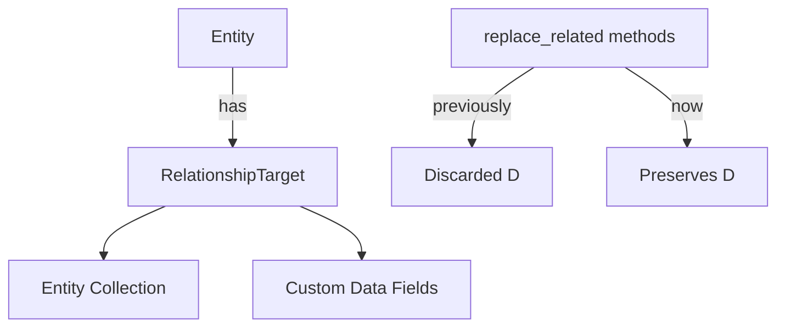

+++
title = "#19588 Preserving RelationshipTarget Data in Bevy's ECS Relationships"
date = "2025-06-15T00:00:00"
draft = false
template = "pull_request_page.html"
in_search_index = true

[taxonomies]
list_display = ["show"]

[extra]
current_language = "en"
available_languages = {"en" = { name = "English", url = "/pull_request/bevy/2025-06/pr-19588-en-20250615" }, "zh-cn" = { name = "中文", url = "/pull_request/bevy/2025-06/pr-19588-zh-cn-20250615" }}
labels = ["C-Bug", "A-ECS", "D-Straightforward"]
+++

## Title: Preserving RelationshipTarget Data in Bevy's ECS Relationships

### Basic Information
- **Title**: Preserve extra data in `RelationshipTarget` with `replace_related`(`_with_difference`)
- **PR Link**: https://github.com/bevyengine/bevy/pull/19588
- **Author**: urben1680
- **Status**: MERGED
- **Labels**: C-Bug, A-ECS, S-Ready-For-Final-Review, X-Uncontroversial, D-Straightforward
- **Created**: 2025-06-11T19:09:37Z
- **Merged**: 2025-06-15T16:58:45Z
- **Merged By**: alice-i-cecile

### Description Translation
#### Objective
The methods `replace_related` and `replace_related_with_difference` were causing data stored in `RelationshipTarget` components to be lost when removing original children before adding new ones. This was part of issue #19589.

#### Solution
Fixed the issue by:
1. For `replace_related_with_difference`: Swapped the order of operations to add new children before removing old ones
2. For `replace_related`: Modified the entire `RelationshipTarget` component instead of just its inner collection

#### Testing
Added:
1. A new test verifying preserved data in `RelationshipTarget`
2. A general test for these methods since none existed previously

### The Story of This Pull Request

#### The Problem and Context
In Bevy's ECS relationship system, `RelationshipTarget` components store relationship data like child entities. The `replace_related` and `replace_related_with_difference` methods had a bug where they would unintentionally drop any additional data stored in `RelationshipTarget` beyond the entity collection. This happened because:

1. `replace_related_with_difference` removed old children before adding new ones, temporarily replacing the entire `RelationshipTarget` with an empty component
2. `replace_related` operated only on the inner collection rather than the full component

The core issue was the unsafe use of `mem::replace` with a dummy component, which discarded any extra fields in `RelationshipTarget` beyond the entity collection.

#### The Solution Approach
The fix required different approaches for each method:

For `replace_related_with_difference`:
- Changed operation order to add new children before removing old ones
- Maintained the existing `RelationshipTarget` component instead of replacing it

For `replace_related`:
- Modified the entire `RelationshipTarget` component rather than extracting its collection
- Kept the component in place during operations

The key insight was that relationship targets should be treated as full components with potential custom data, not just as containers for entity collections.

#### The Implementation
The most significant changes occurred in `replace_related_with_difference`:

```rust
// Before: Extracted only the collection
let mut existing_relations = mem::replace(
    existing_relations.collection_mut_risky(),
    Collection::<R>::with_capacity(0),
);

// After: Preserves entire RelationshipTarget
let mut relations = mem::replace(
    existing_relations.into_inner(),
    <R as Relationship>::RelationshipTarget::from_collection_risky(
        Collection::<R>::with_capacity(0),
    ),
);
```

For `replace_related`, the logic was simplified to directly modify the existing component:

```rust
match self.get_mut::<R::RelationshipTarget>() {
    None => { /* add new relationship */ }
    Some(mut target) => {
        let collection = target.collection_mut_risky();
        collection.clear();
        collection.extend_from_iter(entities_to_relate.iter().copied());
    }
}
```

#### Technical Insights
The solution maintains component integrity by:
1. Avoiding full component replacement where possible
2. Operating on existing components instead of temporary copies
3. Maintaining the component's memory location to prevent archetype moves

The `collection_mut_risky()` method remains necessary for direct collection access but now operates within the context of the full component.

#### The Impact
These changes:
1. Preserve custom data in `RelationshipTarget` components
2. Maintain backward compatibility with existing relationship setups
3. Add missing test coverage for these critical relationship methods

The fixes are localized to relationship methods with no broader architectural changes required.

### Visual Representation



### Key Files Changed

#### `crates/bevy_ecs/src/relationship/related_methods.rs`
- Fixed data loss in relationship replacement methods
- Added comprehensive test coverage

**Key changes in `replace_related_with_difference`**:
```rust
// Before (problematic):
let mut existing_relations = mem::replace(
    existing_relations.collection_mut_risky(),
    Collection::<R>::with_capacity(0),
);

// After (fixed):
let mut relations = mem::replace(
    existing_relations.into_inner(),
    <R as Relationship>::RelationshipTarget::from_collection_risky(
        Collection::<R>::with_capacity(0),
    ),
);
```

**New test verifying data preservation**:
```rust
#[test]
fn replace_related_keeps_data() {
    #[derive(Component)]
    #[relationship(relationship_target = Parent)]
    pub struct Child(Entity);

    #[derive(Component)]
    #[relationship_target(relationship = Child)]
    pub struct Parent {
        #[relationship]
        children: Vec<Entity>,
        pub data: u8,  // Custom data field
    }

    // ... test setup ...
    parent.get_mut::<Parent>().unwrap().data = 42;
    
    parent.replace_related_with_difference::<Child>(...);
    let data = parent.get::<Parent>().unwrap().data;
    assert_eq!(data, 42);  // Verify custom data remains
}
```

### Further Reading
1. [Bevy ECS Relationships Documentation](https://bevyengine.org/learn/book/ecs/relationships/)
2. [Entity Component System Pattern](https://en.wikipedia.org/wiki/Entity_component_system)
3. [Rust Memory Management with mem::replace](https://doc.rust-lang.org/std/mem/fn.replace.html)