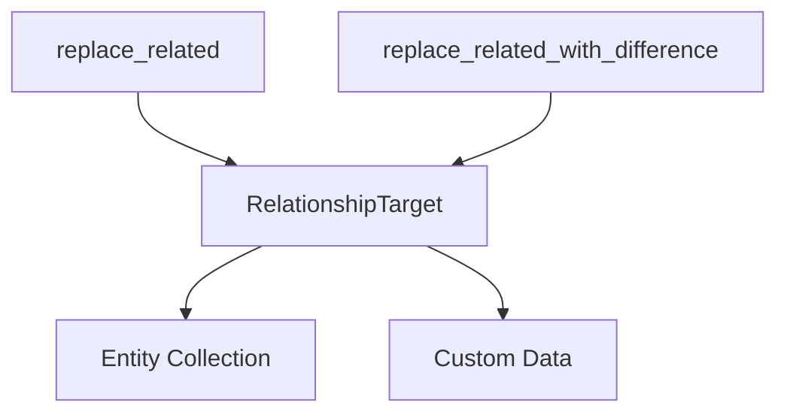

+++
title = "#19588 Preserve extra data in `RelationshipTarget` with `replace_related`(`_with_difference`)"
date = "2025-06-15T00:00:00"
draft = false
template = "pull_request_page.html"
in_search_index = false

[extra]
current_language = "zh-cn"
available_languages = {"en" = { name = "English", url = "/pull_request/bevy/2025-06/pr-19588-en-20250615" }, "zh-cn" = { name = "中文", url = "/pull_request/bevy/2025-06/pr-19588-zh-cn-20250615" }}
+++

# 分析报告：PR #19588 - Preserve extra data in `RelationshipTarget` with `replace_related`(`_with_difference`)

## 基本信息
- **标题**: Preserve extra data in `RelationshipTarget` with `replace_related`(`_with_difference`)
- **PR链接**: https://github.com/bevyengine/bevy/pull/19588
- **作者**: urben1680
- **状态**: 已合并
- **标签**: C-Bug, A-ECS, S-Ready-For-Final-Review, X-Uncontroversial, D-Straightforward
- **创建时间**: 2025-06-11T19:09:37Z
- **合并时间**: 2025-06-15T16:58:45Z
- **合并者**: alice-i-cecile

## 描述翻译

### 目标
`replace_related` 和 `replace_related_with_difference` 方法及命令在移除所有原始子实体后添加新子实体时，可能导致存储在 `RelationshipTarget` 中的数据丢失。

这是 https://github.com/bevyengine/bevy/issues/19589 问题的一部分

### 解决方案
通过两种方式修复问题：
1. 对于 `replace_related_with_difference`：在添加新子实体后移除旧子实体，而不是在之前移除
2. 对于 `replace_related`：直接修改整个 `RelationshipTarget` 而不仅仅是内部集合

### 测试
添加了新的测试用例验证数据保留情况，并为这些方法添加了基础测试（之前没有相关测试）

## PR分析

### 问题背景
在 Bevy 的 ECS 关系系统中，`RelationshipTarget` 组件（如 `Children`）可能包含除实体集合外的额外数据。当使用 `replace_related` 或 `replace_related_with_difference` 方法替换相关实体时，存在数据丢失问题：

```rust
let mut parent = world.spawn_empty();
parent.add_children(&[child1, child2]);
parent.get_mut::<Parent>().unwrap().custom_data = 42;  // 自定义数据

// 问题：替换操作会丢失 custom_data
parent.replace_children(&[child3]);
```

根本原因在于原实现中：
1. 使用 `mem::replace` 直接替换内部集合
2. 移除旧子实体的操作发生在添加新子实体之前
3. 临时替换整个 `RelationshipTarget` 组件导致额外数据被丢弃

### 解决方案
#### 方法重构
核心修改点在于保留整个 `RelationshipTarget` 组件，仅修改其内部集合：

```rust
// 修改前：仅替换内部集合
let mut existing_relations = mem::replace(
    existing_relations.collection_mut_risky(),
    Collection::<R>::with_capacity(0),
);

// 修改后：替换整个组件但保留实例
let mut relations = mem::replace(
    existing_relations.into_inner(),
    <R as Relationship>::RelationshipTarget::from_collection_risky(
        Collection::<R>::with_capacity(0),
    ),
);
let collection = relations.collection_mut_risky();
```

#### 操作顺序优化
对于 `replace_related_with_difference`，调整了子实体移除/添加顺序：
```rust
// 先添加新关系
for new_relation in newly_related_entities {
    world.entity_mut(*new_relation)
        .insert_with_relationship_hook_mode(R::from(this), RelationshipHookMode::Skip);
}

// 后移除旧关系
for related in collection.iter() {
    if !potential_relations.remove(related) {
        world.entity_mut(related).remove::<R>();
    }
}
```

### 测试验证
添加了两个关键测试用例：

1. **基础功能测试** (`replace_related_works`)：
```rust
// 验证父子关系更新逻辑
parent.replace_children(&[child2, child3]);
assert_eq!(children, &[child2, child3]);
```

2. **数据保留测试** (`replace_related_keeps_data`)：
```rust
// 自定义包含额外数据的 Parent 组件
pub struct Parent {
    #[relationship]
    children: Vec<Entity>,
    pub data: u8,  // 额外数据字段
}

// 验证数据在替换操作后保持不变
parent.replace_related::<Child>(&[child1]);
let data = parent.get::<Parent>().unwrap().data;
assert_eq!(data, 42);  // 关键断言
```

### 技术影响
1. **数据完整性**：确保自定义的 `RelationshipTarget` 组件中的额外数据不会在实体替换时丢失
2. **API 稳定性**：保持原有方法签名不变，避免破坏性变更
3. **性能考量**：修改后操作仍保持 O(n) 时间复杂度，未引入额外开销
4. **架构一致性**：强化了关系组件作为独立数据容器的设计理念

## 关键文件变更

### crates/bevy_ecs/src/relationship/related_methods.rs
**变更说明**：重构关系替换方法，解决数据丢失问题并添加验证测试

**核心修改**：
```rust
// 修改前 (易丢失数据版本)
let Some(mut existing_relations) = self.get_mut::<R::RelationshipTarget>() else { ... };
let mut existing_relations = mem::replace(
    existing_relations.collection_mut_risky(),
    Collection::<R>::with_capacity(0),
);

// 修改后 (数据安全版本)
let Some(existing_relations) = self.get_mut::<R::RelationshipTarget>() else { ... };
let mut relations = mem::replace(
    existing_relations.into_inner(),  // 保留组件实例
    <R as Relationship>::RelationshipTarget::from_collection_risky(
        Collection::<R>::with_capacity(0),
    ),
);
let collection = relations.collection_mut_risky();  // 仅修改集合
```

**测试新增**：
```rust
#[test]
fn replace_related_keeps_data() {
    // 自定义包含额外数据的组件
    pub struct Parent {
        #[relationship]
        children: Vec<Entity>,
        pub data: u8,
    }
    
    // 设置初始数据
    parent.get_mut::<Parent>().unwrap().data = 42;
    
    // 执行替换操作
    parent.replace_related::<Child>(&[child1]);
    
    // 验证数据保留
    let data = parent.get::<Parent>().unwrap().data;
    assert_eq!(data, 42);
}
```

## 组件关系图



## 延伸阅读
1. [Bevy ECS 关系系统文档](https://docs.rs/bevy_ecs/latest/bevy_ecs/relationship/index.html)
2. [组件内部可变性模式](https://doc.rust-lang.org/book/ch15-05-interior-mutability.html)
3. [实体关系设计原则](https://github.com/bevyengine/bevy/blob/main/docs/ECS_FAQ.md#entity-relationships)