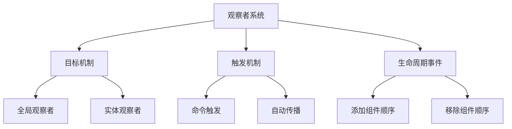

+++
title = "#19590 Thoroughly document the current state of observers"
date = "2025-06-11T00:00:00"
draft = false
template = "pull_request_page.html"
in_search_index = false

[extra]
current_language = "zh-cn"
available_languages = {"en" = { name = "English", url = "/pull_request/bevy/2025-06/pr-19590-en-20250611" }, "zh-cn" = { name = "中文", url = "/pull_request/bevy/2025-06/pr-19590-zh-cn-20250611" }}
+++

### 技术分析报告：PR #19590 - Thoroughly document the current state of observers

## 基本信息
- **标题**: Thoroughly document the current state of observers
- **PR链接**: https://github.com/bevyengine/bevy/pull/19590
- **作者**: alice-i-cecile
- **状态**: MERGED
- **标签**: C-Docs, A-ECS, S-Ready-For-Final-Review, X-Uncontroversial, D-Modest
- **创建时间**: 2025-06-11T20:43:14Z
- **合并时间**: 2025-06-11T22:23:11Z
- **合并者**: alice-i-cecile

## 描述翻译
### 目标

观察者(observer)的文档质量不佳。这不仅对用户造成困扰，**也**给引擎开发者带来严重问题，因为他们试图改进观察者相关的各类问题。

本PR：
- 修复 #14084
- 修复 #14726
- 修复 #16538
- 关闭 #18914（尝试解决相同问题）

为保证本PR的可评审性，我选择仅记录现有各种限制（有些可称为bug！）而非尝试修复它们。这里有大量清理工作需要完成：参见 https://github.com/orgs/bevyengine/projects/17。

### 解决方案
- 为观察者编写优质模块文档，提供指向最常用方法和技术的线索，必要时进行比较对比
- 修复所有存在误导性的文档
- 尝试解释各（公共的？！）内部组件如何关联

## PR分析

### 问题背景
观察者系统是Bevy ECS的核心机制，但现有文档存在三个主要问题：
1. 关键概念如观察者目标(targeting)、触发(triggering)和冒泡(bubbling)缺乏清晰解释
2. 实际使用中的常见陷阱未记录（如无法重新定位观察者）
3. 内部实现细节（如`CachedObservers`结构）缺乏说明，导致开发者难以调试或扩展系统

这些问题导致多个issue被报告（#14084, #14726等），并阻碍了ECS模块的进一步开发。例如：
- 开发者不清楚观察者与缓冲事件(buffered events)的性能取舍
- 观察者命令的延迟执行行为未被明确记录
- 生命周期事件(lifecycle events)与观察者的交互顺序不清晰

### 解决方案
采用全面的文档更新策略：
1. 为`observer`模块添加顶层文档，解释核心概念
2. 为关键结构（如`Trigger`和`Observer`）补充详细文档
3. 明确记录当前限制而非回避问题
4. 使用交叉引用连接相关机制（如生命周期事件）

具体工程决策包括：
- 保持实现不变，仅通过文档澄清现有行为
- 在文档中直接引用相关issue作为技术限制的权威参考
- 使用对比表格解释观察者与缓冲事件的差异

### 实现细节
核心改动集中在`observer/mod.rs`文件，新增167行文档，删除18行过时内容。关键增强包括：

**1. 模块级文档(module-level docs)**  
新增综合概述，解释：
```rust
//! Observers are a push-based tool for responding to [`Event`]s.
//!
//! ## Observer targeting
//! Observers can be "global" or "entity-specific"...
//!
//! ## Writing observers
//! Use the [`Trigger`] system parameter as the first parameter...
//!
//! ## Spawning observers
//! Via [`World::add_observer`] or [`EntityCommands::observe`]...
```

**2. 关键结构文档**  
增强`Trigger`结构说明：
```rust
/// The generic `B: Bundle` is used to modify the further specialize...
///
/// Providing multiple components in this bundle will cause...
/// [rather than requiring all of them to be present](https://github.com/bevyengine/bevy/issues/15325).
pub struct Trigger<'w, E, B: Bundle = ()> { ... }
```

**3. 限制条件文档**  
明确记录已知问题：
```rust
//! Currently, [observers cannot be retargeted after spawning](https://github.com/bevyengine/bevy/issues/19587):
//! despawn and respawn an observer as a workaround.
//!
//! Currently, Bevy does not provide [a way to specify the ordering of observers](https://github.com/bevyengine/bevy/issues/14890)...
```

**4. 对比说明**  
添加观察者与缓冲事件的比较：
```rust
//! ## Observers vs buffered events
//! By contrast, [`EventReader`] and [`EventWriter`] ("buffered events"), are pull-based...
//! This imposes a small overhead, making observers a better choice for extremely rare events...
```

### 技术洞察
1. **目标机制**  
   观察者可配置为：
   - 全局观察者：监听所有事件
   - 实体特定：通过`ObservedBy`组件追踪
   目标实体通过`TriggerTargets` trait实现灵活指定

2. **生命周期事件顺序**  
   文档明确组件钩子(hooks)与观察者的执行顺序差异：
   ```rust
   //! - when adding components, hooks are evaluated first, then observers
   //! - when removing components, observers are evaluated first, then hooks
   ```

3. **执行时序**  
   观察者通过命令系统延迟执行：
   ```rust
   //! Observers are triggered via [`Commands`], which imply that they are evaluated at the next sync point...
   //! Commands sent by observers are [currently not immediately applied](https://github.com/bevyengine/bevy/issues/19569).
   ```

4. **内部缓存优化**  
   `CachedObservers`结构通过分层缓存提升查询效率：
   ```rust
   #[derive(Default, Debug)]
   pub struct CachedObservers {
       // 全局观察者
       global_observers: ObserverMap,
       // 按组件ID索引的观察者
       component_observers: HashMap<ComponentId, ObserverMap>,
       // 按实体索引的观察者
       entity_observers: EntityHashMap<ObserverMap>,
   }
   ```

### 影响分析
1. **问题解决**  
   直接解决4个长期存在的文档相关issue，为#18914提供替代方案

2. **开发者体验**  
   - 新开发者能更快理解观察者与事件系统的差异
   - 现有开发者明确知晓系统限制和工作区(workarounds)
   - 贡献者更易定位需要改进的子系统

3. **代码维护**  
   文档中标记的14处技术限制（含issue链接）为后续优化提供明确路线图

## 关键文件变更

### `crates/bevy_ecs/src/observer/mod.rs`
**变更说明**：  
重写模块文档，全面覆盖观察者机制的使用场景、限制条件和实现细节。新增167行文档，删除18行过时代码。

**关键代码片段**：  
```rust
// 新增模块文档（节选）
//! ## Writing observers
//! Observers are systems which implement [`IntoObserverSystem`]...
//! To write observer systems, use the [`Trigger`] system parameter...
//! 
//! ## Observer bubbling
//! When events are targeted at an entity, they can optionally bubble...
//! This can be done using the [`Trigger::propagate`] method...

// Trigger结构文档增强
pub struct Trigger<'w, E, B: Bundle = ()> {
    event: &'w mut E,
    propagate: &'w mut bool,
    trigger: &'w ObserverTrigger,
    marker: PhantomData<B>,
}

impl<'w, E, B: Bundle> Trigger<'w, E, B> {
    /// 阻止事件继续冒泡
    pub fn stop_propagation(&mut self) {
        *self.propagate = false;
    }
}

// 明确记录内部结构作用
#[derive(Default, Debug)]
pub struct Observers {
    // 常用生命周期事件的专用缓存
    on_add: CachedObservers,
    on_insert: CachedObservers,
    // 通用观察者的缓存
    cache: HashMap<ComponentId, CachedObservers>,
}
```

## 视觉呈现


## 延伸阅读
1. [Bevy观察者技术设计讨论](https://github.com/bevyengine/bevy/discussions/19589)
2. [ECS观察者模式比较研究](https://www.gamedeveloper.com/programming/observer-pattern-in-game-engines)
3. [Bevy生命周期事件文档](https://docs.rs/bevy_ecs/latest/bevy_ecs/lifecycle/index.html)