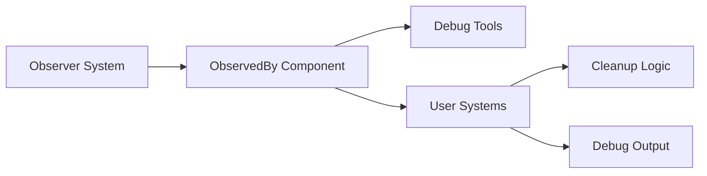

+++
title = "#19591 Make the `ObservedBy` component useful to public consumers"
date = "2025-06-12T00:00:00"
draft = false
template = "pull_request_page.html"
in_search_index = false

[extra]
current_language = "zh-cn"
available_languages = {"en" = { name = "English", url = "/pull_request/bevy/2025-06/pr-19591-en-20250612" }, "zh-cn" = { name = "中文", url = "/pull_request/bevy/2025-06/pr-19591-zh-cn-20250612" }}
+++

## PR 分析报告：Make the `ObservedBy` component useful to public consumers

### 基本信息
- **标题**: Make the `ObservedBy` component useful to public consumers
- **PR 链接**: https://github.com/bevyengine/bevy/pull/19591
- **作者**: alice-i-cecile
- **状态**: 已合并
- **标签**: D-Trivial, A-ECS, C-Usability, S-Ready-For-Final-Review, X-Uncontroversial
- **创建时间**: 2025-06-11T22:17:24Z
- **合并时间**: 2025-06-12T20:31:04Z
- **合并人**: alice-i-cecile

### 描述翻译
#### 目标
如 @Jondolf 提出的，该类型是 `pub`，对各类消费者确保清理或调试很有用。然而它并未提供任何查看数据的方式。

#### 解决方案
- 添加数据的只读视图
- 不添加任何（简单的）数据修改方式，避免引入严重隐患
- 实现 Reflect 并注册组件，便于在检查器中查看

### 技术分析

#### 问题背景
`ObservedBy` 组件是 Bevy ECS 观察者系统的核心部分，用于追踪哪些实体正在观察目标实体。该组件虽然被标记为 `pub` 公开，但其内部数据（`Vec<Entity>`）通过 `pub(crate)` 限制访问，导致外部用户无法读取实际内容。这种设计限制了该组件的实用性，特别是在需要调试观察关系或基于观察状态执行清理操作的场景中。

#### 解决方案设计
PR 采用最小化修改策略解决此问题：
1. **只读访问接口**：添加安全的 getter 方法，避免直接暴露内部数据
2. **反射支持**：实现 `Reflect` trait 并注册类型，支持引擎的运行时检查工具
3. **安全边界**：明确禁止数据修改，防止破坏观察系统的内部一致性

#### 实现细节
关键修改集中在两个文件：

1. **`entity_observer.rs` 组件增强**
```rust
// Before:
#[derive(Default)]
pub struct ObservedBy(pub(crate) Vec<Entity>);

// After:
#[derive(Default, Debug)]
#[cfg_attr(feature = "bevy_reflect", derive(bevy_reflect::Reflect))]
#[cfg_attr(feature = "bevy_reflect", reflect(Component, Debug))]
pub struct ObservedBy(pub(crate) Vec<Entity>);

impl ObservedBy {
    /// Provides a read-only reference to the list of entities observing this entity.
    pub fn get(&self) -> &[Entity] {
        &self.0
    }
}
```
主要变更：
- 添加 `get()` 方法提供安全的只读访问
- 实现 `Debug` trait 支持日志输出
- 条件编译实现 `Reflect`（仅在启用 `bevy_reflect` 时生效）

2. **`app.rs` 反射注册**
```rust
// Before: (仅注册部分类型)
app.register_type::<Name>();
app.register_type::<ChildOf>();
app.register_type::<Children>();

// After: (添加 ObservedBy 注册)
use bevy_ecs::observer::ObservedBy;
app.register_type::<ObservedBy>();
```
变更说明：
- 在类型注册流程中显式添加 `ObservedBy`
- 确保组件能在 Bevy 的检查器工具中显示

#### 技术洞察
1. **封装边界控制**：通过 `pub fn get()` 而非直接公开字段，维护了组件内部状态的一致性。观察关系应由 ECS 系统管理，用户不应直接修改。
2. **条件反射实现**：使用 `#[cfg_attr(feature = ...)]` 宏保证反射功能仅在启用对应 feature 时编译，避免增加无依赖场景的开销。
3. **零成本抽象**：`get()` 方法返回切片引用（`&[Entity]`），不产生数据拷贝，保持高效内存访问。

#### 实际影响
1. **调试能力增强**：开发者现在可通过 `observed_by.get()` 或检查器查看观察关系
2. **安全清理操作**：系统可安全读取观察者列表执行相关清理
3. **API 完整性**：公开组件的设计更符合最小可用原则，避免 "half-public" 反模式

### 组件关系图


### 关键文件变更

#### crates/bevy_ecs/src/observer/entity_observer.rs
```diff
#[derive(Default, Debug)]
+#[cfg_attr(feature = "bevy_reflect", derive(bevy_reflect::Reflect))]
+#[cfg_attr(feature = "bevy_reflect", reflect(Component, Debug))]
pub struct ObservedBy(pub(crate) Vec<Entity>);
+
+impl ObservedBy {
+    pub fn get(&self) -> &[Entity] {
+        &self.0
+    }
+}
```
变更说明：添加组件数据访问接口和反射支持

#### crates/bevy_app/src/app.rs
```diff
#[cfg(feature = "bevy_reflect")]
{
+    use bevy_ecs::observer::ObservedBy;
+
     app.register_type::<Name>();
     app.register_type::<ChildOf>();
     app.register_type::<Children>();
+    app.register_type::<ObservedBy>();
}
```
变更说明：在反射系统中注册组件类型

### 延伸阅读
1. Bevy 观察者系统文档：[Entity Observers RFC](https://github.com/bevyengine/rfcs/pull/39)
2. 反射系统实现原理：[Bevy Reflection](https://bevyengine.org/learn/book/features/reflection/)
3. 组件设计最佳实践：[ECS Component Design](https://github.com/bevyengine/bevy/discussions/1976)

### 完整代码变更
```diff
diff --git a/crates/bevy_app/src/app.rs b/crates/bevy_app/src/app.rs
index 2adf6c2857571..e4bed51448614 100644
--- a/crates/bevy_app/src/app.rs
+++ b/crates/bevy_app/src/app.rs
@@ -106,10 +106,13 @@ impl Default for App {
 
         #[cfg(feature = "bevy_reflect")]
         {
+            use bevy_ecs::observer::ObservedBy;
+
             app.init_resource::<AppTypeRegistry>();
             app.register_type::<Name>();
             app.register_type::<ChildOf>();
             app.register_type::<Children>();
+            app.register_type::<ObservedBy>();
         }
 
         #[cfg(feature = "reflect_functions")]
diff --git a/crates/bevy_ecs/src/observer/entity_observer.rs b/crates/bevy_ecs/src/observer/entity_observer.rs
index bd45072a5a332..d3ad78e4c1c4b 100644
--- a/crates/bevy_ecs/src/observer/entity_observer.rs
+++ b/crates/bevy_ecs/src/observer/entity_observer.rs
@@ -6,12 +6,24 @@ use crate::{
 };
 use alloc::vec::Vec;
 
+#[cfg(feature = "bevy_reflect")]
+use crate::prelude::ReflectComponent;
+
 use super::Observer;
 
 /// Tracks a list of entity observers for the [`Entity`] [`ObservedBy`] is added to.
-#[derive(Default)]
+#[derive(Default, Debug)]
+#[cfg_attr(feature = "bevy_reflect", derive(bevy_reflect::Reflect))]
+#[cfg_attr(feature = "bevy_reflect", reflect(Component, Debug))]
 pub struct ObservedBy(pub(crate) Vec<Entity>);
 
+impl ObservedBy {
+    /// Provides a read-only reference to the list of entities observing this entity.
+    pub fn get(&self) -> &[Entity] {
+        &self.0
+    }
+}
+
 impl Component for ObservedBy {
     const STORAGE_TYPE: StorageType = StorageType::SparseSet;
     type Mutability = Mutable;
```