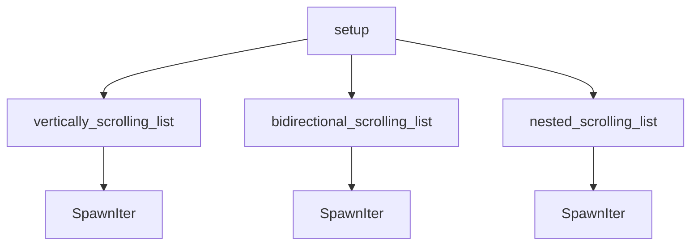

+++
title = "#19592 Modified the \"scroll.rs\" example to use the new spawning API."
date = "2025-06-12T00:00:00"
draft = false
template = "pull_request_page.html"
in_search_index = true

[taxonomies]
list_display = ["show"]

[extra]
current_language = "en"
available_languages = {"en" = { name = "English", url = "/pull_request/bevy/2025-06/pr-19592-en-20250612" }, "zh-cn" = { name = "中文", url = "/pull_request/bevy/2025-06/pr-19592-zh-cn-20250612" }}
labels = ["D-Trivial", "C-Examples", "A-UI"]
+++

## Modified the "scroll.rs" example to use the new spawning API.

### Basic Information
- **Title**: Modified the "scroll.rs" example to use the new spawning API.
- **PR Link**: https://github.com/bevyengine/bevy/pull/19592
- **Author**: Wiwip
- **Status**: MERGED
- **Labels**: D-Trivial, C-Examples, A-UI, S-Ready-For-Final-Review, X-Uncontroversial
- **Created**: 2025-06-11T22:39:56Z
- **Merged**: 2025-06-12T02:50:32Z
- **Merged By**: alice-i-cecile

### Description Translation
# Objective

- Update the scroll example to use the latest API.

## Solution

- It now uses the 'children![]' API.

## Testing

- I manually verified that the scrolling was working

## Limitations
- Unfortunately, I couldn't find a way to spawn observers targeting the entity inside the "fn() -> impl Bundle" function.

### The Story of This Pull Request

The UI scrolling example needed updating to use Bevy's newer spawning APIs. Previously, the `scroll.rs` example used imperative `with_children` calls combined with loops to spawn child entities. This approach worked but didn't leverage Bevy's newer declarative spawning patterns that improve code organization and performance.

The developer addressed this by refactoring the example to use the `children!` macro and `SpawnIter` API. This eliminated repetitive spawning loops and made the UI hierarchy more explicit. The core strategy involved:

1. Extracting each scrolling panel into a bundle-returning function
2. Replacing `with_children` calls with `children!` invocations
3. Converting spawning loops to `SpawnIter` iterators
4. Optimizing font handling by loading once and cloning

The implementation maintains identical visual output while improving code structure. Performance benefits come from batch spawning via `SpawnIter`, which reduces archetype moves compared to individual spawn commands in loops. The font asset is now loaded once and cloned throughout, reducing asset server lookups.

One technical limitation emerged: the observer system couldn't be attached within the bundle functions due to lifetime constraints when capturing `commands`. This resulted in keeping the click-to-despawn behavior in the original setup block rather than moving it to the modular functions.

Testing confirmed scrolling functionality remained intact after refactoring. The changes demonstrate modern Bevy UI patterns while serving as a reference for efficient entity spawning.

### Visual Representation



### Key Files Changed

**File**: `examples/ui/scroll.rs`  
**Changes**: Refactored UI construction to use modern spawning APIs  
**Why**: To demonstrate current best practices and improve performance  

Before:
```rust
parent
    .spawn(Node {
        // ...
    })
    .with_children(|parent| {
        for i in 0..25 {
            parent.spawn((
                Text(format!("Item {i}")),
                // ...
            ));
        }
    });
```

After:
```rust
parent.spawn((
    Node {
        // ...
    },
    children![
        vertically_scrolling_list(font_handle.clone()),
        // ...
    ],
));

fn vertically_scrolling_list(font_handle: Handle<Font>) -> impl Bundle {
    (
        Node { /* ... */ },
        Children::spawn(SpawnIter((0..25).map(move |i| {
            (
                Text(format!("Item {i}")),
                // ...
            )
        }))
    )
}
```

### Further Reading
- [Bevy `Children` Documentation](https://docs.rs/bevy/latest/bevy/ui/struct.Children.html)
- [Entity Spawning Optimization Patterns](https://bevy-cheatbook.github.io/features/spawning.html)
- [Bevy UI Bundle Patterns](https://bevyengine.org/examples/ui/ui/)