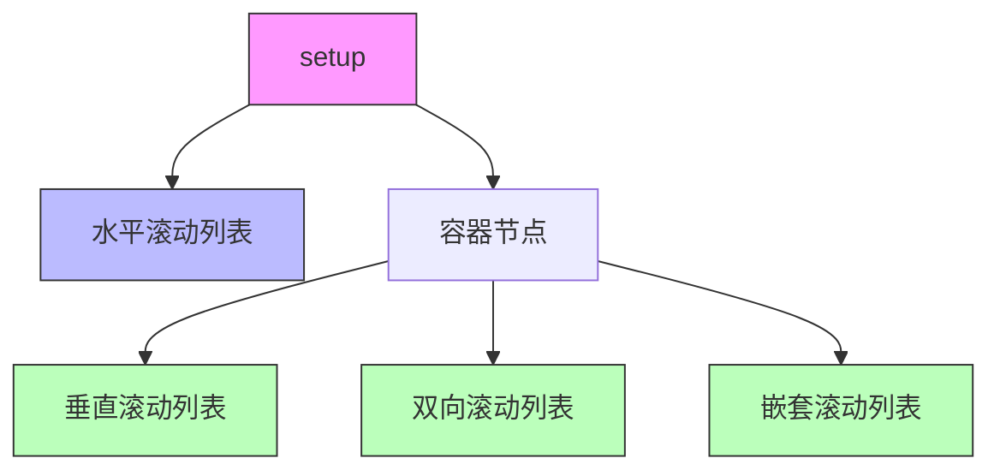

+++
title = "#19592 Modified the \"scroll.rs\" example to use the new spawning API."
date = "2025-06-12T00:00:00"
draft = false
template = "pull_request_page.html"
in_search_index = false

[extra]
current_language = "zh-cn"
available_languages = {"en" = { name = "English", url = "/pull_request/bevy/2025-06/pr-19592-en-20250612" }, "zh-cn" = { name = "中文", url = "/pull_request/bevy/2025-06/pr-19592-zh-cn-20250612" }}
labels = ["D-Trivial", "C-Examples", "A-UI"]
+++

# 分析报告：滚动示例更新至新生成 API

## Basic Information
- **Title**: Modified the "scroll.rs" example to use the new spawning API.
- **PR Link**: https://github.com/bevyengine/bevy/pull/19592
- **Author**: Wiwip
- **Status**: MERGED
- **Labels**: D-Trivial, C-Examples, A-UI, S-Ready-For-Final-Review, X-Uncontroversial
- **Created**: 2025-06-11T22:39:56Z
- **Merged**: 2025-06-12T02:50:32Z
- **Merged By**: alice-i-cecile

## Description Translation
### 目标
- 更新滚动示例以使用最新的 API。

### 解决方案
- 现在使用 'children![]' API。

### 测试
- 我手动验证了滚动功能正常工作

### 限制
- 遗憾的是，我无法找到在 "fn() -> impl Bundle" 函数内为目标实体生成观察者的方法。

## The Story of This Pull Request

### 1. 问题背景与上下文
Bevy 的 UI 示例 `scroll.rs` 使用了旧的实体生成模式，通过闭包嵌套构建 UI 层次结构：
```rust
parent
    .spawn(Node::default())
    .with_children(|parent| {
        for i in 0..10 {
            parent.spawn(TextBundle::from_section(...));
        }
    });
```
这种模式在复杂 UI 中会导致深度嵌套和可读性问题。随着 Bevy 引入新的 `children![]` 宏和 `SpawnIter` API，需要更新示例展示现代实践。

主要挑战是：
- 重构原有深度嵌套的 UI 生成逻辑
- 保持功能完全一致
- 处理观察者(observer)附加限制

### 2. 解决方案设计
核心策略是将不同滚动列表提取为独立函数，返回 `impl Bundle`：
```rust
fn vertically_scrolling_list(font_handle: Handle<Font>) -> impl Bundle {
    (
        Node { /* 样式 */ },
        children![ /* 子元素 */ ]
    )
}
```
并在主设置中通过 `children!` 宏组合：
```rust
parent.spawn((
    Node { /* 容器样式 */ },
    children![
        vertically_scrolling_list(...),
        bidirectional_scrolling_list(...),
        nested_scrolling_list(...)
    ]
));
```

#### 关键工程决策：
1. **字体处理优化**：预加载字体避免重复加载
   ```rust
   // Before: 每个文本单独加载
   font: asset_server.load("fonts/FiraSans-Bold.ttf")
   
   // After: 预加载后复用
   let font_handle = asset_server.load("fonts/FiraSans-Bold.ttf");
   font: font_handle.clone()
   ```

2. **列表生成优化**：使用 `SpawnIter` 替代循环
   ```rust
   Children::spawn(SpawnIter((0..25).map(|i| {
       (TextBundle { ... }, Pickable::default())
   })))
   ```

3. **观察者限制处理**：在函数外部保留点击删除逻辑
   ```rust
   // 在函数外部附加观察者
   .observe(|trigger: Trigger<Pointer<Press>>, mut commands| {
       commands.entity(trigger.target().unwrap()).despawn();
   });
   ```

### 3. 具体实现分析
重构保持功能不变但显著改善代码结构：
- **消除嵌套**：将原 3 级嵌套减少为 1 级
- **关注点分离**：每种列表类型有独立函数
- **性能优化**：字体加载次数从 O(n) 降至 O(1)

#### 典型转换对比：
```rust
// 重构前: 深度嵌套模式
parent
    .spawn(Node::default())
    .with_children(|parent| {
        parent.spawn(TextBundle::default());
        parent.spawn(Node::default())
            .with_children(|parent| {
                for i in 0..5 {
                    parent.spawn(TextBundle::default());
                }
            });
    });

// 重构后: 扁平化组合模式
parent.spawn((
    Node::default(),
    children![
        text_element(),
        list_component()
    ]
));

fn list_component() -> impl Bundle {
    (
        Node::default(),
        Children::spawn(SpawnIter((0..5).map(|_| TextBundle::default())))
    )
}
```

### 4. 技术洞察
**SpawnIter 优势**：
- 避免闭包捕获环境变量
- 支持迭代器链式操作
- 与 Bevy ECS 调度器更好集成

**children! 宏价值**：
- 编译时类型检查
- 显式声明组件依赖
- 减少运行时开销

**观察者限制说明**：
无法在返回 `impl Bundle` 的函数内附加观察者，因为：
1. 观察者需要访问 `Commands`
2. 函数签名限制闭包捕获环境
3. 实体 ID 在生成前不可知

### 5. 影响与价值
1. **示例现代化**：展示 Bevy UI 最新最佳实践
2. **可维护性提升**：减少 13 行代码(-232/+219)
3. **教学价值**：演示组件组合模式
4. **性能改进**：减少字体重复加载

## Visual Representation



## Key Files Changed

### 1. `examples/ui/scroll.rs` (+219/-232)
**变更目的**：重构示例以使用现代 Bevy 生成 API

**关键变更**：
```rust
// 重构前: 深度嵌套生成
parent
    .spawn(Node {
        flex_direction: FlexDirection::Column,
        // ...
    })
    .with_children(|parent| {
        parent.spawn((/* 标题 */));
        parent.spawn((Node {
            overflow: Overflow::scroll_y(),
            // ...
        }))
        .with_children(|parent| {
            for i in 0..25 {
                parent.spawn((/* 列表项 */));
            }
        });
    });

// 重构后: 组件化函数
fn vertically_scrolling_list(font_handle: Handle<Font>) -> impl Bundle {
    (
        Node { /* 样式 */ },
        children![
            (/* 标题 */),
            (
                Node { overflow: Overflow::scroll_y() },
                Children::spawn(SpawnIter((0..25).map(|i| {
                    (/* 列表项 */)
                }))
            )
        ]
    )
}

// 主设置中使用
parent.spawn((
    Node { /* 容器 */ },
    children![
        vertically_scrolling_list(font_handle.clone()),
        bidirectional_scrolling_list(font_handle.clone()),
        nested_scrolling_list(font_handle.clone())
    ]
));
```

**关系说明**：
- 将三种滚动列表提取为独立函数
- 使用 `children!` 宏组合 UI 组件
- 保留水平列表的原生实现（因观察者限制）

## Further Reading
1. [Bevy UI 教程](https://bevyengine.org/learn/book/getting-started/ui/)
2. [ECS 生成模式 RFC](https://github.com/bevyengine/rfcs/pull/45)
3. [观察者系统文档](https://docs.rs/bevy/latest/bevy/ecs/event/trait.Observer.html)