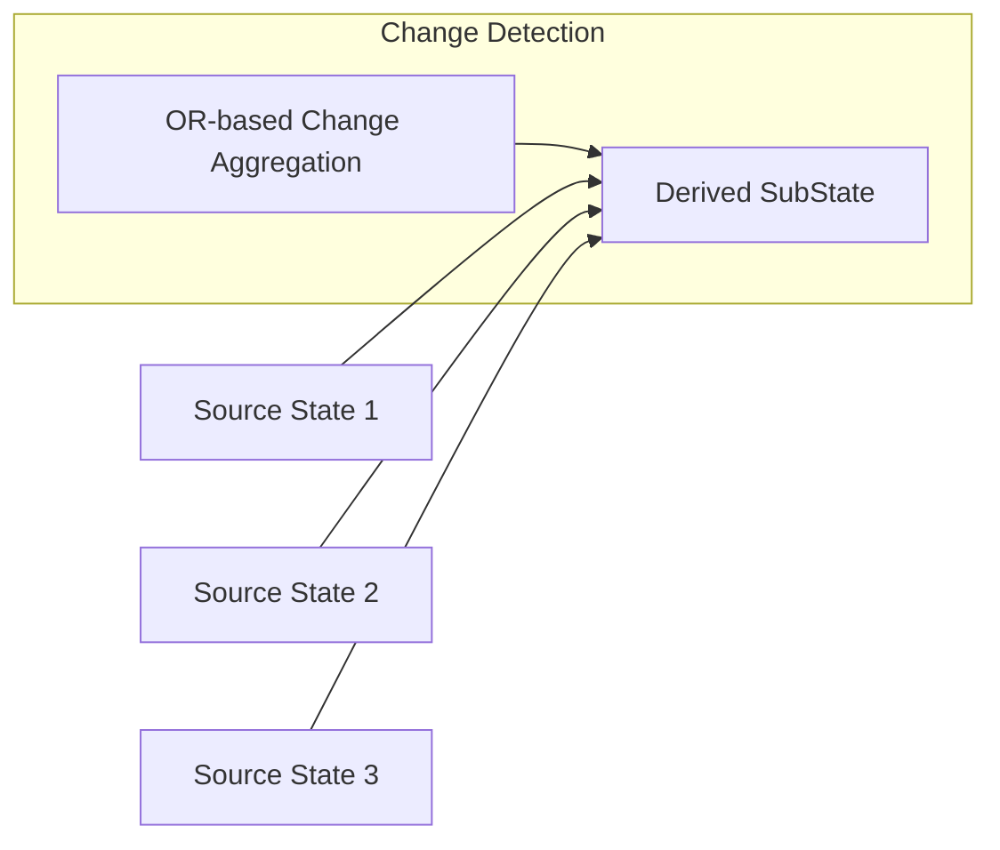

+++
title = "#19595"
date = "2025-06-16T00:00:00"
draft = false
template = "pull_request_page.html"
in_search_index = true

[taxonomies]
list_display = ["show"]

[extra]
current_language = "en"
available_languages = {"en" = { name = "English", url = "/pull_request/bevy/2025-06/pr-19595-en-20250616" }, "zh-cn" = { name = "中文", url = "/pull_request/bevy/2025-06/pr-19595-zh-cn-20250616" }}
+++

## Fixing SubState Reactions to Multiple Source Changes

### The Problem and Context
In Bevy's state management system, `SubStates` can depend on one or more source states. Before this fix, a critical bug existed when a `SubState` depended on multiple source states: it would only react when *all* source states changed simultaneously. This violated the expected behavior where any source state transition should trigger re-evaluation of dependent states. 

The issue stemmed from incorrect logic in the event reader handling. The original implementation used a logical AND (`&&`) to check if parent states changed, meaning all source states had to change to trigger the `SubState` update. This created a subtle bug where `SubStates` wouldn't activate when only one source state transitioned, breaking expected state management patterns.

### The Solution Approach
The core fix was straightforward but impactful: change the boolean logic from AND to OR when checking for source state changes. This ensures that if *any* source state transitions, the `SubState` will properly re-evaluate its existence. 

The author implemented this by modifying the state transition macro to generate `||` (OR) operations instead of `&&` (AND) when checking event readers. This aligns with the fundamental requirement that SubStates should react to individual source state changes.

### The Implementation
The key modification occurred in the state_set macro where the parent state change detection logic was corrected:

```rust
// File: crates/bevy_state/src/state/state_set.rs
// Before:
let parent_changed = ($($evt.read().last().is_some())&&*);

// After:
let parent_changed = ($($evt.read().last().is_some())||*);
```

This single-character change from `&&` to `||` fundamentally fixed the reactivity issue. The macro now correctly aggregates change detection across multiple sources using OR logic.

To validate the fix, the author added comprehensive tests covering both `ComputedStates` and `SubStates` with multiple sources:

```rust
// New test for ComputedStates
#[test]
fn computed_state_with_multiple_sources_should_react_to_any_source_change() {
    // Test setup...
    // Verifies state reacts to individual source changes
}

// New test for SubStates
#[test]
fn sub_state_with_multiple_sources_should_react_to_any_source_change() {
    // Test setup...
    // Confirms state activates when any source meets conditions
}
```

These tests simulate various transition scenarios:
1. Changing only the first source state
2. Changing only the second source state
3. Changing both simultaneously
4. Reverting to states that should remove the computed state

Each test validates that the `SubState` appears/disappears correctly when any individual source changes, not just when all change together.

### Technical Insights
The fix demonstrates an important principle in state dependency management: derived states should use union-based (OR) change detection rather than intersection-based (AND) when tracking multiple sources. This maintains proper reactivity in state graphs.

The implementation leverages Rust's macro system to generate efficient change detection code. The generated closure handles any number of source states dynamically:

```rust
let parent_changed = (ereader0.read().last().is_some()
    || ereader1.read().last().is_some()
    || ereader2.read().last().is_some());
```

This approach maintains Bevy's ECS performance characteristics while fixing the logical error. The macro-generated code ensures no runtime overhead for unused state dependencies.

### The Impact
This fix resolves a significant behavioral bug in Bevy's state management where:
1. SubStates would remain inactive when only one source state changed
2. State transitions could be missed in multi-source dependency graphs
3. Complex state machines could enter invalid configurations

The solution maintains backward compatibility while making the state system behave as documented. Developers can now reliably create SubStates that depend on multiple sources without unexpected behavior.

## Visual Representation



## Key Files Changed

1. **crates/bevy_state/src/state/mod.rs** (+197/-0)
   - Added comprehensive tests for multi-source SubStates
   - Implemented test state machines covering edge cases
   - Validated both ComputedStates and SubStates behaviors

```rust
// Key test implementation
#[test]
fn sub_state_with_multiple_sources_should_react_to_any_source_change() {
    // ... test setup ...
    // Verify initial state
    assert!(!world.contains_resource::<State<MultiSourceSubState>>());
    
    // Change only first source
    world.insert_resource(NextState::Pending(SimpleState::B(true)));
    world.run_schedule(StateTransition);
    assert!(world.contains_resource::<State<MultiSourceSubState>>());
    
    // Change only second source
    world.insert_resource(NextState::Pending(SimpleState2::B2));
    world.run_schedule(StateTransition);
    assert!(world.contains_resource::<State<MultiSourceSubState>>());
}
```

2. **crates/bevy_state/src/state/state_set.rs** (+1/-1)
   - Fixed the state transition logic
   - Changed AND to OR in parent change detection

```rust
// Before:
let parent_changed = ($($evt.read().last().is_some())&&*);

// After:
let parent_changed = ($($evt.read().last().is_some())||*);
```

## Further Reading
1. [Bevy States Documentation](https://docs.rs/bevy_ecs/latest/bevy_ecs/schedule/state/index.html)
2. [State Transition Events RFC](https://github.com/bevyengine/rfcs/blob/main/rfcs/45-state-rework.md)
3. [Computed States Example](https://github.com/bevyengine/bevy/blob/main/examples/ecs/state.rs)