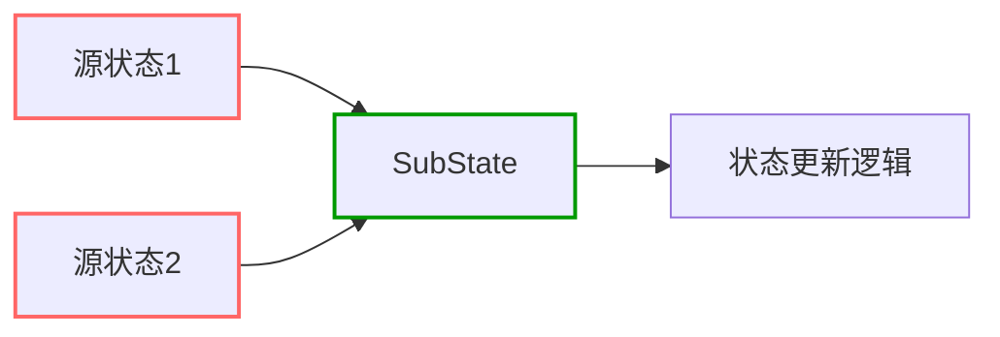

+++
title = "#19595 Fix SubStates with multiple source states not reacting to all source changes"
date = "2025-06-16T00:00:00"
draft = false
template = "pull_request_page.html"
in_search_index = false

[extra]
current_language = "zh-cn"
available_languages = {"en" = { name = "English", url = "/pull_request/bevy/2025-06/pr-19595-en-20250616" }, "zh-cn" = { name = "中文", url = "/pull_request/bevy/2025-06/pr-19595-zh-cn-20250616" }}
labels = ["C-Bug", "D-Straightforward", "A-States"]
+++

# Fix SubStates with multiple source states not reacting to all source changes

## Basic Information
- **Title**: Fix SubStates with multiple source states not reacting to all source changes
- **PR Link**: https://github.com/bevyengine/bevy/pull/19595
- **Author**: mgi388
- **Status**: MERGED
- **Labels**: C-Bug, S-Ready-For-Final-Review, D-Straightforward, A-States
- **Created**: 2025-06-12T12:12:24Z
- **Merged**: 2025-06-16T21:54:43Z
- **Merged By**: alice-i-cecile

## Description Translation
### 目标
- 修复当 `SubStates` 依赖多个源状态时，仅在*所有*源状态同时改变时才响应的问题
- SubStates 应在*任意*源状态发生变化时创建/销毁，而非仅当所有状态同时改变时才响应

### 解决方案
- 将"父状态是否改变"的检测逻辑从 AND 改为 OR。我们需要检查*任意*事件读取器是否改变，而非检查*所有*是否改变
- 修复前的失败测试证明：https://github.com/bevyengine/bevy/actions/runs/15610159742/job/43968937544?pr=19595
- 生成的代码需要 `||` 而非 `&&`：

```rust
fn register_sub_state_systems_in_schedule<T: SubStates<SourceStates = Self>>(schedule: &mut Schedule) {
  let apply_state_transition = |(mut ereader0, mut ereader1, mut ereader2): (
      EventReader<StateTransitionEvent<S0::RawState>>,
      EventReader<StateTransitionEvent<S1::RawState>>,
      EventReader<StateTransitionEvent<S2::RawState>>,
  ),
      event: EventWriter<StateTransitionEvent<T>>,
      commands: Commands,
      current_state_res: Option<ResMut<State<T>>>,
      next_state_res: Option<ResMut<NextState<T>>>,
      (s0, s1, s2): (
          Option<Res<State<S0::RawState>>>,
          Option<Res<State<S1::RawState>>>,
          Option<Res<State<S2::RawState>>>,
  )| {
    // 使用 `||` 可正确检测任意源状态变化
    let parent_changed = (ereader0.read().last().is_some()
        || ereader1.read().last().is_some()
        || ereader2.read().last().is_some());
    let next_state = take_next_state(next_state_res);
    if !parent_changed && next_state.is_none() {
        return;
    }
    // ...
  }
}
```

### 测试
- 添加新测试
- 在游戏中验证修复效果

## The Story of This Pull Request

### 问题背景
在 Bevy 的状态管理系统中，`SubStates` 是依赖其他状态（源状态）的派生状态。当实现依赖多个源状态的 `SubStates` 时，存在一个关键缺陷：派生状态仅在*所有*源状态同时变化时才更新。这与预期行为不符——正确逻辑应是*任意*源状态变化都应触发派生状态的重新计算。

该缺陷源于状态变更检测逻辑的实现方式。原代码使用逻辑与(AND)操作判断源状态变化：
```rust
let parent_changed = ($($evt.read().last().is_some())&&*);
```
这意味着仅当所有源状态事件读取器都检测到新事件时，才会标记父状态变化。对于依赖多个源状态的场景，这导致派生状态无法响应单个源状态的独立变化。

### 解决方案
核心修复方案直接明了：将检测逻辑从 AND 改为 OR 操作：
```rust
let parent_changed = ($($evt.read().last().is_some())||*);
```
现在只要任意源状态事件读取器检测到变化（`last().is_some()` 返回 `true`），`parent_changed` 即被标记为 `true`，触发派生状态的重新计算。

这种修改符合状态机的预期行为：
1. 当任意源状态变化时，重新评估派生状态的存在性
2. 派生状态根据最新源状态值创建/销毁
3. 确保状态依赖关系保持同步

### 实现验证
为验证修复效果，PR 添加了两个关键测试：

**1. 多源计算状态测试 (`computed_state_with_multiple_sources_should_react_to_any_source_change`)**
```rust
// 测试场景：
// 1. 初始状态：SimpleState::A, SimpleState2::A1 → 无派生状态
// 2. 仅改变 SimpleState → 派生状态应创建
world.insert_resource(NextState::Pending(SimpleState::B(true)));
// 3. 仅改变 SimpleState2 → 派生状态应创建
world.insert_resource(NextState::Pending(SimpleState2::B2));
// 4. 同时改变两个状态 → 派生状态应更新
world.insert_resource(NextState::Pending(SimpleState::B(true)));
world.insert_resource(NextState::Pending(SimpleState2::A1));
```

**2. 多源子状态测试 (`sub_state_with_multiple_sources_should_react_to_any_source_change`)**
```rust
// 测试场景：
// 1. 初始状态：SimpleState::A, SimpleState2::A1 → 无子状态
// 2. 仅改变 SimpleState → 子状态应创建
// 3. 仅改变 SimpleState2 → 子状态应创建
// 4. 同时改变两个状态 → 子状态应创建
// 5. 状态回退 → 子状态应销毁
```
这些测试系统验证了：
- 单个源状态变化能正确触发派生状态
- 多个源状态同时变化时行为正确
- 状态回退时派生状态正确销毁

### 影响分析
此修复对状态管理系统有重要影响：
1. **行为修正**：使多源派生状态的行为符合设计预期
2. **系统可靠性**：消除状态不同步的潜在风险
3. **API一致性**：确保 `SubStates` 和 `ComputedStates` 在多源场景下行为一致
4. **复杂状态机**：支持更精细的状态依赖关系建模

## Visual Representation



## Key Files Changed

### crates/bevy_state/src/state/mod.rs
**变更描述**：添加两个测试用例验证多源状态行为  
**关键代码**：
```rust
// 测试1：多源计算状态
#[test]
fn computed_state_with_multiple_sources_should_react_to_any_source_change() {
    // 测试场景设置
    // 验证单个状态变化触发派生状态
    world.insert_resource(NextState::Pending(SimpleState::B(true)));
    world.run_schedule(StateTransition);
    assert!(world.contains_resource::<State<MultiSourceComputedState>>());

    // 验证另一个状态变化触发派生状态
    world.insert_resource(NextState::Pending(SimpleState2::B2));
    world.run_schedule(StateTransition);
    assert!(world.contains_resource::<State<MultiSourceComputedState>>());
}

// 测试2：多源子状态
#[test]
fn sub_state_with_multiple_sources_should_react_to_any_source_change() {
    // 类似测试逻辑
    // 验证子状态对单个源状态变化的响应
}
```

### crates/bevy_state/src/state/state_set.rs
**变更描述**：修复状态变化检测逻辑  
**变更对比**：
```rust
// 修复前：
let parent_changed = ($($evt.read().last().is_some())&&*);

// 修复后：
let parent_changed = ($($evt.read().last().is_some())||*);
```
**影响**：此单字符变更(`&&` → `||`)是修复的核心，确保任意源状态变化都能被检测到

## Further Reading
1. [Bevy States 官方文档](https://docs.rs/bevy/latest/bevy/ecs/schedule/state/index.html)
2. [状态机设计模式](https://en.wikipedia.org/wiki/State_pattern)
3. [Rust 枚举状态机实现](https://hoverbear.org/blog/rust-state-machine-pattern/)