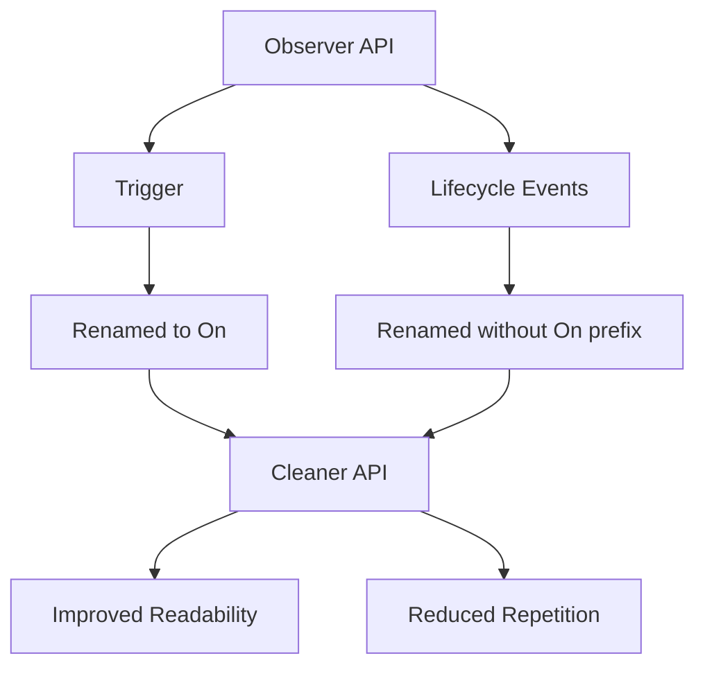

+++
title = "#19596 Rename `Trigger` to `On`"
date = "2025-06-12T00:00:00"
draft = false
template = "pull_request_page.html"
in_search_index = true

[taxonomies]
list_display = ["show"]

[extra]
current_language = "en"
available_languages = {"en" = { name = "English", url = "/pull_request/bevy/2025-06/pr-19596-en-20250612" }}
labels = ["A-ECS", "C-Usability", "X-Blessed", "D-Straightforward"]
+++

# Pull Request Analysis: Rename `Trigger` to `On`

## Basic Information
- **Title**: Rename `Trigger` to `On`
- **PR Link**: https://github.com/bevyengine/bevy/pull/19596
- **Author**: Jondolf
- **Status**: MERGED
- **Labels**: A-ECS, C-Usability, S-Ready-For-Final-Review, M-Needs-Migration-Guide, M-Needs-Release-Note, X-Blessed, D-Straightforward
- **Created**: 2025-06-12T14:00:48Z
- **Merged**: 2025-06-12T18:41:05Z
- **Merged By**: alice-i-cecile

## Description Translation
**Objective**

The observer API had ergonomic issues:
```rust
app.add_observer(|trigger: Trigger<Explode>| {
    info!("Entity {} exploded!", trigger.target());
});
```

Future plans for multi-event observers would create repetitive syntax:
```rust
trigger: Trigger<(
    OnAdd<Pressed>,
    OnRemove<Pressed>,
    OnAdd<InteractionDisabled>,
    OnRemove<InteractionDisabled>,
    OnInsert<Hovered>,
)>,
```

By renaming `Trigger` to `On` and simplifying event names:
```rust
app.add_observer(|trigger: On<Explode>| {
    info!("Entity {} exploded!", trigger.target());
});
```

```rust
trigger: On<(
    Add<Pressed>,
    Remove<Pressed>,
    Add<InteractionDisabled>,
    Remove<InteractionDisabled>,
    Insert<Hovered>,
)>,
```

This improves readability and reduces repetition. The change:
- Better conveys the event-listener relationship
- Frees up `Trigger` for potential future use
- Aligns with `bevy_eventlistener`'s `On` naming

**Solution**
- Rename `Trigger` to `On`
- Rename `OnAdd` to `Add`
- Rename `OnInsert` to `Insert`
- Rename `OnReplace` to `Replace`
- Rename `OnRemove` to `Remove`
- Rename `OnDespawn` to `Despawn`

**Discussion**
**Naming Conflicts**: Using `Add` might conflict with `core::ops::Add`, but:
- Rarely needed in ECS contexts
- Easy to disambiguate with `ops::Add`
- Zero conflicts found in Bevy's own codebase

**Documentation**: Documentation becomes slightly more awkward when referring to `On` or its methods, but overall remains acceptable. Some phrasing adjustments were made in the PR.

## The Story of This Pull Request

### The Problem and Context
The observer API suffered from verbosity and redundancy, particularly noticeable in UI contexts where observers are frequently used. The original `Trigger<OnAdd<T>>` pattern created visual clutter due to the duplicated `On` prefix across multiple event types. This became especially problematic with multi-event observers, where the repetition of `On` made declarations harder to read and maintain.

The naming also created conceptual ambiguity - `Trigger` implied an action rather than a container for event data, while the `OnX` prefixes were redundant with the `Trigger` context. These issues were expected to compound as observer usage increased in high-traffic areas like UI systems.

### The Solution Approach
The solution centered on renaming the core types to improve clarity and conciseness. The `Trigger` type became `On`, better reflecting its role as a container for event information ("On an event"). The lifecycle event types (`OnAdd`, `OnInsert`, etc.) were simplified by removing the `On` prefix (`Add`, `Insert`, etc.), eliminating repetitive syntax.

The primary alternative considered was using past tense names (`Added` instead of `Add`), but this conflicted with existing query filters (`Added<T>`) and didn't match the present-tense convention of observer events. The chosen approach maintained consistency while maximizing readability improvements.

### The Implementation
The changes were implemented through systematic renaming across the codebase:
1. `Trigger` → `On` in type definitions and usage
2. `OnX` event types → `X` (e.g., `OnAdd` → `Add`)
3. Updated associated constants (`ON_ADD` → `ADD`)
4. Added deprecation aliases for backward compatibility

Key implementation details:
- Preserved all existing functionality while improving names
- Maintained observer behavior and propagation mechanics
- Added deprecation aliases to ease migration:
  ```rust
  #[deprecated(since = "0.17.0", note = "Renamed to `Add`.")]
  pub type OnAdd = Add;
  ```
- Updated 62 files across the codebase with consistent changes

### Technical Insights
The changes required careful handling of potential naming conflicts, particularly with `Add` overlapping with `core::ops::Add`. The solution leverages Rust's namespace resolution - since `Add` is a struct while the trait is `ops::Add`, compiler errors would clearly indicate the source of any conflicts. Real-world testing showed no conflicts within Bevy itself.

The PR also addressed documentation challenges. References to "sending a Trigger" became "sending an observer Event", which more accurately reflects the underlying mechanics. The documentation updates focused on clarity while preserving technical accuracy.

### The Impact
These changes significantly improve API ergonomics:
- Reduced syntactic noise in observer declarations
- More intuitive naming that better conveys the relationship between events and observers
- Cleaner multi-event observer syntax
- Maintained full backward compatibility through deprecation aliases
- Sets the stage for potential future expansion of the `Trigger` name

The changes affect multiple subsystems but are mechanically straightforward, primarily involving systematic renaming. The migration path is clear, with deprecation warnings guiding users to the new naming conventions.

## Visual Representation



## Key Files Changed

1. `crates/bevy_ecs/src/observer/mod.rs` (+137/-159)
   - Core observer implementation updated with new naming
   - Before:
     ```rust
     pub struct Trigger<'w, E, B: Bundle = ()> { ... }
     impl<'w, E, B: Bundle> Trigger<'w, E, B> { ... }
     ```
   - After:
     ```rust
     pub struct On<'w, E, B: Bundle = ()> { ... }
     impl<'w, E, B: Bundle> On<'w, E, B> { ... }
     ```

2. `crates/bevy_ecs/src/lifecycle.rs` (+53/-28)
   - Lifecycle events renamed and aliased
   - Before:
     ```rust
     pub struct OnAdd;
     pub const ON_ADD: ComponentId = ...;
     ```
   - After:
     ```rust
     pub struct Add;
     pub const ADD: ComponentId = ...;
     #[deprecated(since = "0.17.0", note = "Renamed to `Add`.")]
     pub type OnAdd = Add;
     ```

3. `crates/bevy_ecs/src/world/entity_ref.rs` (+25/-29)
   - World methods updated to use new event names
   - Before:
     ```rust
     deferred_world.trigger_observers(ON_DESPAWN, ...);
     ```
   - After:
     ```rust
     deferred_world.trigger_observers(DESPAWN, ...);
     ```

4. `crates/bevy_ecs/src/observer/runner.rs` (+17/-18)
   - Observer runner updated for new type name
   - Before:
     ```rust
     fn observer_system_runner<E: Event, B: Bundle, S: ObserverSystem<E, B>>(
         trigger: Trigger<E, B>,
         ...
     ```
   - After:
     ```rust
     fn observer_system_runner<E: Event, B: Bundle, S: ObserverSystem<E, B>>(
         trigger: On<E, B>,
         ...
     ```

5. `examples/ui/scroll.rs` (+19/-16)
   - Example updated to demonstrate new API
   - Before:
     ```rust
     .observe(|trigger: Trigger<Pointer<Press>>, ...| { ... })
     ```
   - After:
     ```rust
     .observe(|trigger: On<Pointer<Press>>, ...| { ... })
     ```

## Further Reading
- [Observer API Documentation](https://docs.rs/bevy_ecs/latest/bevy_ecs/observer/index.html)
- [Lifecycle Events Documentation](https://docs.rs/bevy_ecs/latest/bevy_ecs/lifecycle/index.html)
- [Migration Guide: Observer Triggers](https://bevyengine.org/learn/migration-guides/0.16-0.17/#observer-triggers)