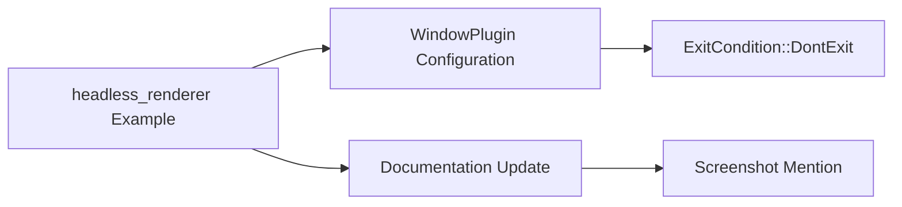

+++
title = "#19598 Fix `headless_renderer` example and mention `Screenshot`."
date = "2025-06-12T00:00:00"
draft = false
template = "pull_request_page.html"
in_search_index = true

[taxonomies]
list_display = ["show"]

[extra]
current_language = "en"
available_languages = {"en" = { name = "English", url = "/pull_request/bevy/2025-06/pr-19598-en-20250612" }, "zh-cn" = { name = "中文", url = "/pull_request/bevy/2025-06/pr-19598-zh-cn-20250612" }}
labels = ["D-Trivial", "A-Rendering", "C-Examples"]
+++

# Fix `headless_renderer` example and mention `Screenshot`

## Basic Information
- **Title**: Fix `headless_renderer` example and mention `Screenshot`.
- **PR Link**: https://github.com/bevyengine/bevy/pull/19598
- **Author**: kpreid
- **Status**: MERGED
- **Labels**: D-Trivial, A-Rendering, C-Examples, S-Ready-For-Final-Review
- **Created**: 2025-06-12T17:50:38Z
- **Merged**: 2025-06-12T20:31:04Z
- **Merged By**: alice-i-cecile

## Description Translation
### Objective

- Makes `headless_renderer` example work instead of exiting without effect.
- Guides users who actually just need [`Screenshot`](https://docs.rs/bevy/0.16.1/bevy/render/view/window/screenshot/struct.Screenshot.html) to use that instead.

This PR was inspired by my own efforts to do headless rendering, in which the complexity of the `headless_renderer` example was a distraction, and this comment from https://github.com/bevyengine/bevy/issues/12478#issuecomment-2094925039 :

> The example added in https://github.com/bevyengine/bevy/pull/13006 would benefit from this change: be sure to clean it up when tackling this work :)

That "cleanup" was not done, and I thought to do it, but it seems to me that using `Screenshot` (in its current form) in the example would not be correct, because - if I understand correctly - the example is trying to, potentially, capture many *consecutive* frames, whereas `Screenshot` by itself gives no means to capture multiple frames without gaps or duplicates. But perhaps I am wrong (the code is complex and not clearly documented), or perhaps that feature isn't worth preserving. In that case, let me know and I will revise this PR.

### Solution

- Added `exit_condition: bevy::window::ExitCondition::DontExit`
- Added a link to `Screenshot` in the crate documentation.

### Testing

- Ran the example and confirmed that it now writes an image file and then exits.

## The Story of This Pull Request

The `headless_renderer` example had a fundamental issue: it was exiting immediately after starting due to Bevy's default behavior of terminating when no windows exist. This made the example non-functional as a demonstration of headless rendering. The problem stemmed from how Bevy's window management works - by default, if no windows are present, the application automatically exits.

To solve this, the developer identified the need to override the default exit behavior. The solution involved configuring the `WindowPlugin` to use `ExitCondition::DontExit`, which prevents automatic termination when no windows are present. This change allows the example's custom rendering pipeline to execute fully:

```rust
.set(WindowPlugin {
    primary_window: None,
    // Don't automatically exit due to having no windows
    exit_condition: bevy::window::ExitCondition::DontExit,
    ..default()
})
```

The comment added clearly explains the relationship between this configuration change and the explicit `AppExit` event that triggers later in the example's logic.

Additionally, the developer recognized that users might be using this complex example unnecessarily when they only need single-frame capture functionality. To guide users toward a simpler solution, they added documentation pointing to Bevy's built-in `Screenshot` functionality:

```rust
//! If your goal is to capture a single "screenshot" as opposed to every single rendered frame
//! without gaps, it is simpler to use [`bevy::render::view::window::screenshot::Screenshot`]
//! than this approach.
```

This documentation improvement helps users make informed decisions about which approach best fits their needs, potentially saving them from unnecessary complexity. The implementation maintains the example's original capability for multi-frame capture while clearly indicating when a simpler alternative exists.

The testing approach was straightforward but effective: running the example and verifying it now correctly writes an image file before exiting. This practical validation confirmed both the functional fix and the preservation of the example's core behavior.

## Visual Representation



## Key Files Changed

### `examples/app/headless_renderer.rs`
This file contains the headless rendering example. The changes fix its execution flow and improve documentation.

**Documentation improvements:**
```rust
// Before:
//! This example illustrates how to make headless renderer
//! derived from: <https://sotrh.github.io/learn-wgpu/showcase/windowless/#a-triangle-without-a-window>
//! It follows this steps:

// After:
//! This example illustrates how to make a headless renderer.
//! Derived from: <https://sotrh.github.io/learn-wgpu/showcase/windowless/#a-triangle-without-a-window>
//! It follows these steps:
//!
//! [steps unchanged]
//!
//! If your goal is to capture a single "screenshot" as opposed to every single rendered frame
//! without gaps, it is simpler to use [`bevy::render::view::window::screenshot::Screenshot`]
//! than this approach.
```

**Configuration fix:**
```rust
// Before:
.set(WindowPlugin {
    primary_window: None,
    ..default()
})

// After:
.set(WindowPlugin {
    primary_window: None,
    // Don't automatically exit due to having no windows
    exit_condition: bevy::window::ExitCondition::DontExit,
    ..default()
})
```

## Further Reading
1. [Bevy Screenshot Documentation](https://docs.rs/bevy/0.16.1/bevy/render/view/window/screenshot/struct.Screenshot.html)
2. [Original headless rendering example inspiration](https://sotrh.github.io/learn-wgpu/showcase/windowless/#a-triangle-without-a-window)
3. [Bevy Window Management](https://github.com/bevyengine/bevy/blob/main/crates/bevy_window/src/window.rs)