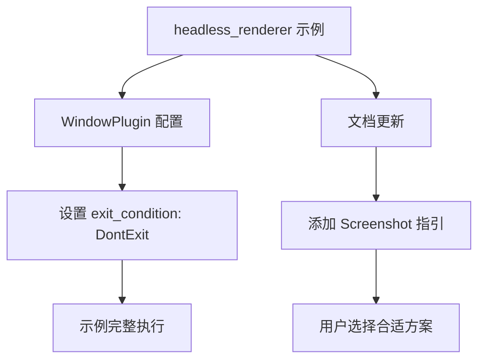

+++
title = "#19598 Fix `headless_renderer` example and mention `Screenshot`."
date = "2025-06-12T00:00:00"
draft = false
template = "pull_request_page.html"
in_search_index = false

[extra]
current_language = "zh-cn"
available_languages = {"en" = { name = "English", url = "/pull_request/bevy/2025-06/pr-19598-en-20250612" }, "zh-cn" = { name = "中文", url = "/pull_request/bevy/2025-06/pr-19598-zh-cn-20250612" }}
labels = ["D-Trivial", "A-Rendering", "C-Examples"]
+++

# Fix `headless_renderer` example and mention `Screenshot`

## Basic Information
- **Title**: Fix `headless_renderer` example and mention `Screenshot`.
- **PR Link**: https://github.com/bevyengine/bevy/pull/19598
- **Author**: kpreid
- **Status**: MERGED
- **Labels**: D-Trivial, A-Rendering, C-Examples, S-Ready-For-Final-Review
- **Created**: 2025-06-12T17:50:38Z
- **Merged**: 2025-06-12T20:31:04Z
- **Merged By**: alice-i-cecile

## Description Translation
## 目标

- 使 `headless_renderer` 示例正常工作，而不是无效果地退出。
- 引导实际只需要 [`Screenshot`](https://docs.rs/bevy/0.16.1/bevy/render/view/window/screenshot/struct.Screenshot.html) 的用户使用该功能。

这个 PR 的灵感来源于我自己进行无头渲染( headless rendering)时的尝试，其中 `headless_renderer` 示例的复杂性分散了我的注意力，以及来自 https://github.com/bevyengine/bevy/issues/12478#issuecomment-2094925039 的评论：

> The example added in https://github.com/bevyengine/bevy/pull/13006 would benefit from this change: be sure to clean it up when tackling this work :)

那个"清理"工作当时没有完成，我本想去做，但在我看来，在示例中使用 `Screenshot`（在它当前的形式下）是不正确的，因为——如果我理解正确的话——该示例试图（潜在地）捕获多个连续的帧，而 `Screenshot` 本身并没有提供在无间隔或无重复的情况下捕获多帧的方法。但也许我错了（代码复杂且没有清晰的文档），或者也许那个功能不值得保留。如果是那样的话，请告诉我，我会修改这个 PR。

## 解决方案

- 添加了 `exit_condition: bevy::window::ExitCondition::DontExit`
- 在 crate 文档中添加了一个指向 `Screenshot` 的链接。

## 测试

- 运行了该示例并确认它现在会写入一个图像文件然后退出。

## The Story of This Pull Request

### 问题背景与根源
`headless_renderer` 示例用于演示 Bevy 如何在无窗口环境下渲染图像，这对于服务器端渲染或自动化测试等场景很重要。但该示例存在一个关键问题：运行时它会立即退出而不生成任何输出文件。根本原因在于 Bevy 的默认窗口处理逻辑——当没有活动窗口时，应用程序会自动退出。

同时，用户反馈表明该示例的复杂性（涉及多步渲染管线）对于那些只需要捕获单张截图的用户来说是过度的。Bevy 已有更简单的 [`Screenshot`](https://docs.rs/bevy/0.16.1/bevy/render/view/window/screenshot/struct.Screenshot.html) 功能，但文档中未提及此替代方案。

### 解决方案与实施
修复的核心是修改窗口插件的退出行为。通过设置 `exit_condition: bevy::window::ExitCondition::DontExit`，我们阻止了应用在没有窗口时自动退出：

```rust
.set(WindowPlugin {
    primary_window: None,
    // Don’t automatically exit due to having no windows.
    // Instead, the code in `update()` will explicitly produce an `AppExit` event.
    exit_condition: bevy::window::ExitCondition::DontExit,
    ..default()
})
```

这个改动让示例能完整执行渲染管线：渲染到 GPU 图像 → 复制到缓冲区 → 保存到文件 → 显式触发退出。

同时，在文档中添加了关于 `Screenshot` 的指引，帮助用户选择适合需求的方案：

```rust
//! If your goal is to capture a single “screenshot” as opposed to every single rendered frame
//! without gaps, it is simpler to use [`bevy::render::view::window::screenshot::Screenshot`]
//! than this approach.
```

### 技术权衡
作者考虑了用 `Screenshot` 重构整个示例，但保留了现有实现，因为：
1. 该示例演示了连续帧捕获能力（虽然当前未完全实现）
2. `Screenshot` 主要用于单帧捕获，不适合连续场景
3. 修改退出条件是最小且安全的修复方案

### 影响与验证
修复后：
1. 示例成功生成图像文件并正常退出
2. 用户能根据文档选择适合自己需求的方案
3. 保留了示例展示高级渲染管线的价值

测试通过实际运行示例并确认文件生成：
```bash
cargo run --example headless_renderer
# 确认生成类似 frame_1707336871.png 的文件
```

## Visual Representation



## Key Files Changed

### `examples/app/headless_renderer.rs` (+11/-3)

**修改目的**：修复示例立即退出的问题，并添加替代方案指引

**关键修改点**：
1. 文档更新：添加关于 `Screenshot` 的说明
```diff
 //! 5. Exit if `single_image` setting is set
+//!
+//! If your goal is to capture a single “screenshot” as opposed to every single rendered frame
+//! without gaps, it is simpler to use [`bevy::render::view::window::screenshot::Screenshot`]
+//! than this approach.
```

2. 设置窗口插件不自动退出
```diff
 .set(WindowPlugin {
     primary_window: None,
+    // Don’t automatically exit due to having no windows.
+    // Instead, the code in `update()` will explicitly produce an `AppExit` event.
+    exit_condition: bevy::window::ExitCondition::DontExit,
     ..default()
 })
```

## Further Reading
1. [Bevy Screenshot API 文档](https://docs.rs/bevy/0.16.1/bevy/render/view/window/screenshot/struct.Screenshot.html)
2. [原始无头渲染教程](https://sotrh.github.io/learn-wgpu/showcase/windowless/#a-triangle-without-a-window)
3. [Bevy 窗口管理源码](https://github.com/bevyengine/bevy/blob/main/crates/bevy_window/src/window.rs)

## Full Code Diff
```diff
diff --git a/examples/app/headless_renderer.rs b/examples/app/headless_renderer.rs
index 2b6b23b706f78..2038c85a29ab7 100644
--- a/examples/app/headless_renderer.rs
+++ b/examples/app/headless_renderer.rs
@@ -1,11 +1,16 @@
-//! This example illustrates how to make headless renderer
-//! derived from: <https://sotrh.github.io/learn-wgpu/showcase/windowless/#a-triangle-without-a-window>
-//! It follows this steps:
+//! This example illustrates how to make a headless renderer.
+//! Derived from: <https://sotrh.github.io/learn-wgpu/showcase/windowless/#a-triangle-without-a-window>
+//! It follows these steps:
+//!
 //! 1. Render from camera to gpu-image render target
 //! 2. Copy from gpu image to buffer using `ImageCopyDriver` node in `RenderGraph`
 //! 3. Copy from buffer to channel using `receive_image_from_buffer` after `RenderSystems::Render`
 //! 4. Save from channel to random named file using `scene::update` at `PostUpdate` in `MainWorld`
 //! 5. Exit if `single_image` setting is set
+//!
+//! If your goal is to capture a single “screenshot” as opposed to every single rendered frame
+//! without gaps, it is simpler to use [`bevy::render::view::window::screenshot::Screenshot`]
+//! than this approach.
 
 use bevy::{
     app::{AppExit, ScheduleRunnerPlugin},
@@ -86,6 +91,9 @@ fn main() {
                 // replaces the bevy_winit app runner and so a window is never created.
                 .set(WindowPlugin {
                     primary_window: None,
+                    // Don’t automatically exit due to having no windows.
+                    // Instead, the code in `update()` will explicitly produce an `AppExit` event.
+                    exit_condition: bevy::window::ExitCondition::DontExit,
                     ..default()
                 })
                 // WinitPlugin will panic in environments without a display server.
```