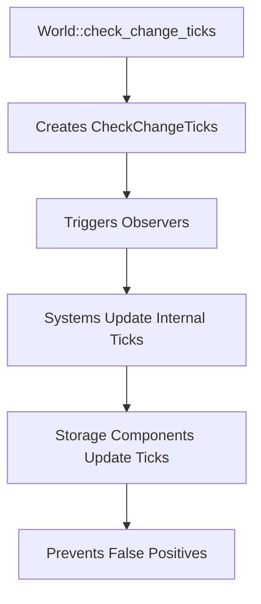

+++
title = "#19600 `System::check_change_tick` and similar methods take `CheckChangeTicks`"
date = "2025-06-13T00:00:00"
draft = false
template = "pull_request_page.html"
in_search_index = true

[taxonomies]
list_display = ["show"]

[extra]
current_language = "en"
available_languages = {"en" = { name = "English", url = "/pull_request/bevy/2025-06/pr-19600-en-20250613" }, "zh-cn" = { name = "中文", url = "/pull_request/bevy/2025-06/pr-19600-zh-cn-20250613" }}
labels = ["A-ECS", "C-Code-Quality", "C-Usability", "D-Straightforward"]
+++

# System::check_change_tick and similar methods take CheckChangeTicks

## Basic Information
- **Title**: `System::check_change_tick` and similar methods take `CheckChangeTicks`
- **PR Link**: https://github.com/bevyengine/bevy/pull/19600
- **Author**: urben1680
- **Status**: MERGED
- **Labels**: A-ECS, C-Code-Quality, C-Usability, S-Ready-For-Final-Review, X-Uncontroversial, D-Straightforward
- **Created**: 2025-06-12T18:50:15Z
- **Merged**: 2025-06-13T19:44:31Z
- **Merged By**: alice-i-cecile

## Description
Follow-up of #19274.

Make the `check_change_tick` methods, of which some are now public, take `CheckChangeTicks` to make it obvious where this tick comes from, see other PR.

This also affects the `System` trait, hence the many changed files.

## The Story of This Pull Request

### The Problem and Context
Change detection in Bevy's ECS relies on tracking ticks to identify modified components. Previously, methods like `System::check_change_tick` took a raw `Tick` parameter. This made it unclear where the tick should originate from, potentially leading to incorrect usage. The tick passed to these methods must be the current world tick to ensure accurate change detection calculations.

This became more relevant after #19274 made some of these methods public. Without clear context about the tick's origin, developers might pass arbitrary ticks, compromising change detection reliability. The core issue was insufficient type safety and documentation around tick parameters.

### The Solution Approach
The solution introduces a newtype wrapper `CheckChangeTicks` to encapsulate the current world tick. This wrapper is now passed instead of raw ticks to:
1. Clearly indicate the tick's origin (the world's current state)
2. Provide a single access point (`present_tick()`) for the underlying tick
3. Improve API self-documentation

The implementation required updating all change tick checking methods to accept `CheckChangeTicks` instead of `Tick`. This change propagates through multiple layers including systems, schedules, and storage components.

### The Implementation
The key changes involve:

1. Modifying `Tick::check_tick` to accept `CheckChangeTicks`:
```rust
// Before:
pub fn check_tick(&mut self, tick: Tick) -> bool {
    let age = tick.relative_to(*self);
    // ...
}

// After:
pub fn check_tick(&mut self, check: CheckChangeTicks) -> bool {
    let age = check.present_tick().relative_to(*self);
    // ...
}
```

2. Updating the `System` trait to use `CheckChangeTicks`:
```rust
pub trait System {
    // Before:
    fn check_change_tick(&mut self, change_tick: Tick);
    
    // After:
    fn check_change_tick(&mut self, check: CheckChangeTicks);
}
```

3. Enhancing `World::check_change_ticks` to return the check event:
```rust
// Before:
pub fn check_change_ticks(&mut self) {
    // ...
    self.trigger(CheckChangeTicks(change_tick));
}

// After:
pub fn check_change_ticks(&mut self) -> Option<CheckChangeTicks> {
    // ...
    let check = CheckChangeTicks(change_tick);
    self.trigger(check);
    Some(check)
}
```

These changes propagate through all systems and storage layers (tables, sparse sets, resources) ensuring consistent handling of change ticks. The migration guide demonstrates how to use the new pattern in custom systems.

### Technical Insights
The `CheckChangeTicks` type acts as a semantic marker ensuring:
- Only current world ticks are used for change detection
- Clear API contracts for public methods
- Better observer integration through event triggering

The change avoids potential misuse where developers might pass stale or incorrect ticks. By returning `Option<CheckChangeTicks>` from `World::check_change_ticks`, we enable chaining and explicit handling of when checks occur.

### The Impact
These changes improve:
1. **Code Safety**: Prevents incorrect tick passing through type enforcement
2. **API Clarity**: Makes parameter purpose explicit in method signatures
3. **Extensibility**: Enables better observer patterns with `CheckChangeTicks` events
4. **Consistency**: Standardizes tick handling across all ECS layers

Developers implementing custom systems now have clear guidance on proper change tick handling through the migration guide and type system.

## Visual Representation



## Key Files Changed

### `crates/bevy_ecs/src/component.rs`
- Renamed `CheckChangeTicks::get()` to `present_tick()` for clarity
- Updated `Tick::check_tick` to take `CheckChangeTicks`
```rust
// Before:
pub fn check_tick(&mut self, tick: Tick) -> bool {
    let age = tick.relative_to(*self);
    // ...
}

// After:
pub fn check_tick(&mut self, check: CheckChangeTicks) -> bool {
    let age = check.present_tick().relative_to(*self);
    // ...
}
```

### `crates/bevy_ecs/src/world/mod.rs`
- Modified `check_change_ticks` to return `Option<CheckChangeTicks>`
- Added event triggering and flushing
```rust
// Before:
pub fn check_change_ticks(&mut self) {
    // ...
    self.trigger(CheckChangeTicks(change_tick));
}

// After:
pub fn check_change_ticks(&mut self) -> Option<CheckChangeTicks> {
    // ...
    let check = CheckChangeTicks(change_tick);
    self.trigger(check);
    Some(check)
}
```

### `crates/bevy_ecs/src/schedule/schedule.rs`
- Updated `check_change_ticks` parameter to `CheckChangeTicks`
```rust
// Before:
pub fn check_change_ticks(&mut self, change_tick: Tick) {
    system.check_change_tick(change_tick);
}

// After:
pub fn check_change_ticks(&mut self, check: CheckChangeTicks) {
    system.check_change_tick(check);
}
```

### `crates/bevy_ecs/src/system/combinator.rs`
- Updated system combinators to pass `CheckChangeTicks`
```rust
// Before:
fn check_change_tick(&mut self, change_tick: Tick) {
    self.a.check_change_tick(change_tick);
}

// After:
fn check_change_tick(&mut self, check: CheckChangeTicks) {
    self.a.check_change_tick(check);
}
```

### `release-content/migration-guides/check_change_ticks.md`
- Added migration guide with usage example
```markdown
---
title: `CheckChangeTicks` parameter in `System::check_change_tick`
pull_requests: [19274, 19600]
---

`System::check_change_tick` took a `Tick` parameter... now takes `CheckChangeTicks`...

Example:
```rs
world.add_observer(|check: On<CheckChangeTicks>, mut schedule: ResMut<CustomSchedule>| {
    schedule.0.check_change_ticks(*check);
});
```
```

## Further Reading
1. [Bevy Change Detection Documentation](https://bevyengine.org/learn/book/change-detection/)
2. [Type Safety in Rust APIs](https://rust-lang.github.io/api-guidelines/type-safety.html)
3. Original PR #19274: Making change tick methods public