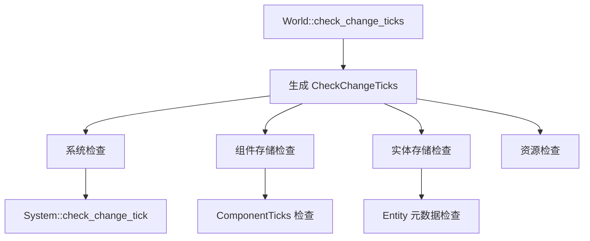

+++
title = "#19600 System::check_change_tick` and similar methods take `CheckChangeTicks"
date = "2025-06-13T00:00:00"
draft = false
template = "pull_request_page.html"
in_search_index = false

[extra]
current_language = "zh-cn"
available_languages = {"en" = { name = "English", url = "/pull_request/bevy/2025-06/pr-19600-en-20250613" }, "zh-cn" = { name = "中文", url = "/pull_request/bevy/2025-06/pr-19600-zh-cn-20250613" }}
+++

# `System::check_change_tick` 及相关方法现在接受 `CheckChangeTicks`

## 基础信息
- **标题**: `System::check_change_tick` and similar methods take `CheckChangeTicks`
- **PR 链接**: https://github.com/bevyengine/bevy/pull/19600
- **作者**: urben1680
- **状态**: 已合并
- **标签**: A-ECS, C-Code-Quality, C-Usability, S-Ready-For-Final-Review, X-Uncontroversial, D-Straightforward
- **创建时间**: 2025-06-12T18:50:15Z
- **合并时间**: 2025-06-13T19:44:31Z
- **合并人**: alice-i-cecile

## 描述翻译
#19274 的后续工作。

使 `check_change_tick` 方法（其中一些现在是公开的）接受 `CheckChangeTicks`，以明确这个 tick 的来源，详见其他 PR。

这也影响了 `System` trait，因此涉及多个文件更改。

## 这个 Pull Request 的故事

### 问题和背景
在 Bevy 的 ECS 实现中，变更检测机制依赖于跟踪组件修改的时间点（tick）。为了防止 tick 值溢出导致误判（错误地将旧变更识别为新变更），系统需要定期检查并重置过旧的 tick。在 PR #19274 中，部分 `check_change_tick` 方法被公开，但它们的参数类型是裸的 `Tick`，这导致两个问题：

1. 参数来源不明确：开发者在调用 `check_change_tick` 时，不清楚应该传递什么 tick 值
2. 意图不清晰：方法签名没有明确表达参数代表的是"当前检查时刻"的 tick

### 解决方案
核心方案是引入 `CheckChangeTicks` 类型作为检查操作的显式标记：

```rust
#[derive(Debug, Clone, Copy, Event)]
pub struct CheckChangeTicks(pub(crate) Tick);
```

这个类型包装了原来的 `Tick` 值，但通过类型名称清晰表达了其用途——它代表用于检查其他 tick 的基准 tick。同时添加了更清晰的访问方法：

```rust
impl CheckChangeTicks {
    pub fn present_tick(self) -> Tick {
        self.0
    }
}
```

### 实现细节
所有接受 tick 进行检查的方法签名都统一修改为接受 `CheckChangeTicks` 类型：

```rust
// 修改前:
pub fn check_tick(&mut self, tick: Tick) -> bool

// 修改后:
pub fn check_tick(&mut self, check: CheckChangeTicks) -> bool
```

在方法内部，通过 `present_tick()` 获取实际 tick 值：

```rust
let age = check.present_tick().relative_to(*self);
```

这种模式贯穿整个变更检测系统：
1. `World::check_change_ticks()` 现在返回 `Option<CheckChangeTicks>`
2. 所有系统（`System` trait 实现）的 `check_change_tick` 方法都改为接受 `CheckChangeTicks`
3. 存储层（tables/sparse sets/resources）的检查方法也相应更新

### 技术考量
这个修改实现了几个关键改进：
1. **类型安全**：`CheckChangeTicks` 作为新类型防止了错误传递普通 `Tick`
2. **清晰意图**：方法签名明确表达了参数是用于检查操作的基准 tick
3. **扩展性**：如果需要添加额外检查元数据，可在新类型中扩展
4. **一致性**：所有变更检查接口统一使用相同参数类型

### 影响
这个 PR 带来了以下具体改进：
1. **更好的 API 清晰度**：开发者更容易理解如何正确使用检查方法
2. **减少错误**：显式类型降低了传递错误 tick 值的风险
3. **文档友好**：方法签名自身就传达了更多信息
4. **为观察者模式铺路**：`CheckChangeTicks` 可作为事件触发观察者

## 可视化表示



## 关键文件变更

### 1. `crates/bevy_ecs/src/component.rs` (+7/-7)
**变更说明**：定义了 `CheckChangeTicks` 类型并修改了 tick 检查方法的签名

```rust
// 修改前:
pub fn check_tick(&mut self, tick: Tick) -> bool {
    let age = tick.relative_to(*self);
    // ...
}

// 修改后:
pub fn check_tick(&mut self, check: CheckChangeTicks) -> bool {
    let age = check.present_tick().relative_to(*self);
    // ...
}

// 新增方法:
impl CheckChangeTicks {
    pub fn present_tick(self) -> Tick {
        self.0
    }
}
```

### 2. `crates/bevy_ecs/src/world/mod.rs` (+18/-11)
**变更说明**：修改了世界级检查方法，使其返回 `CheckChangeTicks`

```rust
// 修改前:
pub fn check_change_ticks(&mut self) {
    // ...
    tables.check_change_ticks(change_tick);
    // ...
}

// 修改后:
pub fn check_change_ticks(&mut self) -> Option<CheckChangeTicks> {
    // ...
    let check = CheckChangeTicks(change_tick);
    tables.check_change_ticks(check);
    // ...
    Some(check)
}
```

### 3. `crates/bevy_ecs/src/schedule/schedule.rs` (+8/-7)
**变更说明**：更新了调度器检查系统 tick 的方法

```rust
// 修改前:
pub fn check_change_ticks(&mut self, change_tick: Tick) {
    system.check_change_tick(change_tick);
}

// 修改后:
pub fn check_change_ticks(&mut self, check: CheckChangeTicks) {
    system.check_change_tick(check);
}
```

### 4. `crates/bevy_ecs/src/system/system.rs` (+7/-7)
**变更说明**：修改了系统 trait 的检查方法签名

```rust
// 修改前:
fn check_change_tick(&mut self, change_tick: Tick);

// 修改后:
fn check_change_tick(&mut self, check: CheckChangeTicks);
```

### 5. `release-content/migration-guides/check_change_ticks.md` (+25/-0)
**变更说明**：添加了迁移指南，说明如何使用新 API

```markdown
---
title: `CheckChangeTicks` parameter in `System::check_change_tick`
---

`System::check_change_tick` 现在接受 `CheckChangeTicks` 类型参数。
如果需要手动调用这些方法，可以通过观察者获取：

```rust
world.add_observer(|check: On<CheckChangeTicks>, mut schedule: ResMut<CustomSchedule>| {
    schedule.0.check_change_ticks(*check);
});
```

`World::check_change_ticks` 现在返回 `Option<CheckChangeTicks>`。
```

## 延伸阅读
1. [Bevy 变更检测文档](https://docs.rs/bevy_ecs/latest/bevy_ecs/change_detection/index.html)
2. [Newtype 模式在 Rust 中的应用](https://doc.rust-lang.org/rust-by-example/generics/new_types.html)
3. [类型系统在 API 设计中的作用](https://www.infoq.com/articles/type-systems-api-design/)