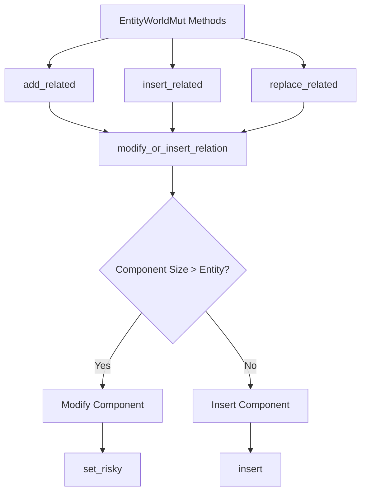

+++
title = "#19601 `EntityWorldMut` methods do not automatically overwrite `Relationship` components"
date = "2025-06-22T00:00:00"
draft = false
template = "pull_request_page.html"
in_search_index = true

[taxonomies]
list_display = ["show"]

[extra]
current_language = "en"
available_languages = {"en" = { name = "English", url = "/pull_request/bevy/2025-06/pr-19601-en-20250622" }, "zh-cn" = { name = "中文", url = "/pull_request/bevy/2025-06/pr-19601-zh-cn-20250622" }}
labels = ["C-Bug", "A-ECS"]
+++

# EntityWorldMut methods do not automatically overwrite Relationship components

## Basic Information
- **Title**: `EntityWorldMut` methods do not automatically overwrite `Relationship` components
- **PR Link**: https://github.com/bevyengine/bevy/pull/19601
- **Author**: urben1680
- **Status**: MERGED
- **Labels**: C-Bug, A-ECS, S-Ready-For-Final-Review, M-Needs-Migration-Guide
- **Created**: 2025-06-12T20:33:41Z
- **Merged**: 2025-06-22T00:41:49Z
- **Merged By**: alice-i-cecile

## Description Translation
# Objective

Some methods and commands carelessly overwrite `Relationship` components. This may overwrite additional data stored at them which is undesired.

Part of #19589

## Solution

A new private method will be used instead of insert: `modify_or_insert_relation_with_relationship_hook_mode`.

This method behaves different to `insert` if `Relationship` is a larger type than `Entity` and already contains this component. It will then use the `modify_component` API and a new `Relationship::set_risky` method to set the related entity, keeping all other data untouched.

For the `replace_related`(`_with_difference`) methods this also required a `InsertHookMode` parameter for efficient modifications of multiple children. The changes here are limited to the non-public methods.

I would appreciate feedback if this is all good.

# Testing

Added tests of all methods that previously could reset `Relationship` data.

## The Story of This Pull Request

The PR addresses a subtle bug in Bevy's ECS relationship handling. Several methods in `EntityWorldMut` were overwriting entire `Relationship` components when updating entity relationships. This was problematic because `Relationship` components might contain additional data beyond the basic entity reference. The overwrite operation would reset this extra data to default values, potentially causing unexpected behavior.

The core issue stemmed from the use of `insert` operations to update relationships. When a component already exists, `insert` replaces it entirely. This is acceptable for simple relationship types like `Child(Entity)`, but becomes problematic for more complex relationship components that contain additional fields. For example:

```rust
#[derive(Component)]
#[relationship(relationship_target = CarOwner)]
struct OwnedCar {
    #[relationship]
    owner: Entity,
    first_owner: Option<Entity>, // Extra data field
}
```

In this case, calling `add_related` would overwrite the entire `OwnedCar` component, resetting `first_owner` to its default value.

The solution introduces a new method `modify_or_insert_relation_with_relationship_hook_mode` that handles relationship updates more intelligently. When a relationship component already exists and is larger than a basic `Entity` reference, it uses a new `Relationship::set_risky` method to update only the target entity field while preserving other data. The implementation checks the component size to determine whether to modify or replace:

```rust
if size_of::<R>() > size_of::<Entity>() {
    // Use modify_component to preserve existing data
    world.modify_component_with_relationship_hook_mode::<R, _>(
        this,
        relationship_hook_mode,
        |r| r.set_risky(entity),
    )
} else {
    // Regular insert for simple components
    self.insert_with_relationship_hook_mode(R::from(entity), relationship_hook_mode)
}
```

The `set_risky` method was added to the `Relationship` trait to enable targeted updates of the relationship entity without affecting other component data. This method includes warnings about proper usage since manual relationship modifications can break consistency if not handled correctly.

The changes required modifications to several relationship-handling methods (`add_related`, `insert_related`, `replace_related`, etc.), which now use the new update logic. The PR also adds comprehensive tests that verify additional data in relationship components is preserved during operations.

## Visual Representation



## Key Files Changed

### crates/bevy_ecs/src/relationship/related_methods.rs (+175/-10)
Added the core logic for preserving relationship data during updates. Implemented the `modify_or_insert_relation_with_relationship_hook_mode` method and updated relationship methods to use it.

Key changes:
```rust
// Before:
world.entity_mut(*related).insert(R::from(id));

// After:
world.entity_mut(*related).modify_or_insert_relation_with_relationship_hook_mode::<R>(
    id,
    RelationshipHookMode::Run,
);
```

Added tests that verify data preservation:
```rust
#[test]
fn add_related_keeps_relationship_data() {
    #[derive(Component, PartialEq, Debug)]
    #[relationship(relationship_target = Parent)]
    struct Child {
        #[relationship]
        parent: Entity,
        data: u8,
    }
    // ... test implementation ...
}
```

### release-content/migration-guides/relationship_set_risky.md (+41/-0)
Added migration guide explaining the new `set_risky` method and its implications.

Key content:
```markdown
The trait `Relationship` received a new method, `set_risky`. It is used to alter the entity ID of the entity that contains its `RelationshipTarget` counterpart.
This is needed to leave [other data you can store in these components](https://docs.rs/bevy/latest/bevy/ecs/relationship/trait.Relationship.html#derive)
unchanged at operations that reassign the relationship target...
```

### crates/bevy_ecs/src/world/deferred_world.rs (+17/-10)
Extended the component modification API to support relationship hook modes.

Key change:
```rust
pub(crate) fn modify_component_with_relationship_hook_mode<T: Component, R>(
    &mut self,
    entity: Entity,
    relationship_hook_mode: RelationshipHookMode,
    f: impl FnOnce(&mut T) -> R,
) -> Result<Option<R>, EntityMutableFetchError> {
    // ...
}
```

### crates/bevy_ecs/src/relationship/mod.rs (+14/-0)
Added the `set_risky` method to the `Relationship` trait and implemented it in the derive macro.

Key addition:
```rust
pub trait Relationship: Component + Sized {
    // ...
    fn set_risky(&mut self, entity: Entity);
}
```

### crates/bevy_ecs/src/world/mod.rs (+11/-2)
Updated world methods to use the new relationship hook mode parameter.

Key change:
```rust
// Before:
world.modify_component(entity, f)

// After:
world.modify_component_with_relationship_hook_mode(
    entity,
    RelationshipHookMode::Run,
    f,
)
```

## Further Reading
1. [Bevy Relationships Documentation](https://docs.rs/bevy/latest/bevy/ecs/relationship/trait.Relationship.html)
2. [Component Hooks in Bevy ECS](https://bevyengine.org/learn/book/next/ecs/component-hooks/)
3. [Entity Component System Architecture Patterns](https://www.gamedeveloper.com/programming/entity-component-system-architecture)