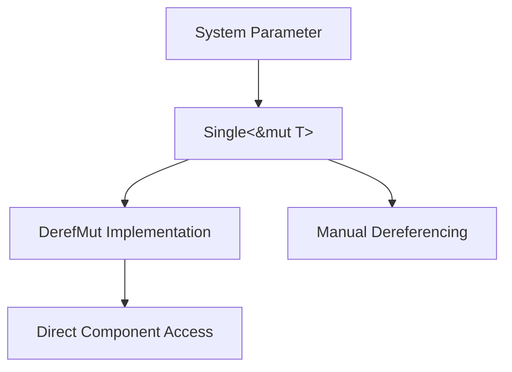

+++
title = "#19603 Add example to `Single` docs (#19461)"
date = "2025-06-13T00:00:00"
draft = false
template = "pull_request_page.html"
in_search_index = true

[taxonomies]
list_display = ["show"]

[extra]
current_language = "en"
available_languages = {"en" = { name = "English", url = "/pull_request/bevy/2025-06/pr-19603-en-20250613" }, "zh-cn" = { name = "中文", url = "/pull_request/bevy/2025-06/pr-19603-zh-cn-20250613" }}
labels = ["C-Docs", "A-ECS", "D-Straightforward"]
+++

## Add example to `Single` docs (#19461)

### Basic Information
- **Title**: Add example to `Single` docs (#19461)
- **PR Link**: https://github.com/bevyengine/bevy/pull/19603
- **Author**: Joel-Singh
- **Status**: MERGED
- **Labels**: C-Docs, A-ECS, S-Ready-For-Final-Review, X-Uncontroversial, D-Straightforward
- **Created**: 2025-06-12T21:44:11Z
- **Merged**: 2025-06-13T01:06:10Z
- **Merged By**: alice-i-cecile

### Description
# Objective
- Add example to `Single` docs, highlighting that you can use methods and properties directly.
- Fixes #19461

## Solution
- Added example to inline docs of `Single`

## Testing
- `cargo test --doc`
- `cargo doc --open`

### The Story of This Pull Request
The `Single` struct in Bevy's ECS module is a system parameter wrapper that enforces exactly one matching entity for a query. While its basic functionality was documented, users needed clearer guidance on practical usage patterns. The absence of examples made it non-obvious that `Single` implements `Deref` and `DerefMut`, enabling direct access to component data without explicit dereferencing calls.

To address this, the PR adds a self-contained example showing typical `Single` usage. The solution demonstrates:
1. Component declaration with a `health` field
2. System implementation using `Single<&mut Boss>` as a parameter
3. Direct field access via `boss.health` without manual dereferencing
4. Explicit documentation of the auto-dereferencing behavior

The implementation directly modifies the `Single` struct's doc comments. The example shows a complete workflow from component definition to system implementation, making the documentation immediately actionable. The added note explicitly calls out the `Deref`/`DerefMut` implementations and alternative access methods, covering both implicit and explicit usage patterns.

This change improves API discoverability and reduces cognitive load for developers working with singleton entities. By showing direct field access in context, it eliminates potential boilerplate and clarifies `Single`'s role as a convenience wrapper. The change is localized to documentation and doesn't affect runtime behavior, but significantly enhances developer experience.

### Visual Representation


### Key Files Changed
**File**: `crates/bevy_ecs/src/system/query.rs`

**Changes**: Added documentation example showing practical usage of `Single` with component access patterns.

**Code Before**:
```rust
/// See [`Query`] for more details.
///
/// [System parameter]: crate::system::SystemParam
pub struct Single<'w, D: QueryData, F: QueryFilter = ()> {
    pub(crate) item: D::Item<'w>,
    pub(crate) _filter: PhantomData<F>,
}
```

**Code After**:
```rust
/// See [`Query`] for more details.
///
/// [System parameter]: crate::system::SystemParam
///
/// # Example
/// ```
/// # use bevy_ecs::prelude::*;
/// #[derive(Component)]
/// struct Boss {
///    health: f32
/// };
///
/// fn hurt_boss(mut boss: Single<&mut Boss>) {
///    boss.health -= 4.0;
/// }
/// ```
/// Note that because [`Single`] implements [`Deref`] and [`DerefMut`], methods and fields like `health` can be accessed directly.
/// You can also access the underlying data manually, by calling `.deref`/`.deref_mut`, or by using the `*` operator.
pub struct Single<'w, D: QueryData, F: QueryFilter = ()> {
    pub(crate) item: D::Item<'w>,
    pub(crate) _filter: PhantomData<F>,
}
```

### Further Reading
1. [Rust Deref trait documentation](https://doc.rust-lang.org/std/ops/trait.Deref.html)
2. [Bevy ECS System Parameters](https://docs.rs/bevy_ecs/latest/bevy_ecs/system/trait.SystemParam.html)
3. [Bevy Singleton Pattern Discussion](https://github.com/bevyengine/bevy/discussions/19461)