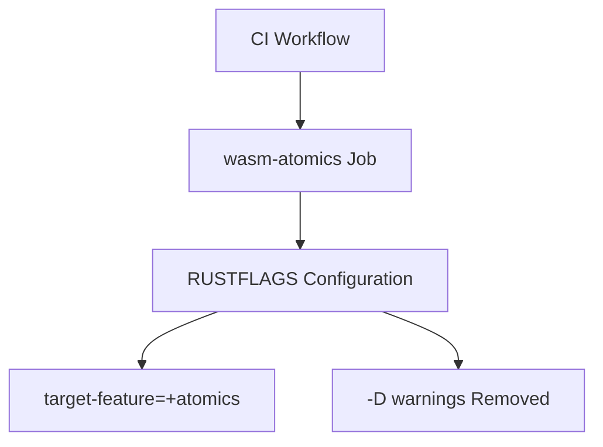

+++
title = "#19604 don't deny warnings on wasm-atomics CI job"
date = "2025-06-13T00:00:00"
draft = false
template = "pull_request_page.html"
in_search_index = false

[extra]
current_language = "zh-cn"
available_languages = {"zh-cn" = { name = "中文", url = "/pull_request/bevy/2025-06/pr-19604-zh-cn-20250613" }}
+++

# 技术分析报告：PR #19604 - don't deny warnings on wasm-atomics CI job

## 基本信息
- **标题**: don't deny warnings on wasm-atomics CI job
- **PR 链接**: https://github.com/bevyengine/bevy/pull/19604
- **作者**: mockersf
- **状态**: 已合并
- **标签**: D-Trivial, A-Build-System, P-High, C-Usability, S-Ready-For-Final-Review
- **创建时间**: 2025-06-12T21:51:54Z
- **合并时间**: 2025-06-12T23:51:48Z
- **合并者**: alice-i-cecile

## 描述翻译
### 目标 (Objective)
- CI 作业检查 wasm atomics 时因 nightly Rust 上无关的 lint 而失败
- 修复 #19573

### 解决方案 (Solution)
- 不要拒绝 (deny) 警告，这本来就不是该作业要检查的内容

## PR 分析

### 问题背景
在 Bevy 引擎的 CI 流水线中，存在一个专门验证 WebAssembly (wasm) 原子操作支持的作业。该作业配置为使用 Rust 的 nightly 版本构建，并设置了 `-D warnings` 标志，这会将所有编译警告视为错误 (treat warnings as errors)。近期由于 nightly 工具链引入了新的 lint 检查，导致该作业因无关的警告而失败 (#19573)。核心问题在于：
1. 该作业的核心目标是验证 wasm 原子操作支持，而非代码质量检查
2. `-D warnings` 标志使任何新出现的 lint 警告都会中断构建
3. Nightly 工具链的不稳定性导致这类问题可能频繁发生

### 解决方案
修改 CI 配置，移除了 `RUSTFLAGS` 中的 `-D warnings` 选项：
```diff
- RUSTFLAGS: "-C target-feature=+atomics,+bulk-memory -D warnings"
+ RUSTFLAGS: "-C target-feature=+atomics,+bulk-memory"
```
这个改动：
1. 保留了核心功能：继续使用 `-C target-feature=+atomics,+bulk-memory` 验证 wasm 原子支持
2. 移除了次要约束：不再强制要求构建过程零警告
3. 使作业关注核心目标：wasm 原子操作支持检查

### 技术决策考量
1. **职责分离**：wasm 原子检查作业不应承担代码质量检查的责任
2. **Nightly 兼容性**：Nightly 工具链的特性变更不应阻塞核心功能验证
3. **维护成本**：避免因第三方工具链变更频繁调整 CI 配置
4. **错误信号明确**：作业失败应只反映原子操作支持问题，而非无关警告

### 影响分析
1. **CI 稳定性**：显著降低 wasm 原子检查作业的失败率
2. **开发体验**：减少因无关 lint 变化导致的主干 (main) 分支构建失败
3. **关注点分离**：保持 wasm 验证作业的专注性，不混入代码质量检查
4. **维护成本**：减少因 nightly 工具链变更所需的 CI 维护工作

## 关键文件变更

### `.github/workflows/ci.yml`
**变更描述**：移除了 wasm 原子检查作业中的 `-D warnings` 编译标志

**变更前**:
```yaml
RUSTFLAGS: "-C target-feature=+atomics,+bulk-memory -D warnings"
```

**变更后**:
```yaml
RUSTFLAGS: "-C target-feature=+atomics,+bulk-memory"
```

**关联性**：
- 直接解决 #19573 报告的 CI 失败问题
- 保持 wasm 原子操作的核心验证功能不变
- 避免因无关 lint 警告中断构建过程

## 组件关系图


## 延伸阅读
1. [Rust 编译标志文档](https://doc.rust-lang.org/rustc/command-line-arguments.html)
2. [WebAssembly 原子操作规范](https://github.com/WebAssembly/threads)
3. [GitHub Actions 工作流配置指南](https://docs.github.com/en/actions/using-workflows)
4. [Rust 的 nightly 与稳定版区别](https://doc.rust-lang.org/book/appendix-07-nightly-rust.html)