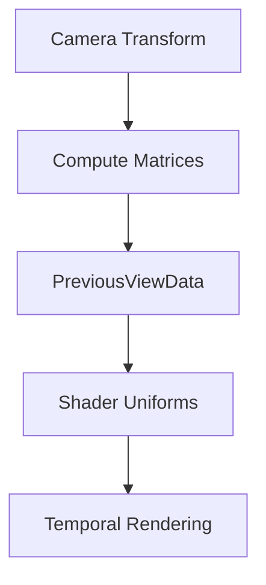

+++
title = "#19605 Add more PreviousViewData"
date = "2025-06-16T00:00:00"
draft = false
template = "pull_request_page.html"
in_search_index = true

[taxonomies]
list_display = ["show"]

[extra]
current_language = "en"
available_languages = {"en" = { name = "English", url = "/pull_request/bevy/2025-06/pr-19605-en-20250616" }, "zh-cn" = { name = "中文", url = "/pull_request/bevy/2025-06/pr-19605-zh-cn-20250616" }}
labels = ["A-Rendering", "C-Usability", "D-Straightforward"]
+++

### Technical Analysis: PR #19605 - Add more PreviousViewData

## Basic Information
- **Title**: Add more PreviousViewData
- **PR Link**: https://github.com/bevyengine/bevy/pull/19605
- **Author**: JMS55
- **Status**: MERGED
- **Labels**: A-Rendering, C-Usability, X-Uncontroversial, D-Straightforward, S-Needs-Review
- **Created**: 2025-06-13T00:16:48Z
- **Merged**: 2025-06-16T05:13:39Z
- **Merged By**: superdump

## Description Translation
Add some more matrices to PreviousViewData for future use with bevy_solari.

## The Story of This Pull Request

### The Problem and Context
Temporal rendering techniques like TAA (Temporal Anti-Aliasing) require access to camera matrices from both current and previous frames to calculate motion vectors. While Bevy's existing `PreviousViewData` struct provided basic view matrices, it lacked inverse transformations needed for efficient reconstruction of world-space positions from clip-space coordinates in shaders. This limitation required extra computation in shaders, particularly for temporal effects being developed in projects like bevy_solari.

### The Solution Approach
The solution adds two new matrices to `PreviousViewData`:
1. `world_from_clip` - Directly transforms clip-space coordinates to world-space
2. `view_from_clip` - Transforms clip-space coordinates to view-space

These matrices are computed once per frame on the CPU and passed to shaders, eliminating redundant inverse calculations in shader code. The implementation maintains consistency between CPU and GPU representations while avoiding breaking changes.

### The Implementation
The changes propagate through three layers:

1. **Struct definition** (core pipeline):
```rust
// Before:
pub struct PreviousViewData {
    pub view_from_world: Mat4,
    pub clip_from_world: Mat4,
    pub clip_from_view: Mat4,
}

// After:
pub struct PreviousViewData {
    pub view_from_world: Mat4,
    pub clip_from_world: Mat4,
    pub clip_from_view: Mat4,
    pub world_from_clip: Mat4,
    pub view_from_clip: Mat4,
}
```

2. **Matrix computation** (PBR module):
The update logic now calculates inverses once and reuses them:
```rust
let world_from_view = camera_transform.compute_matrix();
let view_from_world = world_from_view.inverse();
let view_from_clip = camera.clip_from_view().inverse();

commands.entity(entity).try_insert(PreviousViewData {
    // Existing matrices
    world_from_clip: world_from_view * view_from_clip,
    view_from_clip,
});
```

3. **Shader integration**:
The WGSL struct mirrors the Rust changes:
```wgsl
struct PreviousViewUniforms {
    view_from_world: mat4x4<f32>,
    clip_from_world: mat4x4<f32>,
    clip_from_view: mat4x4<f32>,
    world_from_clip: mat4x4<f32>,  // New
    view_from_clip: mat4x4<f32>,   // New
}
```

### Technical Insights
Key implementation details:
1. **Matrix composition**: `world_from_clip` is efficiently computed as `world_from_view * view_from_clip` instead of inverting `clip_from_world`
2. **Frame coherence**: The same calculation appears in both `update_previous_view_data` (active camera) and `prepare_previous_view_uniforms` (shadow camera)
3. **Backwards compatibility**: Existing matrices remain unchanged, maintaining compatibility with existing shaders

### The Impact
These changes:
1. Reduce shader complexity by precomputing clip-space inverses
2. Improve performance for temporal techniques by eliminating per-frame matrix inversions in shaders
3. Enable more efficient screen-space reprojection in bevy_solari
4. Maintain API consistency with minimal surface area changes

## Visual Representation



## Key Files Changed

1. `crates/bevy_core_pipeline/src/prepass/mod.rs` (+12/-2)
```rust
// Before:
#[derive(Component, ShaderType, Clone)]
pub struct PreviousViewData {
    pub view_from_world: Mat4,
    pub clip_from_world: Mat4,
    pub clip_from_view: Mat4,
}

// After:
#[derive(Component, ShaderType, Clone)]
pub struct PreviousViewData {
    pub view_from_world: Mat4,
    pub clip_from_world: Mat4,
    pub clip_from_view: Mat4,
    pub world_from_clip: Mat4,  // Added
    pub view_from_clip: Mat4,   // Added
}
```

2. `crates/bevy_pbr/src/prepass/mod.rs` (+12/-2)
```rust
// Update logic:
let world_from_view = camera_transform.compute_matrix();
let view_from_world = world_from_view.inverse();
let view_from_clip = camera.clip_from_view().inverse();  // New inverse

commands.entity(entity).try_insert(PreviousViewData {
    view_from_world,
    clip_from_world: camera.clip_from_view() * view_from_world,
    clip_from_view: camera.clip_from_view(),
    world_from_clip: world_from_view * view_from_clip,  // New
    view_from_clip,  // New
});
```

3. `crates/bevy_pbr/src/prepass/prepass_bindings.wgsl` (+2/-0)
```wgsl
struct PreviousViewUniforms {
    view_from_world: mat4x4<f32>,
    clip_from_world: mat4x4<f32>,
    clip_from_view: mat4x4<f32>,
    world_from_clip: mat4x4<f32>,  // Added
    view_from_clip: mat4x4<f32>,   // Added
}
```

## Further Reading
1. [Temporal Anti-Aliasing Techniques](https://en.wikipedia.org/wiki/Temporal_anti-aliasing)
2. [Clip Space Transformations](https://www.scratchapixel.com/lessons/3d-basic-rendering/perspective-and-orthographic-projection-matrix/opengl-perspective-projection-matrix.html)
3. [Bevy Rendering Architecture](https://bevyengine.org/learn/book/getting-started/rendering/)