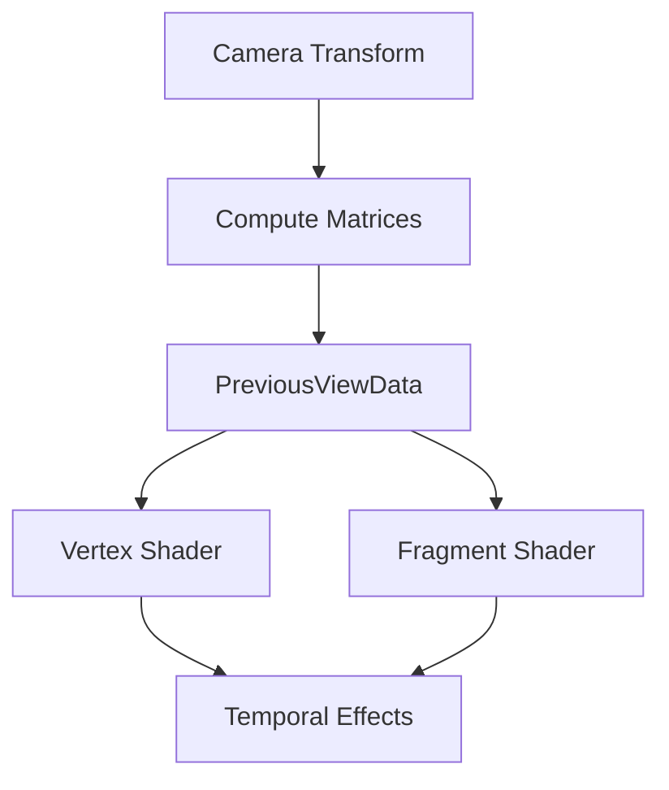

+++
title = "#19605 Add more PreviousViewData"
date = "2025-06-16T00:00:00"
draft = false
template = "pull_request_page.html"
in_search_index = false

[extra]
current_language = "zh-cn"
available_languages = {"en" = { name = "English", url = "/pull_request/bevy/2025-06/pr-19605-en-20250616" }, "zh-cn" = { name = "中文", url = "/pull_request/bevy/2025-06/pr-19605-zh-cn-20250616" }}
labels = ["A-Rendering", "C-Usability", "D-Straightforward"]
+++

# Add more PreviousViewData

## Basic Information
- **Title**: Add more PreviousViewData
- **PR Link**: https://github.com/bevyengine/bevy/pull/19605
- **Author**: JMS55
- **Status**: MERGED
- **Labels**: A-Rendering, C-Usability, X-Uncontroversial, D-Straightforward, S-Needs-Review
- **Created**: 2025-06-13T00:16:48Z
- **Merged**: 2025-06-16T05:13:39Z
- **Merged By**: superdump

## Description Translation
Add some more matrices to PreviousViewData for future use with bevy_solari.

## The Story of This Pull Request

### 问题背景
在Bevy引擎的渲染管线中，`PreviousViewData`结构体存储前一帧的视图矩阵数据，主要用于时间性渲染技术(temporal rendering techniques)。现有实现只包含`view_from_world`、`clip_from_world`和`clip_from_view`三个矩阵，但对于某些高级时间性特效（如TAA或运动模糊），需要额外的变换矩阵来提高计算效率和精度。

具体来说，开发者在实现`bevy_solari`（一个开发中的时间性渲染功能）时发现，缺少`world_from_clip`和`view_from_clip`这两个逆变换矩阵会导致：
1. 需要在shader中进行额外的矩阵求逆运算
2. 增加GPU计算开销
3. 可能引入数值精度问题

### 解决方案
PR通过扩展`PreviousViewData`结构体直接提供这两个预计算的逆矩阵。技术选择基于：
1. CPU端矩阵求逆成本远低于GPU端
2. 保持数据结构的一致性
3. 避免shader中的冗余计算

实现时确保所有矩阵的计算保持一致性：
```rust
let world_from_view = camera_transform.compute_matrix();
let view_from_world = world_from_view.inverse();
let view_from_clip = camera.clip_from_view().inverse();
```
新增字段通过矩阵乘法推导：
```rust
world_from_clip: world_from_view * view_from_clip
```

### 实现细节
修改涉及三个关键文件：
1. 在`bevy_core_pipeline`中扩展结构体定义
2. 在`bevy_pbr`中更新矩阵计算逻辑
3. 在WGSL shader中同步结构体定义

核心计算逻辑在`update_previous_view_data`和`prepare_previous_view_uniforms`两个系统中实现。使用`world_from_view * view_from_clip`而不是直接求逆`clip_from_world`，因为：
1. 复用已有中间变量更高效
2. 保持数值稳定性
3. 与现有计算流程一致

### 技术影响
1. **性能提升**：减少shader中的矩阵求逆操作
2. **功能扩展**：为时间性渲染提供完整矩阵集
3. **API一致性**：保持CPU-GPU数据结构对齐
4. **未来扩展性**：为`bevy_solari`等高级特效奠定基础

潜在注意事项：
- 增加152字节/摄像机的内存占用（2个mat4）
- 增加少量CPU矩阵乘法开销
- 需确保所有使用PreviousViewData的shader同步更新

## Visual Representation



## Key Files Changed

### crates/bevy_core_pipeline/src/prepass/mod.rs (+5/-0)
扩展PreviousViewData结构体定义，增加两个新矩阵字段并添加文档说明。

```rust
// Before:
#[derive(Component, ShaderType, Clone)]
pub struct PreviousViewData {
    pub view_from_world: Mat4,
    pub clip_from_world: Mat4,
    pub clip_from_view: Mat4,
}

// After:
#[derive(Component, ShaderType, Clone)]
pub struct PreviousViewData {
    pub view_from_world: Mat4,
    pub clip_from_world: Mat4,
    pub clip_from_view: Mat4,
    pub world_from_clip: Mat4,      // 新增
    pub view_from_clip: Mat4,       // 新增
}
```

### crates/bevy_pbr/src/prepass/mod.rs (+12/-2)
在相机数据更新系统中增加新矩阵的计算逻辑。

```rust
// 修改后的矩阵计算逻辑：
let world_from_view = camera_transform.compute_matrix();
let view_from_world = world_from_view.inverse();
let view_from_clip = camera.clip_from_view().inverse();  // 新增计算

commands.entity(entity).try_insert(PreviousViewData {
    view_from_world,
    clip_from_world: camera.clip_from_view() * view_from_world,
    clip_from_view: camera.clip_from_view(),
    world_from_clip: world_from_view * view_from_clip,  // 新增
    view_from_clip,                                     // 新增
});
```

### crates/bevy_pbr/src/prepass/prepass_bindings.wgsl (+2/-0)
同步更新WGSL shader中的数据结构定义。

```wgsl
// 修改后:
struct PreviousViewUniforms {
    view_from_world: mat4x4<f32>,
    clip_from_world: mat4x4<f32>,
    clip_from_view: mat4x4<f32>,
    world_from_clip: mat4x4<f32>,  // 新增
    view_from_clip: mat4x4<f32>,   // 新增
}
```

## Further Reading
1. [Bevy Rendering Pipeline Overview](https://bevyengine.org/learn/book/rendering/pipeline/)
2. [WGSL Matrix Operations](https://www.w3.org/TR/WGSL/#matrix-expr)
3. [Temporal Anti-Aliasing Techniques](https://developer.nvidia.com/gpugems/gpugems3/part-iv-image-effects/chapter-27-motion-blur-post-processing-effect)
4. [3D Transformation Matrices](https://en.wikipedia.org/wiki/Transformation_matrix#Affine_transformations)