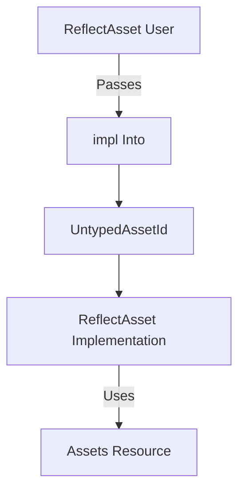

+++
title = "#19606 Replace `UntypedHandle` from ReflectAsset with `impl Into<UntypedAssetId>`."
date = "2025-06-15T00:00:00"
draft = false
template = "pull_request_page.html"
in_search_index = true

[taxonomies]
list_display = ["show"]

[extra]
current_language = "en"
available_languages = {"en" = { name = "English", url = "/pull_request/bevy/2025-06/pr-19606-en-20250615" }, "zh-cn" = { name = "中文", url = "/pull_request/bevy/2025-06/pr-19606-zh-cn-20250615" }}
labels = ["A-Assets", "C-Usability", "A-Reflection", "D-Straightforward"]
+++

## Replace `UntypedHandle` from ReflectAsset with `impl Into<UntypedAssetId>`

### Basic Information
- **Title**: Replace `UntypedHandle` from ReflectAsset with `impl Into<UntypedAssetId>`.
- **PR Link**: https://github.com/bevyengine/bevy/pull/19606
- **Author**: andriyDev
- **Status**: MERGED
- **Labels**: A-Assets, C-Usability, S-Ready-For-Final-Review, A-Reflection, M-Needs-Migration-Guide, X-Uncontroversial, D-Straightforward
- **Created**: 2025-06-13T00:20:07Z
- **Merged**: 2025-06-15T17:02:17Z
- **Merged By**: alice-i-cecile

### Description
# Objective

- A step towards #19024.
- Allow `ReflectAsset` to work with any `AssetId` not just `Handle`.
- `ReflectAsset::ids()` returns an iterator of `AssetId`s, but then there's no way to use these ids, since all the other APIs in `ReflectAsset` require a handle (and we don't have a reflect way to get the handle).

## Solution

- Replace the `UntypedHandle` argument in `ReflectAsset` methods with `impl Into<UntypedAssetId>`.
- This matches the regular asset API.
- This allows `ReflectAsset::ids()` to be more useful.

## Testing

- None.

---

## The Story of This Pull Request

### The Problem and Context
The `ReflectAsset` API had a usability gap where its `ids()` method returned `UntypedAssetId` values, but all other methods required `UntypedHandle` parameters. This made the IDs essentially unusable since there was no straightforward way to convert between asset IDs and handles within the reflection system. This limitation prevented developers from working directly with asset IDs obtained through reflection, forcing unnecessary conversions or workarounds.

The core issue stemmed from an inconsistency between the reflected asset API and Bevy's standard asset API. The regular `Assets<T>` methods accept any type implementing `Into<AssetId>`, providing flexibility in how assets are referenced. However, `ReflectAsset` only accepted `UntypedHandle`, creating an artificial barrier for reflection-based workflows.

### The Solution Approach
The solution replaces all `UntypedHandle` parameters in `ReflectAsset` methods with `impl Into<UntypedAssetId>`. This approach:
1. Maintains backward compatibility (since `UntypedHandle` implements `Into<UntypedAssetId>`)
2. Aligns with Bevy's standard asset API conventions
3. Enables direct use of asset IDs from `ids()` iterator
4. Requires minimal changes to existing code

No alternatives were seriously considered since this directly addresses the inconsistency while maintaining full backward compatibility. The implementation follows Rust's best practices for API design by using trait bounds to accept multiple input types.

### The Implementation
The changes required updates to both the `ReflectAsset` struct definition and its method implementations. The function pointers within `ReflectAsset` were modified to use `UntypedAssetId` instead of `UntypedHandle`, while public methods gained `impl Into<UntypedAssetId>` parameters.

Key implementation details:
1. All method parameters now accept any type convertible to `UntypedAssetId`
2. Internal conversions happen via `.into()` at method boundaries
3. The `FromType` implementation was updated to handle `UntypedAssetId`
4. Tests were updated to demonstrate the new usage patterns

The implementation maintains safety invariants for `get_unchecked_mut` by continuing to use `UnsafeWorldCell` for interior mutability. The `typed_debug_checked` conversion ensures type safety when accessing specific asset types.

### Technical Insights
The change leverages Rust's trait system to create a more flexible API without runtime overhead. The `impl Into<UntypedAssetId>` parameter:
- Is monomorphized at compile-time
- Adds no runtime indirection
- Allows both handles and raw asset IDs
- Preserves existing safety guarantees

The migration demonstrates good practice for API evolution: maintaining backward compatibility while improving usability. The `UntypedAssetId` serves as a common denominator for all asset reference types, similar to how `AssetId` works in non-reflected contexts.

### The Impact
This change significantly improves the usability of `ReflectAsset` by:
1. Enabling direct use of asset IDs from `ids()` iterator
2. Aligning reflected and non-reflected asset APIs
3. Reducing boilerplate for asset ID/handle conversions
4. Unlocking new reflection-based workflows

The solution moves Bevy closer to the goals of Assets V2 (#19024) by creating a more consistent asset handling system. The changes affect all users of `ReflectAsset`, but the migration path is straightforward thanks to the backward-compatible API design.

---

## Visual Representation



---

## Key Files Changed

### `crates/bevy_asset/src/reflect.rs`
Updated `ReflectAsset` to accept asset IDs instead of handles

**Before:**
```rust
pub fn get<'w>(&self, world: &'w World, handle: UntypedHandle) -> Option<&'w dyn Reflect> {
    (self.get)(world, handle)
}
```

**After:**
```rust
pub fn get<'w>(
    &self,
    world: &'w World,
    asset_id: impl Into<UntypedAssetId>,
) -> Option<&'w dyn Reflect> {
    (self.get)(world, asset_id.into())
}
```

**Internal implementation change:**
```rust
// Before:
get: fn(&World, UntypedHandle) -> Option<&dyn Reflect>,

// After:
get: fn(&World, UntypedAssetId) -> Option<&dyn Reflect>,
```

### `release-content/migration-guides/reflect_asset_asset_ids.md`
Added migration guide for the API change

```markdown
---
title: `ReflectAsset` now uses `UntypedAssetId` instead of `UntypedHandle`.
pull_requests: [19606]
---

Previously, `ReflectAsset` methods all required having `UntypedHandle`. The only way to get an
`UntypedHandle` through this API was with `ReflectAsset::add`. `ReflectAsset::ids` was not very
useful in this regard.

Now, all methods have been changed to accept `impl Into<UntypedAssetId>`, which matches our regular
`Assets<T>` API. This means you may need to change how you are calling these methods.

For example, if your code previously looked like:

```rust
let my_handle: UntypedHandle;
let my_asset = reflect_asset.get_mut(world, my_handle).unwrap();
```

You can migrate it to:

```rust
let my_handle: UntypedHandle;
let my_asset = reflect_asset.get_mut(world, &my_handle).unwrap();
```
```

---

## Further Reading
1. [Bevy Assets Documentation](https://docs.rs/bevy_asset/latest/bevy_asset/)
2. [Rust's Into Trait](https://doc.rust-lang.org/std/convert/trait.Into.html)
3. [Bevy Reflection System](https://github.com/bevyengine/bevy/blob/main/docs/plugins_guidelines.md#reflection)
4. [Assets V2 Tracking Issue (#19024)](https://github.com/bevyengine/bevy/issues/19024)