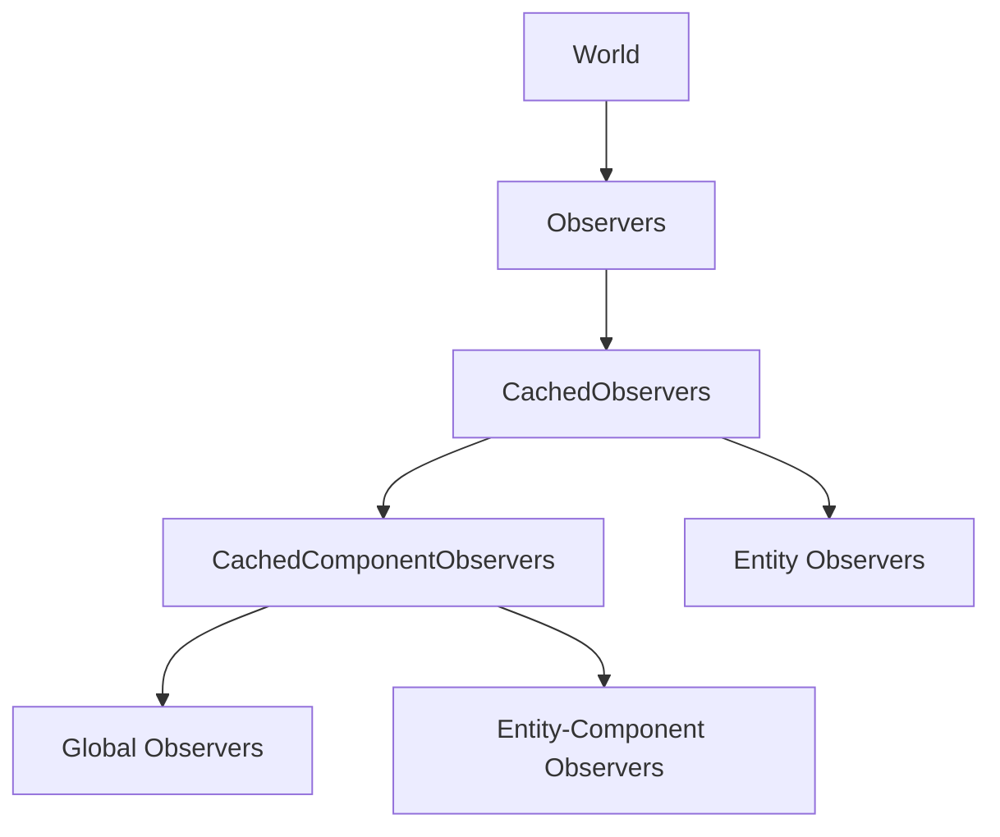

+++
title = "#19608 Make observers metadata / storage publicly visible"
date = "2025-06-16T00:00:00"
draft = false
template = "pull_request_page.html"
in_search_index = false

[extra]
current_language = "zh-cn"
available_languages = {"en" = { name = "English", url = "/pull_request/bevy/2025-06/pr-19608-en-20250616" }, "zh-cn" = { name = "中文", url = "/pull_request/bevy/2025-06/pr-19608-zh-cn-20250616" }}
+++

# Make observers metadata / storage publicly visible 技术报告

## 基本信息
- **标题**: Make observers metadata / storage publicly visible
- **PR链接**: https://github.com/bevyengine/bevy/pull/19608
- **作者**: alice-i-cecile
- **状态**: 已合并
- **标签**: A-ECS, C-Usability, S-Ready-For-Final-Review, X-Contentious, D-Straightforward
- **创建时间**: 2025-06-13T01:01:37Z
- **合并时间**: 2025-06-16T22:20:39Z
- **合并者**: alice-i-cecile

## 描述翻译
### Objective

我们存储观察者(observer)的策略由几个移动部件组成，最终是相当简单的嵌套哈希映射(HashMap)。

这些类型目前是`pub`的，但缺乏任何有意义的访问方式。

我们有三个选项：
1. 完全不让这些内部结构`pub`
2. 使数据只读可访问
3. 使数据可写访问

### Solution

我选择了选项2，暴露只读值。这与我们对ECS内部结构的现有方法一致，允许更轻松的调试而不冒数据损坏的风险。如果有一天你需要可变访问这些数据，请开一个issue明确解释你想做什么。

这是一个相当机械的更改，通过getter暴露字段。我还尽力澄清了一些字段名和文档：请仔细检查它们的正确性。很难完全自信，因为字段名和文档不够清晰；）

### Testing

我花了一些时间走查代码路径，确保用户可以从`World`一直追踪到叶子节点。审阅者请确保同样如此！

### Notes for reviewers

这是一个更大的观察者系统重构的一部分：我完全预期我们会改变这些内部结构并打破这些新API。甚至可能在同一个开发周期内！

但请先清理你的工作区：这种只读getter和改进的文档在我们工作时将是重要的替代品。

## 本PR的技术分析

### 问题与背景
在Bevy的ECS实现中，观察者(observer)系统用于响应组件变更事件。该系统的内部存储结构（如`CachedObservers`和`CachedComponentObservers`）虽然标记为`pub`，但实际上无法被外部代码访问。这导致两个问题：
1. 调试困难：开发者无法检查观察者系统的内部状态
2. 文档不清晰：现有字段命名（如`map`和`entity_map`）未能清晰表达其实际用途

原始实现中，观察者数据存储在多级嵌套结构中：
```rust
pub struct CachedComponentObservers {
    map: ObserverMap, // 用途不明确的字段
    entity_map: EntityHashMap<ObserverMap>, // 用途不明确的字段
}
```

### 解决方案
PR选择了折中方案：保持数据结构公开但提供只读访问器(getter)。这种方法：
1. 保持封装性：防止外部代码意外修改内部状态
2. 提升可观察性：允许调试和检查
3. 改善可读性：通过更清晰的字段名和文档

关键设计决策：
1. **只读访问**：避免提供setter或可变引用，保持数据完整性
2. **字段重命名**：使用更语义化的名称替换通用名称
3. **文档补充**：明确每个字段和方法的用途

### 具体实现
实现包含三个主要方面：

1. **字段重命名**：用语义明确的名称替换通用名称
```rust
// 修改前
pub struct CachedComponentObservers {
    map: ObserverMap,
    entity_map: EntityHashMap<ObserverMap>,
}

// 修改后
pub struct CachedComponentObservers {
    global_observers: ObserverMap, // 监听组件事件（不针对特定实体）
    entity_component_observers: EntityHashMap<ObserverMap>, // 监听特定实体的组件事件
}
```

2. **添加只读访问器**：为关键结构添加getter方法
```rust
impl CachedComponentObservers {
    pub fn global_observers(&self) -> &ObserverMap {
        &self.global_observers
    }
    
    pub fn entity_component_observers(&self) -> &EntityHashMap<ObserverMap> {
        &self.entity_component_observers
    }
}
```

3. **公开观察者访问点**：通过World提供入口
```rust
impl World {
    pub fn observers(&self) -> &Observers {
        &self.observers
    }
}
```

### 技术细节
1. **观察者分类**：实现区分了三种观察者类型：
   - 全局观察者(global_observers)：监听所有事件
   - 组件观察者(component_observers)：监听特定组件事件
   - 实体观察者(entity_observers)：监听特定实体事件

2. **生命周期事件处理**：特别处理ECS生命周期事件（添加/插入/移除等）
```rust
pub fn try_get_observers(&self, event_type: ComponentId) -> Option<&CachedObservers> {
    use crate::lifecycle::*;
    match event_type {
        ADD => Some(&self.add),
        INSERT => Some(&self.insert),
        // ...其他生命周期事件
        _ => self.custom.get(&event_type),
    }
}
```

3. **内部一致性修改**：所有使用点同步更新字段名
```diff
- if let Some(map) = observers.entity_map.get(&source).cloned() {
-     observers.entity_map.insert(target, map);
+ if let Some(map) = observers.entity_component_observers.get(&source).cloned() {
+     observers.entity_component_observers.insert(target, map);
```

### 影响与注意事项
1. **调试能力提升**：开发者现在可以通过`world.observers()`检查观察者状态
2. **API稳定性**：作者明确指出这是临时方案，未来可能变更
3. **命名澄清**：新字段名更准确反映实际用途：
   - `global_observers` → 不限定目标的观察者
   - `entity_component_observers` → 特定实体+组件的观察者

4. **潜在改进点**：
   - `CachedObservers::entity_observers()` 实际返回的是组件观察者，可能需要更名
   - 可考虑为常用操作添加更高级的查询API

## 组件关系图



## 关键文件变更

### 1. `crates/bevy_ecs/src/observer/mod.rs`
**变更原因**：重构观察者存储结构，添加只读访问器

关键修改：
```rust
// 字段重命名与getter添加
pub struct CachedComponentObservers {
    // Before: map, entity_map
    // After:
    global_observers: ObserverMap,
    entity_component_observers: EntityHashMap<ObserverMap>,
}

impl CachedComponentObservers {
    pub fn global_observers(&self) -> &ObserverMap { ... }
    pub fn entity_component_observers(&self) -> &EntityHashMap<ObserverMap> { ... }
}

// 类似修改应用于CachedObservers
pub struct CachedObservers {
    global_observers: ObserverMap,
    component_observers: HashMap<ComponentId, CachedComponentObservers>,
    entity_observers: EntityHashMap<ObserverMap>,
}

// 公开访问方法
impl Observers {
    pub fn try_get_observers(&self, event_type: ComponentId) -> Option<&CachedObservers> { ... }
}
```

### 2. `crates/bevy_ecs/src/observer/entity_observer.rs`
**变更原因**：适配主模块的字段名变更

关键修改：
```diff
- let observers = world.observers.get_observers(event_type);
+ let observers = world.observers.get_observers_mut(event_type);

- if let Some(map) = observers.entity_map.get(&source).cloned() {
-     observers.entity_map.insert(target, map);
+ if let Some(map) = observers.entity_component_observers.get(&source).cloned() {
+     observers.entity_component_observers.insert(target, map);
```

### 3. `crates/bevy_ecs/src/world/mod.rs`
**变更原因**：提供World级别的观察者访问入口

关键添加：
```rust
impl World {
    pub fn observers(&self) -> &Observers {
        &self.observers
    }
}
```

## 延伸阅读
1. [Bevy ECS观察者系统设计讨论](https://github.com/bevyengine/bevy/discussions/19599)
2. [实体组件系统模式](https://en.wikipedia.org/wiki/Entity_component_system)
3. [Rust访问控制最佳实践](https://doc.rust-lang.org/book/ch07-03-paths-for-referring-to-an-item-in-the-module-tree.html)