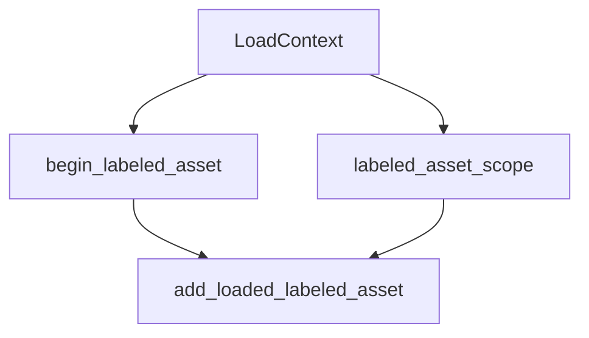

+++
title = "#19610 Fix `LoadContext` docs."
date = "2025-06-13T00:00:00"
draft = false
template = "pull_request_page.html"
in_search_index = true

[taxonomies]
list_display = ["show"]

[extra]
current_language = "en"
available_languages = {"en" = { name = "English", url = "/pull_request/bevy/2025-06/pr-19610-en-20250613" }, "zh-cn" = { name = "中文", url = "/pull_request/bevy/2025-06/pr-19610-zh-cn-20250613" }}
labels = ["C-Docs", "D-Trivial", "A-Assets"]
+++

# Fix `LoadContext` docs.

## Basic Information
- **Title**: Fix `LoadContext` docs.
- **PR Link**: https://github.com/bevyengine/bevy/pull/19610
- **Author**: yrns
- **Status**: MERGED
- **Labels**: C-Docs, D-Trivial, A-Assets, S-Ready-For-Final-Review
- **Created**: 2025-06-13T02:43:55Z
- **Merged**: 2025-06-13T04:08:17Z
- **Merged By**: alice-i-cecile

## Description Translation
The original description is in English and requires no translation:

"add_labeled_asset" (add `Asset`) should be "add_loaded_labeled_asset" (add `LoadedAsset`).

## The Story of This Pull Request

The PR addresses incorrect documentation in Bevy's asset loading system. Specifically, the `LoadContext` struct's documentation contained references to a non-existent method `add_labeled_asset` instead of the correct `add_loaded_labeled_asset` method. This documentation error could mislead developers about the proper API usage when working with labeled assets.

The `LoadContext` API enables developers to load assets with dependencies. The `begin_labeled_asset` method starts loading a new labeled asset, while `labeled_asset_scope` provides a scoped alternative. Both methods require adding the resulting asset back to the parent context using `add_loaded_labeled_asset`. The documentation incorrectly referenced `add_labeled_asset` instead, which doesn't exist in the API.

Additionally, the example code for `begin_labeled_asset` unnecessarily declared the `labeled` variable as mutable (`mut`) when it wasn't mutated in the scope. While not functionally incorrect, this violated Rust's best practice of avoiding unnecessary mutability declarations.

The solution implemented three precise changes:
1. Updated `begin_labeled_asset` docs to reference `add_loaded_labeled_asset`
2. Removed unnecessary `mut` from the example code
3. Updated `labeled_asset_scope` docs to reference `add_loaded_labeled_asset`

These changes improve documentation accuracy and align with Rust's principle of minimizing unnecessary mutability. The fixes ensure developers receive correct guidance when implementing asset loading workflows with labeled assets.

## Visual Representation



## Key Files Changed

### `crates/bevy_asset/src/loader.rs`
**Changes:** Corrected method references in documentation and removed unnecessary mutability in example code.

**Key modifications:**
```rust
// Before:
/// When finished, make sure you call [`LoadContext::add_labeled_asset`] to add the results back to the parent
/// context.
/// [...]
///     let mut labeled = load_context.begin_labeled_asset();
/// [...]
/// This exists to remove the need to manually call [`LoadContext::begin_labeled_asset`] and then manually register the
/// result with [`LoadContext::add_labeled_asset`].

// After:
/// When finished, make sure you call [`LoadContext::add_loaded_labeled_asset`] to add the results back to the parent
/// context.
/// [...]
///     let labeled = load_context.begin_labeled_asset();
/// [...]
/// This exists to remove the need to manually call [`LoadContext::begin_labeled_asset`] and then manually register the
/// result with [`LoadContext::add_loaded_labeled_asset`].
```

**Impact:** Ensures documentation accurately reflects the API, preventing developer confusion when working with labeled assets.

## Further Reading
1. [Bevy Assets Documentation](https://bevyengine.org/learn/book/features/assets/)
2. [Rust API Guidelines - Documentation](https://rust-lang.github.io/api-guidelines/documentation.html)
3. [Rust Mutability Best Practices](https://doc.rust-lang.org/book/ch03-01-variables-and-mutability.html)

## Full Code Diff
```diff
diff --git a/crates/bevy_asset/src/loader.rs b/crates/bevy_asset/src/loader.rs
index 50bbfb5dfc3c9..24405f0657d5e 100644
--- a/crates/bevy_asset/src/loader.rs
+++ b/crates/bevy_asset/src/loader.rs
@@ -344,7 +344,7 @@ impl<'a> LoadContext<'a> {
 
     /// Begins a new labeled asset load. Use the returned [`LoadContext`] to load
     /// dependencies for the new asset and call [`LoadContext::finish`] to finalize the asset load.
-    /// When finished, make sure you call [`LoadContext::add_labeled_asset`] to add the results back to the parent
+    /// When finished, make sure you call [`LoadContext::add_loaded_labeled_asset`] to add the results back to the parent
     /// context.
     /// Prefer [`LoadContext::labeled_asset_scope`] when possible, which will automatically add
     /// the labeled [`LoadContext`] back to the parent context.
@@ -360,7 +360,7 @@ impl<'a> LoadContext<'a> {
     /// # let load_context: LoadContext = panic!();
     /// let mut handles = Vec::new();
     /// for i in 0..2 {
-    ///     let mut labeled = load_context.begin_labeled_asset();
+    ///     let labeled = load_context.begin_labeled_asset();
     ///     handles.push(std::thread::spawn(move || {
     ///         (i.to_string(), labeled.finish(Image::default()))
     ///     }));
@@ -385,7 +385,7 @@ impl<'a> LoadContext<'a> {
     /// [`LoadedAsset`], which is registered under the `label` label.
     ///
     /// This exists to remove the need to manually call [`LoadContext::begin_labeled_asset`] and then manually register the
-    /// result with [`LoadContext::add_labeled_asset`].
+    /// result with [`LoadContext::add_loaded_labeled_asset`].
     ///
     /// See [`AssetPath`] for more on labeled assets.
     pub fn labeled_asset_scope<A: Asset, E>(
```