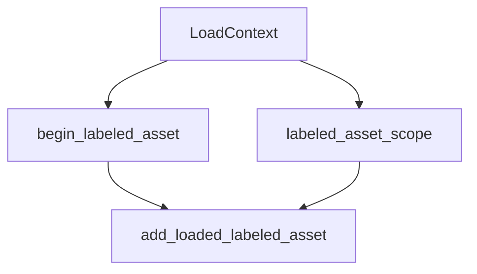

+++
title = "#19610 Fix `LoadContext` docs"
date = "2025-06-13T00:00:00"
draft = false
template = "pull_request_page.html"
in_search_index = false

[extra]
current_language = "zh-cn"
available_languages = {"en" = { name = "English", url = "/pull_request/bevy/2025-06/pr-19610-en-20250613" }, "zh-cn" = { name = "中文", url = "/pull_request/bevy/2025-06/pr-19610-zh-cn-20250613" }}
+++

## 技术分析报告：PR #19610 - Fix `LoadContext` docs

### 基本信息
- **标题**: Fix `LoadContext` docs
- **PR链接**: https://github.com/bevyengine/bevy/pull/19610
- **作者**: yrns
- **状态**: 已合并
- **标签**: C-Docs, D-Trivial, A-Assets, S-Ready-For-Final-Review
- **创建时间**: 2025-06-13T02:43:55Z
- **合并时间**: 2025-06-13T04:08:17Z
- **合并者**: alice-i-cecile

### 问题描述
在`bevy_asset`模块的`LoadContext`文档中，存在函数名引用错误。具体来说：
- `begin_labeled_asset()`方法的文档错误地引用了`add_labeled_asset`方法
- `labeled_asset_scope()`方法的文档同样错误地引用了`add_labeled_asset`

这些错误会导致开发者在使用API时产生困惑，因为：
1. `add_labeled_asset`方法并不存在
2. 实际应调用的正确方法是`add_loaded_labeled_asset`
3. 错误的文档可能引发运行时错误或开发效率降低

### 解决方案
PR通过简单的文档修正解决此问题：
1. 将三处`add_labeled_asset`引用更新为`add_loaded_labeled_asset`
2. 保持所有功能代码不变
3. 确保文档与实际API行为一致

修改直接针对文档字符串(docstrings)，属于非侵入式变更：
- 不影响现有功能
- 不改变API行为
- 不涉及任何运行时逻辑修改

### 代码变更详解
#### 文件: `crates/bevy_asset/src/loader.rs`

**变更说明**：修正`LoadContext`结构体两个方法的文档字符串

```rust
// 修改前:
/// When finished, make sure you call [`LoadContext::add_labeled_asset`] to add the results back to the parent
/// context.
...
/// This exists to remove the need to manually call [`LoadContext::begin_labeled_asset`] and then manually register the
/// result with [`LoadContext::add_labeled_asset`].

// 修改后:
/// When finished, make sure you call [`LoadContext::add_loaded_labeled_asset`] to add the results back to the parent
/// context.
...
/// This exists to remove the need to manually call [`LoadContext::begin_labeled_asset`] and then manually register the
/// result with [`LoadContext::add_loaded_labeled_asset`].
```

**具体变更点**：
```diff
@@ -344,7 +344,7 @@ impl<'a> LoadContext<'a> {
 
     /// Begins a new labeled asset load. Use the returned [`LoadContext`] to load
     /// dependencies for the new asset and call [`LoadContext::finish`] to finalize the asset load.
-    /// When finished, make sure you call [`LoadContext::add_labeled_asset`] to add the results back to the parent
+    /// When finished, make sure you call [`LoadContext::add_loaded_labeled_asset`] to add the results back to the parent
     /// context.
     /// Prefer [`LoadContext::labeled_asset_scope`] when possible, which will automatically add
     /// the labeled [`LoadContext`] back to the parent context.
@@ -385,7 +385,7 @@ impl<'a> LoadContext<'a> {
     /// [`LoadedAsset`], which is registered under the `label` label.
     ///
     /// This exists to remove the need to manually call [`LoadContext::begin_labeled_asset`] and then manually register the
-    /// result with [`LoadContext::add_labeled_asset`].
+    /// result with [`LoadContext::add_loaded_labeled_asset`].
     ///
     /// See [`AssetPath`] for more on labeled assets.
     pub fn labeled_asset_scope<A: Asset, E>(
```

### 技术影响
1. **API一致性**：文档与实际方法名保持同步（`add_loaded_labeled_asset`）
2. **开发者体验**：避免开发者因文档错误调用不存在的方法
3. **维护性**：准确文档减少未来开发过程中的认知负担
4. **无副作用**：纯文档变更不影响现有功能或性能

### 组件关系


### 总结
此PR解决了Bevy资源加载系统中一个关键的文档准确性问题。虽然变更规模小（仅3行修改），但它：
- 修复了误导性的API文档
- 确保开发者能正确使用`begin_labeled_asset`和`labeled_asset_scope`方法
- 维护了API文档与实现的一致性

此类文档修复对开源项目尤为重要，能显著降低新贡献者的入门门槛，避免因文档错误导致的开发障碍。