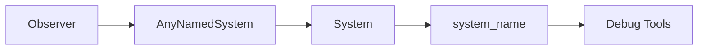

+++
title = "#19611 Exposes `Observer`'s system's name"
date = "2025-06-17T00:00:00"
draft = false
template = "pull_request_page.html"
in_search_index = true

[taxonomies]
list_display = ["show"]

[extra]
current_language = "en"
available_languages = {"en" = { name = "English", url = "/pull_request/bevy/2025-06/pr-19611-en-20250617" }, "zh-cn" = { name = "中文", url = "/pull_request/bevy/2025-06/pr-19611-zh-cn-20250617" }}
labels = ["A-ECS", "C-Usability", "X-Contentious", "D-Straightforward"]
+++

# Technical Analysis: Exposes `Observer`'s system's name

## Basic Information
- **Title**: Exposes `Observer`'s system's name
- **PR Link**: https://github.com/bevyengine/bevy/pull/19611
- **Author**: hukasu
- **Status**: MERGED
- **Labels**: A-ECS, C-Usability, S-Ready-For-Final-Review, M-Needs-Release-Note, X-Contentious, D-Straightforward
- **Created**: 2025-06-13T02:55:55Z
- **Merged**: 2025-06-17T22:57:33Z
- **Merged By**: alice-i-cecile

## Description
# Objective

Fixes #18726
Alternative to and closes #18797

## Solution

Create a method `Observer::system_name` to expose the name of the `Observer`'s system

## Showcase

```rust
// Returns `my_crate::my_observer`
let observer = Observer::new(my_observer);
println!(observer.system_name());

// Returns `my_crate::method::{{closure}}`
let observer = Observer::new(|_trigger: Trigger<...>|);
println!(observer.system_name());

// Returns `custom_name`
let observer = Observer::new(IntoSystem::into_system(my_observer).with_name("custom_name"));
println!(observer.system_name());
```

## TODO
- [ ] Achieve cart's approval

## The Story of This Pull Request

### The Problem and Context
Observers in Bevy's ECS system lacked accessible system names, making debugging difficult. When users created observers (particularly closures), debug tools displayed opaque names like `{{closure}}` instead of meaningful identifiers. This made it challenging to identify specific observers during debugging sessions or in diagnostic output. The issue (#18726) specifically requested exposing the observer's system name to improve debuggability.

### The Solution Approach
The solution involved modifying the `Observer` struct to store systems implementing a new `AnyNamedSystem` trait instead of a generic `Any` trait. This new trait requires systems to implement a `system_name()` method. Since Bevy's `System` trait already defines a `name()` method, we can leverage this existing functionality through a blanket implementation. The implementation maintains backward compatibility while adding the requested functionality through a new public method.

Key engineering decisions:
1. Introduced a new trait to avoid modifying the core `System` trait
2. Maintained type erasure for observer systems while adding name access
3. Implemented the trait for all existing systems via blanket implementation
4. Added minimal changes to existing observer initialization logic

### The Implementation
The core change replaces the `Observer`'s system storage from `Box<dyn Any + Send + Sync>` to `Box<dyn AnyNamedSystem>`. The new trait provides access to the system name:

```rust
trait AnyNamedSystem: Any + Send + Sync + 'static {
    fn system_name(&self) -> Cow<'static, str>;
}

impl<T: Any + System> AnyNamedSystem for T {
    fn system_name(&self) -> Cow<'static, str> {
        self.name()
    }
}
```

The public interface adds a straightforward accessor method:
```rust
impl Observer {
    pub fn system_name(&self) -> Cow<'static, str> {
        self.system.system_name()
    }
}
```

Initialization code was updated to handle the new trait bounds. Downcasting now occurs through the `Any` supertrait:
```rust
// Before:
let system = state.system.downcast_mut::<S>().debug_checked_unwrap();

// After:
let system: &mut dyn Any = state.system.as_mut();
let system = system.downcast_mut::<S>().debug_checked_unwrap();
```

### Technical Insights
The solution demonstrates effective use of:
1. **Trait composition**: `AnyNamedSystem` combines `Any` with name access without modifying core traits
2. **Blanket implementations**: Leveraging existing `System` functionality for all implementors
3. **Type erasure maintenance**: Preserving dynamic dispatch while adding functionality
4. **Backward compatibility**: Existing observer usage remains unchanged

The approach avoids:
1. Breaking changes to public APIs
2. Performance overhead (name access is same as system name lookup)
3. Complex type system modifications

### The Impact
These changes directly improve debuggability:
1. Users can now access observer system names programmatically
2. Debug tools can display meaningful observer names
3. Closure-based observers show their origin location
4. Custom-named systems propagate names correctly

The changes affect observer initialization but maintain identical runtime characteristics. The solution is contained to the observer module with minimal cross-component impact.

## Visual Representation



## Key Files Changed

### 1. `crates/bevy_ecs/src/observer/runner.rs`
Added system name access to observers through a new trait:

```rust
// Before:
pub struct Observer {
    system: Box<dyn Any + Send + Sync + 'static>,
}

// After:
pub struct Observer {
    system: Box<dyn AnyNamedSystem>,
}

trait AnyNamedSystem: Any + Send + Sync + 'static {
    fn system_name(&self) -> Cow<'static, str>;
}

impl<T: Any + System> AnyNamedSystem for T {
    fn system_name(&self) -> Cow<'static, str> {
        self.name()
    }
}

impl Observer {
    pub fn system_name(&self) -> Cow<'static, str> {
        self.system.system_name()
    }
}
```

### 2. `release-content/release-notes/observer_overhaul.md`
Updated release notes to document the new capability:

```markdown
// Before:
authors: ["@Jondolf", "@alice-i-cecile"]
pull_requests: [19596, 19663]

// After:
authors: ["@Jondolf", "@alice-i-cecile", "@hukasu]
pull_requests: [19596, 19663, 19611]

// Added section:
## Expose name of the Observer's system

The name of the Observer's system is now accessible through `Observer::system_name`,
this opens up the possibility for the debug tools to show more meaningful names for observers.
```

### 3. `crates/bevy_ecs/src/system/schedule_system.rs`
Minor cleanup of redundant blank lines:

```rust
// Before:
type Out = S::Out;

fn name(&self) -> Cow<'static, str> {

// After:
type Out = S::Out;

fn name(&self) -> Cow<'static, str> {
```

## Further Reading
1. [Bevy ECS Observer Documentation](https://docs.rs/bevy_ecs/latest/bevy_ecs/event/struct.Observer.html)
2. [System Naming in Bevy](https://github.com/bevyengine/bevy/blob/main/crates/bevy_ecs/src/system/system.rs)
3. [Trait Object Safety Guidelines](https://doc.rust-lang.org/reference/items/traits.html#object-safety)