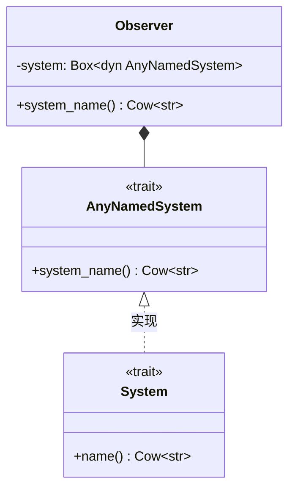

+++
title = "#19611 Exposes `Observer`'s system's name"
date = "2025-06-17T00:00:00"
draft = false
template = "pull_request_page.html"
in_search_index = false

[extra]
current_language = "zh-cn"
available_languages = {"en" = { name = "English", url = "/pull_request/bevy/2025-06/pr-19611-en-20250617" }, "zh-cn" = { name = "中文", url = "/pull_request/bevy/2025-06/pr-19611-zh-cn-20250617" }}
+++

# Exposes `Observer`'s system's name

## Basic Information
- **标题**: Exposes `Observer`'s system's name
- **PR链接**: https://github.com/bevyengine/bevy/pull/19611
- **作者**: hukasu
- **状态**: MERGED
- **标签**: A-ECS, C-Usability, S-Ready-For-Final-Review, M-Needs-Release-Note, X-Contentious, D-Straightforward
- **创建时间**: 2025-06-13T02:55:55Z
- **合并时间**: 2025-06-17T22:57:33Z
- **合并者**: alice-i-cecile

## 描述翻译

# Objective

修复 #18726  
替代并关闭 #18797

## Solution

创建方法 `Observer::system_name` 以暴露 `Observer` 系统名称

## Showcase

```rust
// 返回 `my_crate::my_observer`
let observer = Observer::new(my_observer);
println!(observer.system_name());

// 返回 `my_crate::method::{{closure}}`
let observer = Observer::new(|_trigger: Trigger<...>|);
println!(observer.system_name());

// 返回 `custom_name`
let observer = Observer::new(IntoSystem::into_system(my_observer).with_name("custom_name"));
println!(observer.system_name());
```

## TODO
- [ ] Achieve cart's approval

## PR技术分析

### 问题背景
在Bevy的ECS架构中，Observer用于响应特定事件（如组件变更）。调试时，开发人员需要识别具体是哪个Observer系统在运行。但Observer结构体未提供获取内部系统名称的方法，这导致调试困难且日志信息不明确（issue #18726）。先前尝试（PR #18797）未能完整解决问题，需要更直接的解决方案。

### 解决方案
核心思路是为Observer添加system_name()方法，暴露其内部系统的名称。这需要解决两个技术问题：
1. Observer内部的system字段类型为`Box<dyn Any + Send + Sync>`，无法直接访问系统名称
2. 需要保持与现有Observer构造方式的兼容性

### 实现方案
通过引入AnyNamedSystem trait提供统一访问接口，同时修改system字段类型以支持名称查询：

```rust
// 新增trait定义
trait AnyNamedSystem: Any + Send + Sync + 'static {
    fn system_name(&self) -> Cow<'static, str>;
}

// 为所有System类型实现该trait
impl<T: Any + System> AnyNamedSystem for T {
    fn system_name(&self) -> Cow<'static, str> {
        self.name()
    }
}
```

Observer结构体修改system字段类型并添加访问方法：
```diff
- system: Box<dyn Any + Send + Sync + 'static>,
+ system: Box<dyn AnyNamedSystem>,
...
+ pub fn system_name(&self) -> Cow<'static, str> {
+    self.system.system_name()
+ }
```

### 兼容性处理
为保证动态创建的Observer正常工作，修改了with_dynamic_runner的初始化逻辑：
```diff
- system: Box::new(|| {}),
+ system: Box::new(IntoSystem::into_system(|| {})),
```
这确保即使无实际系统的Observer也能返回有效的系统名称（如闭包的默认名称）。

### 类型安全改进
在observer_system_runner和hook_on_add函数中，优化了类型转换逻辑：
```diff
- let system = state.system.downcast_mut::<S>().debug_checked_unwrap();
+ let system: &mut dyn Any = state.system.as_mut();
+ let system = system.downcast_mut::<S>().debug_checked_unwrap();
```
通过显式声明中间变量，提高代码可读性并保持类型安全。

### 影响与价值
1. **调试体验提升**：开发人员可直接获取Observer系统名称，便于日志记录和问题追踪
```rust
println!("Triggered observer: {}", observer.system_name());
```
2. **工具链支持**：为调试工具提供基础数据，可显示更有意义的Observer标识
3. **向后兼容**：完全兼容现有Observer构造方式，包括闭包和具名系统
4. **性能零开销**：名称查询直接复用System trait的现有方法，无额外计算

### 潜在注意事项
1. 闭包生成的系统名称（如`my_crate::method::{{closure}}`）可读性有限
2. 需配合`with_name()`方法显式命名才能获得最佳可读性

## 可视化表示



## 关键文件变更

### crates/bevy_ecs/src/observer/runner.rs
**变更原因**：实现Observer系统名称暴露功能  
**核心修改**：
```diff
+ use alloc::{borrow::Cow, boxed::Box, vec};
...
- system: Box<dyn Any + Send + Sync + 'static>,
+ system: Box<dyn AnyNamedSystem>,
...
+ pub fn system_name(&self) -> Cow<'static, str> {
+    self.system.system_name()
+ }
...
+ trait AnyNamedSystem: Any + Send + Sync + 'static {
+    fn system_name(&self) -> Cow<'static, str>;
+ }
+
+ impl<T: Any + System> AnyNamedSystem for T {
+    fn system_name(&self) -> Cow<'static, str> {
+        self.name()
+    }
+ }
```

### release-content/release-notes/observer_overhaul.md
**变更原因**：在发布说明中记录新特性  
**核心修改**：
```diff
- authors: ["@Jondolf", "@alice-i-cecile"]
- pull_requests: [19596, 19663]
+ authors: ["@Jondolf", "@alice-i-cecile", "@hukasu]
+ pull_requests: [19596, 19663, 19611]
...
+ ## Expose name of the Observer's system
+
+ The name of the Observer's system is now accessible through `Observer::system_name`,
+ this opens up the possibility for the debug tools to show more meaningful names for observers.
```

### crates/bevy_ecs/src/system/schedule_system.rs
**变更原因**：移除冗余trait关联类型声明（次要清理）  
**核心修改**：
```diff
-    type In = ();
-
     type Out = S::Out;
...
-    type In = ();
-
     type Out = S::Out;
```

## 扩展阅读
1. [Observer系统文档](https://docs.rs/bevy_ecs/latest/bevy_ecs/observer/index.html)
2. [系统命名最佳实践](https://bevy-cheatbook.github.io/programming/system-param.html#system-naming)
3. [相关Issue #18726](https://github.com/bevyengine/bevy/issues/18726)