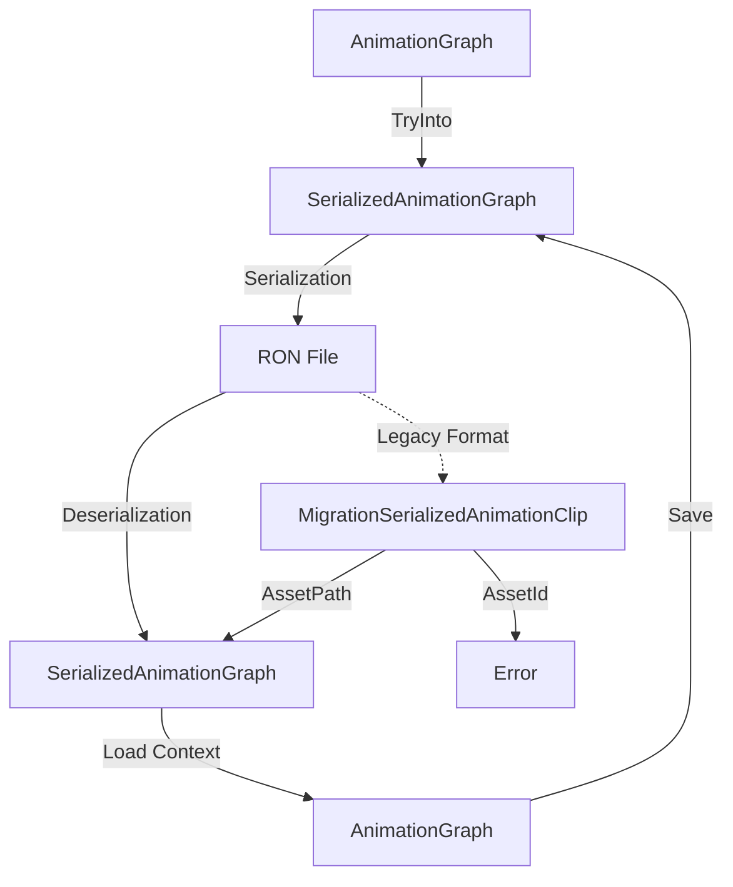

+++
title = "#19615 Prevent `AnimationGraph` from serializing `AssetId`s."
date = "2025-06-30T00:00:00"
draft = false
template = "pull_request_page.html"
in_search_index = true

[taxonomies]
list_display = ["show"]

[extra]
current_language = "en"
available_languages = {"en" = { name = "English", url = "/pull_request/bevy/2025-06/pr-19615-en-20250630" }, "zh-cn" = { name = "中文", url = "/pull_request/bevy/2025-06/pr-19615-zh-cn-20250630" }}
labels = ["C-Bug", "A-Assets", "A-Animation", "D-Modest"]
+++

## Prevent `AnimationGraph` from serializing `AssetId`s

### Basic Information
- **Title**: Prevent `AnimationGraph` from serializing `AssetId`s.
- **PR Link**: https://github.com/bevyengine/bevy/pull/19615
- **Author**: andriyDev
- **Status**: MERGED
- **Labels**: C-Bug, A-Assets, S-Ready-For-Final-Review, A-Animation, M-Needs-Migration-Guide, D-Modest
- **Created**: 2025-06-13T07:10:41Z
- **Merged**: 2025-06-30T22:45:14Z
- **Merged By**: alice-i-cecile

### The Story of This Pull Request

#### The Problem and Context
The core issue addressed in this PR was that `AnimationGraph` could serialize raw `AssetId` values for animation clips. This created a reliability problem because `AssetId`s are typically runtime-generated UUIDs that don't persist meaningfully across sessions. When deserializing an animation graph containing raw `AssetId`s, it was highly unlikely these IDs would correspond to valid assets in the new context, effectively breaking the animation graph. This was a blocker for #19024 (Animation Blending MVP) and affected all users serializing animation graphs.

#### The Solution Approach
The solution centered on two key changes:
1. Removing support for serializing `AssetId` in animation graphs
2. Adding a migration path for existing assets

We decided to completely prohibit serialization of `AssetId` since it provided no practical benefit while introducing significant fragility. For existing assets, we implemented a migration system using Serde's untagged enum deserialization. This allows newer versions to read both old and new formats, while automatically converting to the new format upon resaving.

#### The Implementation
The implementation required coordinated changes across serialization, deserialization, and asset loading:

1. **Serialization Changes**  
   We modified the `AnimationGraph::save` method to convert the graph to a `SerializedAnimationGraph` before serialization. This conversion now fails if any animation clip handles lack asset paths:

   ```rust
   impl TryFrom<AnimationGraph> for SerializedAnimationGraph {
       type Error = NonPathHandleError;
       
       fn try_from(animation_graph: AnimationGraph) -> Result<Self, NonPathHandleError> {
           // Iterates through all nodes
           match node.node_type {
               AnimationNodeType::Clip(ref clip) => match clip.path() {
                   Some(path) => /* use path */,
                   None => return Err(NonPathHandleError),
               },
               // ...
           }
           // ...
       }
   }
   ```

   The new `NonPathHandleError` provides clear feedback when serialization fails due to missing paths.

2. **Deserialization with Migration**  
   The asset loader was updated to handle both current and legacy formats using an untagged enum:

   ```rust
   #[derive(Serialize, Deserialize)]
   #[serde(untagged)]
   pub enum MigrationSerializedAnimationClip {
       Modern(AssetPath<'static>),
       Legacy(SerializedAnimationClip),
   }
   ```

   During loading, we detect legacy formats and either migrate them (for asset paths) or error out (for asset IDs):

   ```rust
   match clip {
       MigrationSerializedAnimationClip::Modern(path) => {
           AnimationNodeType::Clip(load_context.load(path.clone()))
       }
       MigrationSerializedAnimationClip::Legacy(
           SerializedAnimationClip::AssetPath(path),
       ) => {
           warn!("Legacy format detected - please resave asset");
           AnimationNodeType::Clip(load_context.load(path.clone()))
       }
       MigrationSerializedAnimationClip::Legacy(
           SerializedAnimationClip::AssetId(_),
       ) => {
           return Err(AnimationGraphLoadError::GraphContainsLegacyAssetId);
       }
   }
   ```

3. **User Guidance**  
   We added warnings when loading legacy assets and created a migration guide explaining:
   - Why the change was necessary
   - How to resave assets to migrate them
   - How to handle assets containing `AssetId`s

#### Technical Insights
Key technical aspects include:
- **Untagged Enum Strategy**: Using Serde's `untagged` attribute provides backward compatibility without complex versioning schemes
- **Explicit Error Cases**: Introducing specific error types (`NonPathHandleError`, `GraphContainsLegacyAssetId`) makes failure modes explicit
- **In-Place Migration**: Loading legacy assets automatically converts them to the new format when resaved
- **Asset Path Reliability**: Ensures only persistent asset identifiers are serialized

The trade-off is that we lose the ability to serialize default handles or UUID-based references, but these were unreliable anyway.

#### The Impact
These changes:
1. Fix a reliability issue in animation graph serialization
2. Provide a clear migration path for existing assets
3. Improve long-term asset portability
4. Add explicit error handling for invalid states
5. Move Bevy closer to animation blending MVP

The solution maintains backward compatibility while guiding users toward more robust asset management practices.

### Visual Representation



### Key Files Changed

1. **crates/bevy_animation/src/graph.rs** (+134/-59)  
   Core changes to serialization/deserialization logic and error handling:

   ```rust
   // Before: Serialized any Handle, including those without paths
   impl From<AnimationGraph> for SerializedAnimationGraph {
       fn from(animation_graph: AnimationGraph) -> Self {
           // Would serialize AssetId if path was missing
       }
   }
   
   // After: Only serializes handles with paths
   impl TryFrom<AnimationGraph> for SerializedAnimationGraph {
       type Error = NonPathHandleError;
       
       fn try_from(animation_graph: AnimationGraph) -> Result<Self, NonPathHandleError> {
           // Returns error if any clip lacks path
       }
   }
   ```

2. **release-content/migration-guides/animation_graph_no_more_asset_ids.md** (+20/-0)  
   Added migration guide explaining:
   - Why the change was made
   - How to migrate existing assets
   - How to handle edge cases

3. **assets/animation_graphs/Fox.animgraph.ron** (+4/-4)  
   Updated asset to new serialization format:

   ```ron
   // Before:
   node_type: Clip(AssetPath("path/to/clip"))
   
   // After:
   node_type: Clip("path/to/clip")
   ```

4. **examples/animation/animation_graph.rs** (+4/-0)  
   Updated example to handle new serialization:

   ```rust
   // Added conversion to SerializedAnimationGraph
   let animation_graph: SerializedAnimationGraph = animation_graph
       .try_into()
       .expect("Conversion failed");
   ```

### Further Reading
- [Serde Untagged Enums](https://serde.rs/enum-representations.html#untagged) for backward-compatible deserialization
- [Bevy Asset System](https://bevyengine.org/learn/book/assets/) for asset handling concepts
- [RFC 51: Animation Blending](https://github.com/bevyengine/rfcs/blob/main/rfcs/51-animation-composition.md) for background on animation graphs