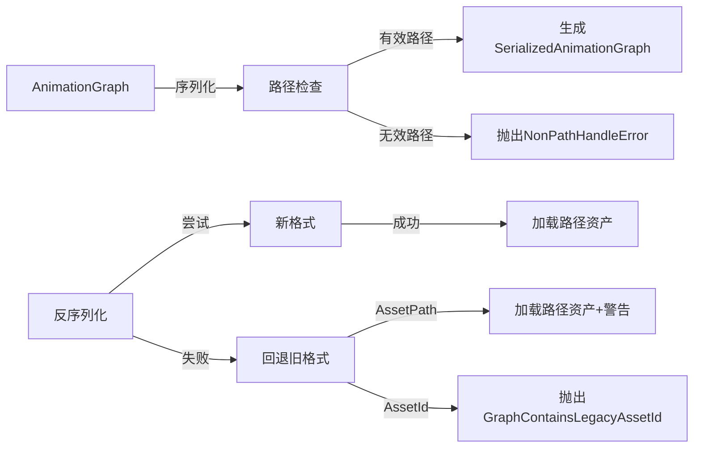

+++
title = "#19615 Prevent `AnimationGraph` from serializing `AssetId`s."
date = "2025-06-30T00:00:00"
draft = false
template = "pull_request_page.html"
in_search_index = false

[extra]
current_language = "zh-cn"
available_languages = {"en" = { name = "English", url = "/pull_request/bevy/2025-06/pr-19615-en-20250630" }, "zh-cn" = { name = "中文", url = "/pull_request/bevy/2025-06/pr-19615-zh-cn-20250630" }}
+++

# PR #19615 技术分析报告

## 基本信息
- **标题**: Prevent `AnimationGraph` from serializing `AssetId`s.
- **PR链接**: https://github.com/bevyengine/bevy/pull/19615
- **作者**: andriyDev
- **状态**: MERGED
- **标签**: C-Bug, A-Assets, S-Ready-For-Final-Review, A-Animation, M-Needs-Migration-Guide, D-Modest
- **创建时间**: 2025-06-13T07:10:41Z
- **合并时间**: 2025-06-30T22:45:14Z
- **合并人**: alice-i-cecile

## 描述翻译
### Objective
- 这是朝着解决#19024问题迈出的一步。
- `AnimationGraph` 可以序列化原始 `AssetId`。然而对于普通句柄(handles)来说，这是一个运行时ID。这意味着反序列化后，`AssetId` 很可能不会对应同一个资产(asset)——这实际上会破坏动画图(animation graph)。

### Solution
- 禁止 `AnimationGraph` 序列化 `AssetId`。现在序列化没有路径(path)的句柄会报错。
- 添加 `MigrationSerializedAnimationClip`。这是一个为serde设计的无标签枚举(untagged enum)，意味着它会尝试第一个能成功反序列化的变体。所以它会先尝试"现代"版本，然后回退到旧版本。
- 添加一些日志/错误信息来解释用户应该怎么做。

注意：这里的一个限制是移除了序列化和反序列化UUID的能力。理论上，有人可能用这个来实现"默认"动画。如果有人在 `Handle::default()` 中插入一个空的 `AnimationClip`，这**可能**会产生T-pose，也可能什么都不做。不确定！我认为为了简单性值得冒这个风险，因为看起来不太可能有人在这里使用UUID（或者你想在**任何**AnimationGraph中要一个默认动画）。

### Testing
- 在main分支运行 `cargo r --example animation_graph -- --save`，然后在这个PR上运行 `cargo r --example animation_graph`。这个PR能够加载旧数据（在#19631之后）。

## 本PR的技术故事

### 问题背景
在Bevy动画系统中，`AnimationGraph` 序列化时保留了 `AssetId`，这会导致严重问题：
- `AssetId` 通常是运行时生成的临时ID
- 序列化后重新加载时，这些ID几乎不可能匹配原始资产
- 导致动画图引用错误或丢失的动画资源
- 这是#19024（动画系统改进）需要解决的根本问题之一

关键问题在于序列化没有稳定标识符的资源句柄。当动画图保存后重新加载时，基于运行时ID的引用会失效，导致动画系统无法正常工作。

### 解决方案设计
PR采用以下方法解决核心问题：
1. **完全禁止序列化AssetId**：
   - 只允许序列化带路径(path-based)的资产引用
   - 无路径的句柄序列化会抛出错误
   
2. **向后兼容机制**：
   - 引入 `MigrationSerializedAnimationClip` 枚举处理旧数据格式
   - 使用serde的`untagged`属性尝试新格式后再回退旧格式
   - 旧格式中的`AssetId`会被显式拒绝

3. **用户引导**：
   - 加载旧数据时输出明确警告
   - 提供迁移路径说明
   - 添加详细错误信息帮助调试

权衡考虑：移除了对UUID序列化的支持，但考虑到实际使用场景极少，这个简化是合理的。

### 具体实现
核心修改在序列化/反序列化逻辑：

1. **序列化路径检查**：
   ```rust
   impl TryFrom<AnimationGraph> for SerializedAnimationGraph {
       type Error = NonPathHandleError;
       fn try_from(animation_graph: AnimationGraph) -> Result<Self, NonPathHandleError> {
           // ...
           match node.node_type {
               AnimationNodeType::Clip(ref clip) => match clip.path() {
                   Some(path) => Ok(...), // 允许带路径的句柄
                   None => Err(NonPathHandleError), // 阻止无路径句柄
               },
               // ...
           }
       }
   }
   ```
   新增 `NonPathHandleError` 明确拒绝无路径资源

2. **反序列化迁移处理**：
   ```rust
   pub enum MigrationSerializedAnimationClip {
       Modern(AssetPath<'static>),     // 新格式
       Legacy(SerializedAnimationClip), // 旧格式（临时）
   }
   ```
   加载时优先尝试现代格式，然后回退：
   ```rust
   match clip {
       MigrationSerializedAnimationClip::Modern(path) => {
           AnimationNodeType::Clip(load_context.load(path.clone()))
       }
       MigrationSerializedAnimationClip::Legacy(
           SerializedAnimationClip::AssetPath(path),
       ) => {
           // 输出迁移警告
           AnimationNodeType::Clip(load_context.load(path.clone()))
       }
       MigrationSerializedAnimationClip::Legacy(
           SerializedAnimationClip::AssetId(_),
       ) => {
           return Err(AnimationGraphLoadError::GraphContainsLegacyAssetId);
       }
   }
   ```

3. **用户提示系统**：
   ```rust
   if !already_warned {
       warn!(
           "Loaded an AnimationGraph asset ... contains legacy-style ... \
           Please re-save the asset using AnimationGraph::save to migrate"
       );
       already_warned = true;
   }
   ```

### 技术洞察
1. **资产引用稳定性**：
   - 路径(path)作为持久化标识符比运行时ID更可靠
   - 符合Bevy资产系统的最佳实践

2. **向后兼容策略**：
   - 使用serde的`untagged`实现优雅降级
   - 明确的错误分类帮助用户定位问题
   - 日志警告提供主动迁移提示

3. **架构影响**：
   - 简化了动画图持久化模型
   - 移除不可靠的引用机制
   - 为动画系统未来改进铺平道路

### 影响分析
1. **正向影响**：
   - 修复动画图序列化/反序列化的可靠性问题
   - 提升资产引用的长期稳定性
   - 减少因ID不匹配导致的运行时错误

2. **迁移要求**：
   - 用户需要重新保存现有动画图资产
   - 旧版含AssetId的资产需要手动迁移
   - 添加了详细的迁移指南文档

3. **限制**：
   - 移除了对纯UUID引用的支持
   - 需要用户主动迁移旧资产

## 视觉表示



## 关键文件变更

### crates/bevy_animation/src/graph.rs
**变更原因**：实现核心序列化/反序列化逻辑改进  
**关键修改**：
```rust
// 序列化时检查路径
pub fn save<W>(&self, writer: &mut W) -> Result<(), AnimationGraphSaveError> {
    let serialized_graph: SerializedAnimationGraph = self.clone().try_into()?;
    // ...序列化操作
}

// 新增错误类型
#[derive(Error, Debug)]
#[error("AnimationGraph contains a handle... without asset path")]
pub struct NonPathHandleError;

// 反序列化时的迁移处理
for serialized_node in serialized_animation_graph.graph.node_weights() {
    match serialized_node.node_type {
        SerializedAnimationNodeType::Clip(ref clip) => match clip {
            MigrationSerializedAnimationClip::Modern(path) => {
                // 加载新格式
            }
            MigrationSerializedAnimationClip::Legacy(SerializedAnimationClip::AssetPath(path)) => {
                // 输出迁移警告
            }
            MigrationSerializedAnimationClip::Legacy(SerializedAnimationClip::AssetId(_)) => {
                return Err(AnimationGraphLoadError::GraphContainsLegacyAssetId);
            }
        },
        // ...
    }
}
```

### release-content/migration-guides/animation_graph_no_more_asset_ids.md
**变更原因**：提供用户迁移指导  
**关键内容**：
```markdown
In previous versions... would serialize `Handle<AnimationClip>` as an asset
path, and if that wasn't available it would fallback to serializing `AssetId<AnimationClip>`...
This confusing behavior has been removed... will need to be re-saved...
```

### assets/animation_graphs/Fox.animgraph.ron
**变更原因**：更新示例资源使用新格式  
**修改示例**：
```diff
- node_type: Clip(AssetPath("models/animated/Fox.glb#Animation0")),
+ node_type: Clip("models/animated/Fox.glb#Animation0"),
```

### examples/animation/animation_graph.rs
**变更原因**：更新示例代码适配新序列化API  
**关键修改**：
```diff
+ let animation_graph: SerializedAnimationGraph = animation_graph
+     .try_into()
+     .expect("The animation graph failed to convert...");
```

## 延伸阅读
1. [Bevy Asset System](https://bevyengine.org/learn/book/assets/) - 理解Bevy资产处理机制
2. [Serde Untagged Enums](https://serde.rs/enum-representations.html) - 处理多种数据格式的技术
3. [RFC #51: Animation Composition](https://github.com/bevyengine/rfcs/blob/main/rfcs/51-animation-composition.md) - 动画图设计原理