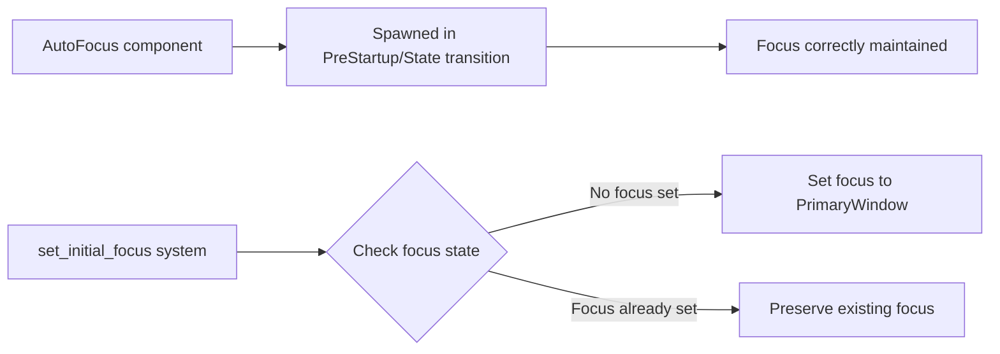

+++
title = "#19618 Fixing `AutoFocus` not working if it's spawn before Startup"
date = "2025-06-13T00:00:00"
draft = false
template = "pull_request_page.html"
in_search_index = true

[taxonomies]
list_display = ["show"]

[extra]
current_language = "en"
available_languages = {"en" = { name = "English", url = "/pull_request/bevy/2025-06/pr-19618-en-20250613" }, "zh-cn" = { name = "中文", url = "/pull_request/bevy/2025-06/pr-19618-zh-cn-20250613" }}
labels = ["C-Bug", "A-UI", "D-Straightforward"]
+++

# Fixing `AutoFocus` not working if it's spawn before Startup

## Basic Information
- **Title**: Fixing `AutoFocus` not working if it's spawn before Startup
- **PR Link**: https://github.com/bevyengine/bevy/pull/19618
- **Author**: eckz
- **Status**: MERGED
- **Labels**: C-Bug, A-UI, S-Ready-For-Final-Review, X-Uncontroversial, D-Straightforward
- **Created**: 2025-06-13T13:40:32Z
- **Merged**: 2025-06-13T17:39:56Z
- **Merged By**: alice-i-cecile

## Description Translation
# Objective

- `AutoFocus` component does not work with the `set_initial_focus` system running in `Startup`.
- If an element is spawned during `PreStartup` or during `OnEnter(SomeState)` that happens before `Startup`, the focus is overridden by `set_initial_focus` which sets the focus to the primary window.

## Solution

- `set_initial_focus` now sets the focus to the `PrimaryWindow` only if no other focus is set.

- *Note*: `cargo test --package bevy_input_focus` was not working, so some changes are related to that.

## Testing

- `cargo test --package bevy_input_focus`: OK
- `cargo run --package ci`: OK

## The Story of This Pull Request

The problem originated in Bevy's UI focus system where the `AutoFocus` component wasn't functioning as expected when entities were spawned before the `Startup` schedule. The core issue was that `set_initial_focus` - a system running in `Startup` - would unconditionally set focus to the primary window, overriding any focus set by `AutoFocus` components spawned earlier in initialization sequences like `PreStartup` or state transitions.

The solution modifies the focus initialization logic in two key ways. First, it changes when the initial focus system runs by moving it from `Startup` to `PostStartup`, ensuring it executes after all regular startup systems. Second, it adds a conditional check to only set focus to the primary window if no focus target currently exists:

```rust
if input_focus.0.is_none() {
    input_focus.0 = Some(*window);
}
```

This simple but effective change preserves any focus set during earlier execution phases while maintaining the fallback behavior of focusing the primary window when no other focus exists.

The implementation required updates to the test suite. The test setup was simplified by removing the custom `SetFocusOnAdd` component and associated hook system, replacing it with direct use of `AutoFocus`. Tests were refactored to use standard Bevy components instead of external dependencies like `smol_str`. New test cases were added to validate the specific bug scenario:

```rust
#[test]
fn initial_focus_not_overridden() {
    let mut app = App::new();
    app.add_plugins((InputPlugin, InputDispatchPlugin));
    app.world_mut().spawn((Window::default(), PrimaryWindow));
    app.add_systems(Startup, |mut commands: Commands| {
        commands.spawn(AutoFocus);
    });
    app.update();
    // Assertions verify AutoFocus entity has focus
}
```

These tests verify that:
1. Focus remains unset when no primary window exists
2. Focus defaults to primary window when nothing else claims it
3. AutoFocus entities spawned during Startup maintain focus

The changes demonstrate good practice in system ordering and resource state management. By moving the system to `PostStartup` and adding the conditional check, the solution maintains backward compatibility while fixing the specific ordering issue. The test improvements ensure the fix works as intended and prevents regressions.

## Visual Representation



## Key Files Changed

### `crates/bevy_input_focus/src/lib.rs` (+73/-35)

1. **System scheduling change**:
```rust
// Before:
app.add_systems(Startup, set_initial_focus)

// After:
app.add_systems(PostStartup, set_initial_focus)
```

2. **Conditional focus logic**:
```rust
// Before:
pub fn set_initial_focus(
    mut input_focus: ResMut<InputFocus>,
    window: Single<Entity, With<PrimaryWindow>>,
) {
    input_focus.0 = Some(*window);
}

// After:
pub fn set_initial_focus(
    mut input_focus: ResMut<InputFocus>,
    window: Single<Entity, With<PrimaryWindow>>,
) {
    if input_focus.0.is_none() {
        input_focus.0 = Some(*window);
    }
}
```

3. **Test improvements**:
```rust
// Simplified test setup by removing custom component
#[derive(Component, Default)]
struct GatherKeyboardEvents(String);

// New tests added
#[test]
fn initial_focus_unset_if_no_primary_window() { ... }

#[test]
fn initial_focus_set_to_primary_window() { ... }

#[test]
fn initial_focus_not_overridden() { ... }
```

### `crates/bevy_input_focus/Cargo.toml` (+0/-3)

Removed unused test dependency:
```toml
// Before:
[dev-dependencies]
smol_str = "0.2"

// After:
// (dependency removed)
```

## Further Reading
- Bevy Engine: [Schedules and System Order](https://bevyengine.org/learn/book/getting-started/schedules/)
- Bevy Engine: [ECS ResMut Documentation](https://docs.rs/bevy_ecs/latest/bevy_ecs/system/struct.ResMut.html)
- Bevy UI Focus RFC: [Input Handling Improvements](https://github.com/bevyengine/rfcs/pull/24)