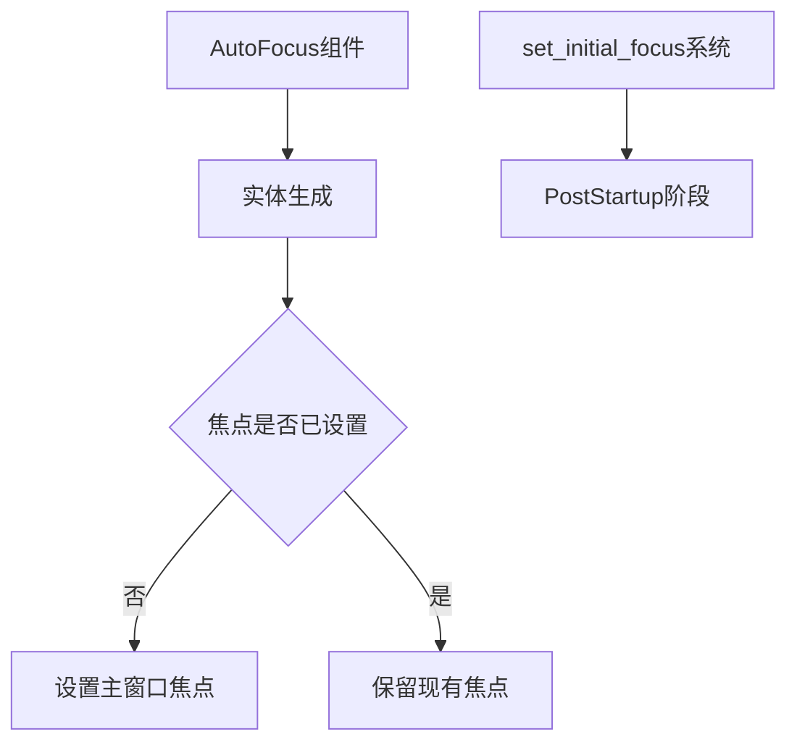

+++
title = "#19618 Fixing `AutoFocus` not working if it's spawn before Startup"
date = "2025-06-13T00:00:00"
draft = false
template = "pull_request_page.html"
in_search_index = false

[extra]
current_language = "zh-cn"
available_languages = {"en" = { name = "English", url = "/pull_request/bevy/2025-06/pr-19618-en-20250613" }, "zh-cn" = { name = "中文", url = "/pull_request/bevy/2025-06/pr-19618-zh-cn-20250613" }}
+++

# 修复 `AutoFocus` 在 Startup 前生成时不生效的问题

## 基本信息
- **标题**: Fixing `AutoFocus` not working if it's spawn before Startup
- **PR 链接**: https://github.com/bevyengine/bevy/pull/19618
- **作者**: eckz
- **状态**: 已合并
- **标签**: C-Bug, A-UI, S-Ready-For-Final-Review, X-Uncontroversial, D-Straightforward
- **创建时间**: 2025-06-13T13:40:32Z
- **合并时间**: 2025-06-13T17:39:56Z
- **合并者**: alice-i-cecile

## 描述翻译
### Objective（目标）
- `AutoFocus` 组件在 `Startup` 阶段运行的 `set_initial_focus` 系统中无法正常工作
- 如果在 `PreStartup` 或发生在 `Startup` 之前的 `OnEnter(SomeState)` 期间生成元素，焦点会被 `set_initial_focus` 覆盖，该函数将焦点设置到主窗口（primary window）

### Solution（解决方案）
- `set_initial_focus` 仅在未设置其他焦点时将焦点设置到 `PrimaryWindow`
- *注意*：`cargo test --package bevy_input_focus` 原本无法运行，因此部分修改与此相关

### Testing（测试）
- `cargo test --package bevy_input_focus`: 通过
- `cargo run --package ci`: 通过

## PR 实现分析

### 问题背景
在 Bevy 的 UI 焦点系统中，`AutoFocus` 组件用于在实体生成时自动获取焦点。然而当实体在 `Startup` 阶段前生成时（例如在 `PreStartup` 或状态转换的 `OnEnter` 系统中），`set_initial_focus` 系统会强制将焦点重置到主窗口，覆盖已设置的 `AutoFocus` 行为。这导致以下问题：
1. 焦点管理逻辑出现意外覆盖
2. 无法在应用初始化早期设置焦点
3. 违反用户对焦点行为的预期

### 解决方案设计
核心思路是将初始焦点设置改为条件操作：
1. 修改 `set_initial_focus` 系统，仅当当前无焦点时才设置主窗口焦点
2. 将该系统从 `Startup` 阶段移至 `PostStartup` 阶段，确保在用户初始化逻辑后执行

### 具体实现
关键修改集中在焦点资源 (`InputFocus`) 的初始化逻辑：

**调度阶段调整**
```rust
// 修改前:
app.add_systems(Startup, set_initial_focus)

// 修改后:
app.add_systems(PostStartup, set_initial_focus)
```
此变更确保焦点设置系统在用户 `Startup` 系统之后运行。

**条件焦点设置**
```rust
// 修改前:
input_focus.0 = Some(*window);

// 修改后:
if input_focus.0.is_none() {
    input_focus.0 = Some(*window);
}
```
新增的条件检查防止覆盖已存在的焦点设置。

### 测试验证
新增测试用例验证不同场景下的焦点行为：

**场景 1：无主窗口时焦点应为空**
```rust
#[test]
fn initial_focus_unset_if_no_primary_window() {
    // ... 省略初始化 ...
    assert_eq!(app.world().resource::<InputFocus>().0, None);
}
```

**场景 2：正常设置主窗口焦点**
```rust
#[test]
fn initial_focus_set_to_primary_window() {
    // ... 生成主窗口 ...
    assert_eq!(app.world().resource::<InputFocus>().0, Some(entity_window));
}
```

**场景 3：避免覆盖现有焦点**
```rust
#[test]
fn initial_focus_not_overridden() {
    // 在 Startup 阶段生成 AutoFocus 实体
    app.add_systems(Startup, |mut commands: Commands| {
        commands.spawn(AutoFocus);
    });
    
    // 验证焦点未被主窗口覆盖
    assert_eq!(app.world().resource::<InputFocus>().0, Some(autofocus_entity));
}
```

### 其他优化
1. **依赖清理**：移除未使用的测试依赖 `smol_str`
   ```diff
   -[dev-dependencies]
   -smol_str = "0.2"
   ```
2. **测试重构**：使用 `AutoFocus` 替代自定义组件，更贴近实际使用场景
3. **事件生成**：封装键盘事件创建逻辑提高可读性
   ```rust
   fn key_a_event() -> KeyboardInput {
       // 统一的事件构造逻辑
   }
   ```

### 技术影响
1. **行为修正**：解决 `AutoFocus` 在早期生成阶段失效的问题
2. **兼容性**：保持与现有焦点系统的兼容性
3. **执行顺序**：通过调度阶段调整明确系统执行顺序依赖
4. **资源管理**：优化 `InputFocus` 资源的初始化逻辑

## 组件关系图


## 关键文件变更

### crates/bevy_input_focus/src/lib.rs
**变更原因**：修复焦点设置逻辑并增强测试覆盖

**核心逻辑修改**：
```rust
// 调度阶段调整
// 修改前:
app.add_systems(Startup, set_initial_focus)

// 修改后:
app.add_systems(PostStartup, set_initial_focus)

// 条件焦点设置
// 修改前:
pub fn set_initial_focus(/* ... */) {
    input_focus.0 = Some(*window);
}

// 修改后:
pub fn set_initial_focus(/* ... */) {
    if input_focus.0.is_none() {
        input_focus.0 = Some(*window);
    }
}
```

**测试用例新增**：
```rust
// 验证焦点未被覆盖的场景
#[test]
fn initial_focus_not_overridden() {
    app.add_systems(Startup, |mut commands: Commands| {
        commands.spawn(AutoFocus);
    });
    // ... 断言验证 ...
}

// 其他新增测试
#[test] fn initial_focus_unset_if_no_primary_window() { ... }
#[test] fn initial_focus_set_to_primary_window() { ... }
```

### crates/bevy_input_focus/Cargo.toml
**变更原因**：清理未使用的测试依赖
```diff
-[dev-dependencies]
-smol_str = "0.2"
```

## 延伸阅读
1. [Bevy 调度系统文档](https://docs.rs/bevy/latest/bevy/app/struct.App.html#method.add_systems)
2. [实体组件系统模式解析](https://en.wikipedia.org/wiki/Entity_component_system)
3. [输入事件处理最佳实践](https://github.com/bevyengine/bevy/discussions/5788)
4. [Bevy UI 焦点管理机制](https://docs.rs/bevy_ui_focus/latest/bevy_ui_focus/)