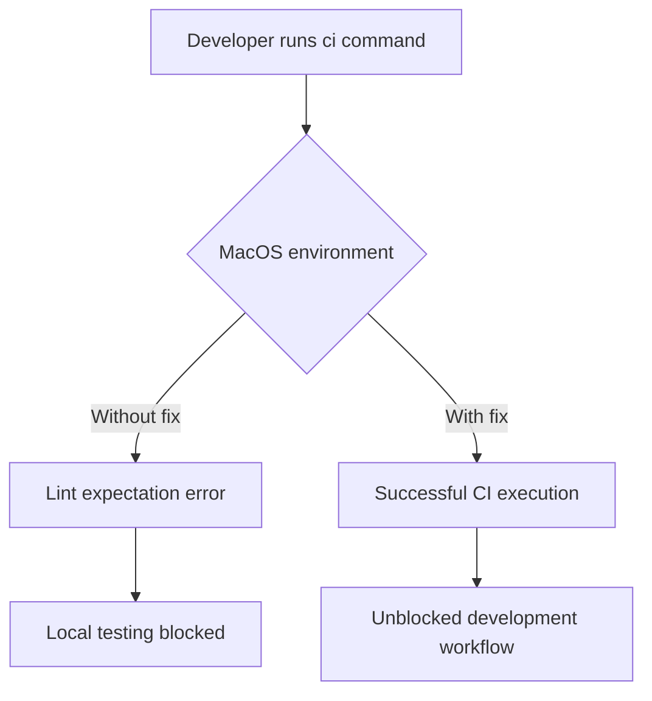

+++
title = "#19619 Fixing running `ci` locally in MacOS"
date = "2025-06-13T00:00:00"
draft = false
template = "pull_request_page.html"
in_search_index = true

[taxonomies]
list_display = ["show"]

[extra]
current_language = "en"
available_languages = {"en" = { name = "English", url = "/pull_request/bevy/2025-06/pr-19619-en-20250613" }, "zh-cn" = { name = "中文", url = "/pull_request/bevy/2025-06/pr-19619-zh-cn-20250613" }}
+++

# Fixing running `ci` locally in MacOS

## Basic Information
- **Title**: Fixing running `ci` locally in MacOS
- **PR Link**: https://github.com/bevyengine/bevy/pull/19619
- **Author**: eckz
- **Status**: MERGED
- **Labels**: None
- **Created**: 2025-06-13T13:45:39Z
- **Merged**: 2025-06-13T15:10:45Z
- **Merged By**: mockersf

## Description
# Objective

- Running `cargo run --package ci` in MacOS does not currently work in `main`.
- It shows a `error: this lint expectation is unfulfilled`.
- Fixes #19583

## Solution

- Remove an unnecessary `#[expect(clippy::large_enum_variant)]` on a function.

## Testing

- `cargo run --package ci`: 👍

## The Story of This Pull Request

The issue started when developers working on macOS encountered a build failure when running the continuous integration (CI) command locally. Specifically, executing `cargo run --package ci` on macOS would fail with the error message: `error: this lint expectation is unfulfilled`. This problem was documented in issue #19583 and prevented developers from properly testing their changes locally on macOS systems.

The root cause was traced to a Clippy lint expectation that was no longer being fulfilled. In the Bevy codebase, a function called `create_pipeline_task` had been annotated with `#[expect(clippy::large_enum_variant)]`. This attribute told the Clippy linter: "I expect this code to trigger a large_enum_variant warning, and that's acceptable in this case." However, recent code changes meant this lint warning was no longer being triggered, causing the `#[expect]` attribute to become an error since its expectation went unfulfilled.

The solution was straightforward: remove the unnecessary `#[expect]` attribute. Since the lint warning it was expecting no longer occurred, the attribute had become redundant and was causing the build failure. After removing these four lines of code, developers could once again run the CI command locally on macOS without errors.

This change demonstrates an important aspect of Rust's linting system: `#[expect]` attributes require the specified lint to actually trigger. When code evolves and the lint condition disappears, these attributes must be removed to prevent build failures. The fix was minimal but crucial for maintaining developer productivity on macOS.

## Visual Representation



## Key Files Changed

### crates/bevy_render/src/render_resource/pipeline_cache.rs
**Purpose**: Remove an unfulfilled Clippy lint expectation that was causing build failures on macOS.

**Code Change**:
```rust
// Before:
#[cfg_attr(
    target_os = "macos",
    not(feature = "multi_threaded")
)]
#[expect(
    clippy::large_enum_variant,
    reason = "See https://github.com/bevyengine/bevy/issues/19220"
)]
fn create_pipeline_task(
    task: impl Future<Output = Result<Pipeline, PipelineCacheError>> + Send + 'static,
    _sync: bool,
```

```rust
// After:
#[cfg_attr(
    target_os = "macos",
    not(feature = "multi_threaded")
)]
fn create_pipeline_task(
    task: impl Future<Output = Result<Pipeline, PipelineCacheError>> + Send + 'static,
    _sync: bool,
```

**Impact**: This change directly resolves the build failure by removing the unfulfilled lint expectation. The conditional compilation attributes remain intact, preserving the macOS-specific behavior while eliminating the problematic lint directive.

## Further Reading
- [Rust Clippy Lint Expectations Documentation](https://doc.rust-lang.org/nightly/clippy/usage.html#lint-expectations)
- [Rust Conditional Compilation Attributes](https://doc.rust-lang.org/reference/conditional-compilation.html)
- [Bevy CI Documentation](https://github.com/bevyengine/bevy/blob/main/docs/ci.md)

## Full Code Diff
```diff
diff --git a/crates/bevy_render/src/render_resource/pipeline_cache.rs b/crates/bevy_render/src/render_resource/pipeline_cache.rs
index e8814895a21a0..9d658cf361abd 100644
--- a/crates/bevy_render/src/render_resource/pipeline_cache.rs
+++ b/crates/bevy_render/src/render_resource/pipeline_cache.rs
@@ -1103,10 +1103,6 @@ fn create_pipeline_task(
     target_os = "macos",
     not(feature = "multi_threaded")
 )]
-#[expect(
-    clippy::large_enum_variant,
-    reason = "See https://github.com/bevyengine/bevy/issues/19220"
-)]
 fn create_pipeline_task(
     task: impl Future<Output = Result<Pipeline, PipelineCacheError>> + Send + 'static,
     _sync: bool,
```