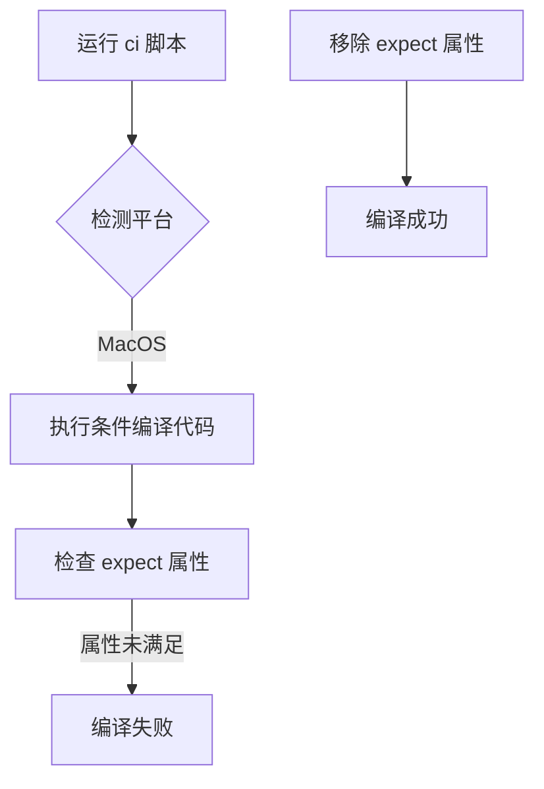

+++
title = "#19619 Fixing running `ci` locally in MacOS"
date = "2025-06-13T00:00:00"
draft = false
template = "pull_request_page.html"
in_search_index = false

[extra]
current_language = "zh-cn"
available_languages = {"en" = { name = "English", url = "/pull_request/bevy/2025-06/pr-19619-en-20250613" }, "zh-cn" = { name = "中文", url = "/pull_request/bevy/2025-06/pr-19619-zh-cn-20250613" }}
+++

# Fixing running `ci` locally in MacOS

## Basic Information
- **Title**: Fixing running `ci` locally in MacOS
- **PR Link**: https://github.com/bevyengine/bevy/pull/19619
- **Author**: eckz
- **Status**: MERGED
- **Labels**: None
- **Created**: 2025-06-13T13:45:39Z
- **Merged**: 2025-06-13T15:10:45Z
- **Merged By**: mockersf

## Description Translation
# 目的 (Objective)

- 在 MacOS 上运行 `cargo run --package ci` 目前在 `main` 分支中无法工作
- 它会显示一个错误：`error: this lint expectation is unfulfilled`
- 修复 #19583

## 解决方案 (Solution)

- 移除一个函数上不必要的 `#[expect(clippy::large_enum_variant)]`

## 测试 (Testing)

- `cargo run --package ci`: 👍

## The Story of This Pull Request

### 问题背景
在 MacOS 环境中运行 Bevy 的 CI 脚本 (`cargo run --package ci`) 时，开发者会遇到一个编译错误：`error: this lint expectation is unfulfilled`。这个错误发生在 `main` 分支中，导致本地开发工作流中断。具体问题是 Clippy 的 `expect` 属性检查失败，该属性原本期望一个 lint 警告会出现，但实际上警告并未触发。

### 问题诊断
问题根源在 `pipeline_cache.rs` 文件中的一个条件编译函数。该函数使用了 `#[expect(clippy::large_enum_variant)]` 属性，目的是临时抑制 Clippy 的 `large_enum_variant` 警告。但代码变更后，这个 lint 警告不再出现，导致 Clippy 的期望检查失败：
```rust
#[expect(
    clippy::large_enum_variant,
    reason = "See https://github.com/bevyengine/bevy/issues/19220"
)]
```
这种模式在 Rust 开发中常见，用于临时处理已知但尚未修复的 lint 警告。但当底层代码变更导致警告消失时，`expect` 属性反而会成为编译障碍。

### 解决方案实施
解决方案直接明了：移除不再需要的 `expect` 属性。该属性位于特定平台的条件编译块内：
```rust
#[cfg(all(
    target_os = "macos",
    not(feature = "multi_threaded")
))]
```
修改后代码简化为：
```rust
#[cfg(all(
    target_os = "macos",
    not(feature = "multi_threaded")
))]
fn create_pipeline_task(
    task: impl Future<Output = Result<Pipeline, PipelineCacheError>> + Send + 'static,
    _sync: bool,
```

### 技术权衡
考虑过其他方案：
1. **修改 lint 规则**：全局禁用该 lint 可能掩盖其他地方的合法问题
2. **重构代码**：解决潜在的 `large_enum_variant` 问题成本较高
3. **保留属性但满足期望**：人为引入警告不切实际

移除属性是最直接且安全的方案，因为：
- 原始问题 (#19220) 可能已通过其他方式解决
- 该属性仅影响特定平台配置
- 移除非必要属性不会改变功能行为

### 验证与影响
验证方法简单直接：在 MacOS 上重新运行 `cargo run --package ci` 确认成功。该修复：
1. 恢复 MacOS 开发者的本地 CI 功能
2. 消除虚假编译错误
3. 保持其他平台行为不变
4. 清理不再必要的代码注解

### 技术启示
该案例展示了 Rust lint 系统的交互复杂性：
- `expect` 属性适用于临时抑制已知警告
- 当警告消失时需及时清理这些属性
- 条件编译会增加此类问题的排查难度
- CI 脚本应覆盖所有目标平台配置

## Visual Representation



## Key Files Changed

### crates/bevy_render/src/render_resource/pipeline_cache.rs
- **修改原因**：移除导致 Clippy 检查失败的冗余属性
- **技术背景**：该文件管理渲染管线缓存，条件编译块处理 MacOS 特定逻辑

```rust
// 修改前:
#[cfg(all(
    target_os = "macos",
    not(feature = "multi_threaded")
))]
#[expect(
    clippy::large_enum_variant,
    reason = "See https://github.com/bevyengine/bevy/issues/19220"
)]
fn create_pipeline_task(
    task: impl Future<Output = Result<Pipeline, PipelineCacheError>> + Send + 'static,
    _sync: bool,

// 修改后:
#[cfg(all(
    target_os = "macos",
    not(feature = "multi_threaded")
))]
fn create_pipeline_task(
    task: impl Future<Output = Result<Pipeline, PipelineCacheError>> + Send + 'static,
    _sync: bool,
```

## Further Reading
1. [Rust Clippy 官方文档](https://doc.rust-lang.org/stable/clippy/)
2. [expect 属性工作机制](https://doc.rust-lang.org/rustc/lints/levels.html#expect)
3. [条件编译指南](https://doc.rust-lang.org/reference/conditional-compilation.html)