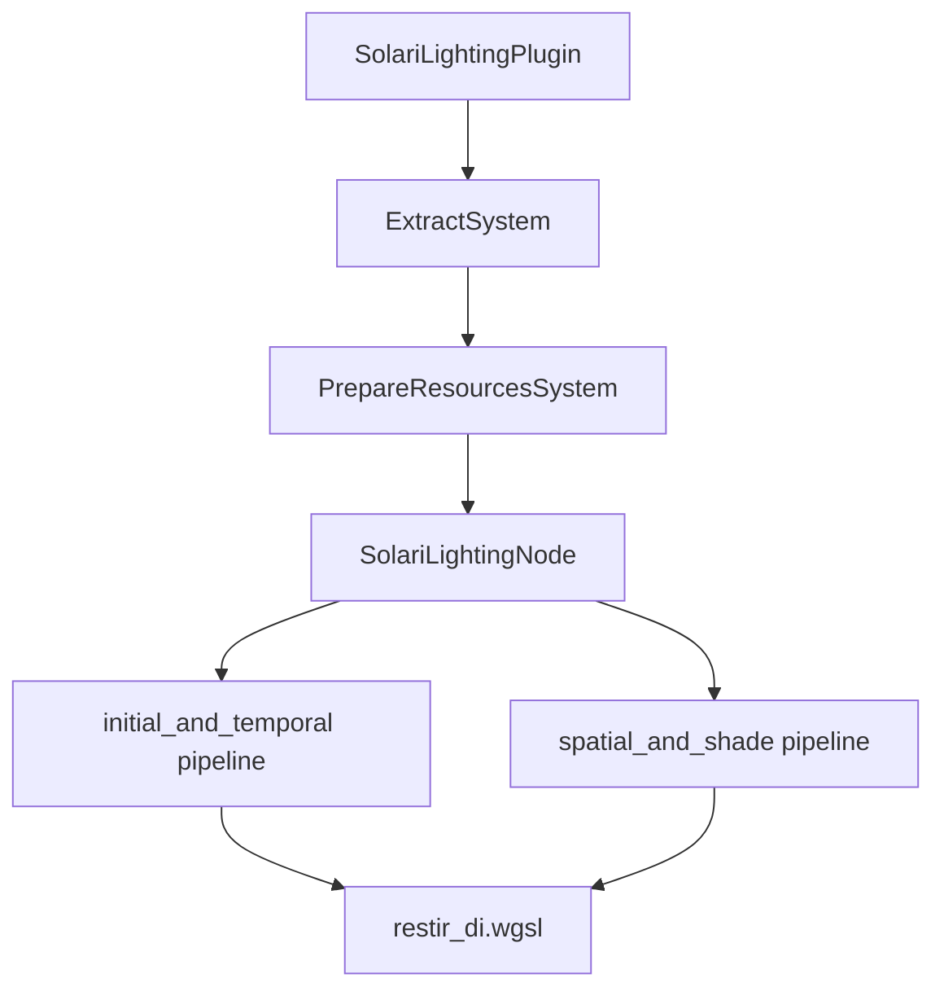

+++
title = "#19620 bevy_solari: RIS for Direct Lighting"
date = "2025-06-23T00:00:00"
draft = false
template = "pull_request_page.html"
in_search_index = false

[extra]
current_language = "zh-cn"
available_languages = {"en" = { name = "English", url = "/pull_request/bevy/2025-06/pr-19620-en-20250623" }, "zh-cn" = { name = "中文", url = "/pull_request/bevy/2025-06/pr-19620-zh-cn-20250623" }}
+++

# 技术分析报告：PR #19620 - bevy_solari: RIS for Direct Lighting

## 基本信息
- **标题**: bevy_solari: RIS for Direct Lighting
- **PR链接**: https://github.com/bevyengine/bevy/pull/19620
- **作者**: JMS55
- **状态**: 已合并
- **标签**: C-Feature, A-Rendering, S-Ready-For-Final-Review, M-Needs-Release-Note
- **创建时间**: 2025-06-13T14:13:02Z
- **合并时间**: 2025-06-23T01:04:57Z
- **合并者**: alice-i-cecile

## 描述翻译
### 目标
- 为bevy solari开启实时直接光照工作

### 解决方案
- 设置实时光照路径的所有CPU端代码（不包括时间复用的部分，尚未编写）
- 实现RIS（Reservoir-based Importance Sampling），使用32个样本来选择良好的随机光源
- 不对定向光源采样整个圆盘，而是将其视为单个点。这样更快且质量下降不大

### 未来计划
- 时空复用 (ReSTIR DI)
- 降噪器 (DLSS-RR)
- 光源分块优化以加速光源选择
- 间接光照 (ReSTIR GI)

### 测试
- 运行solari示例查看实时效果
- 运行solari示例时使用`-- --pathtracer`查看现有的路径追踪器

---
### 展示
1帧直接光照:


累积路径追踪输出:


## 本PR的技术演进

### 问题背景与上下文
Bevy的Solari模块旨在提供实验性的光线追踪光照功能，但在本次PR之前，它只包含一个非实时的路径追踪器（pathtracer）。实时直接光照是全局光照系统的基础部分，需要在保持实时性能的同时提供高质量的照明效果。主要技术挑战包括：
1. 需要高效的光源采样算法以减少噪声
2. 必须在GPU上实现复杂的光线追踪计算
3. 需要与Bevy现有的渲染管线集成
4. 需考虑不同硬件的能力差异

PR #19620聚焦于实现实时直接光照的核心功能，为后续更高级的全局光照功能奠定基础。

### 解决方案与工程决策
开发者选择了Reservoir-based Importance Sampling (RIS)作为核心算法，这是ReSTIR（Reservoir Spatiotemporal Importance Resampling）算法的一部分。关键工程决策包括：

1. **RIS实现**：使用32个初始样本选择光源，通过重要性采样降低噪声
2. **定向光源优化**：将定向光视为单点而非采样整个圆盘，在质量损失可接受的情况下显著提升性能
3. **双缓冲区设计**：使用两个reservoir缓冲区（A和B）交替存储当前帧和上一帧数据
4. **计算管线分离**：将光照计算分为两个独立的计算通道：
   - 初始化和时域重用（initial_and_temporal）
   - 空间重着色（spatial_and_shade）

### 实现细节
实现主要包含三个核心部分：

**1. 渲染管线集成**
在`realtime/mod.rs`中创建了`SolariLightingPlugin`，负责：
- 加载必要的WGSL着色器
- 注册`SolariLighting`组件
- 将光照节点插入渲染图

```rust
// crates/bevy_solari/src/realtime/mod.rs
render_app
    .add_systems(ExtractSchedule, extract_solari_lighting)
    .add_systems(
        Render,
        prepare_solari_lighting_resources.in_set(RenderSystems::PrepareResources),
    )
    .add_render_graph_node::<ViewNodeRunner<SolariLightingNode>>(
        Core3d,
        node::graph::SolariLightingNode,
    );
```

**2. 光照计算核心**
`restir_di.wgsl`着色器实现了RIS算法。关键部分包括：

```wgsl
// crates/bevy_solari/src/realtime/restir_di.wgsl
fn generate_initial_reservoir(...) -> Reservoir {
    var reservoir = empty_reservoir();
    for (var i = 0u; i < INITIAL_SAMPLES; i++) {
        let light_sample = generate_random_light_sample(rng);
        let light_contribution = calculate_light_contribution(...);
        let target_function = luminance(...);
        let resampling_weight = ...;
        
        reservoir.weight_sum += resampling_weight;
        if rand_f(rng) < resampling_weight / reservoir.weight_sum {
            reservoir.sample = light_sample;
        }
    }
    return reservoir;
}
```

**3. GPU资源管理**
在`prepare.rs`中动态创建和管理reservoir缓冲区：

```rust
// crates/bevy_solari/src/realtime/prepare.rs
let size = (view_size.x * view_size.y) as u64 * RESERVOIR_STRUCT_SIZE;
let reservoirs_a = render_device.create_buffer(&BufferDescriptor {
    label: Some("solari_lighting_reservoirs_a"),
    size,
    usage: BufferUsages::STORAGE,
});
```

### 技术洞察
1. **RIS算法优势**：
   - 通过重要性采样减少所需样本数
   - reservoir结构存储最佳候选光源和权重信息
   - 公式：$W = \frac{\sum w_i}{p}$ 其中$p$是目标函数

2. **性能优化**：
   - 定向光源简化为单点采样（禁用`DIRECTIONAL_LIGHT_SOFT_SHADOWS`）
   - 使用计算着色器并行处理
   - 按视图大小动态分配缓冲区

3. **内存管理**：
   - reservoir结构严格定义为32字节（RESERVOIR_STRUCT_SIZE）
   - 使用双缓冲区避免读写冲突

### 影响与后续工作
此PR带来的主要改进：
1. 实现实时直接光照路径
2. 为后续ReSTIR DI/GI提供基础架构
3. 示例帧率从0提升到实时水平（取决于硬件）

示例代码更新后支持两种模式：
```rust
// examples/3d/solari.rs
if args.pathtracer == Some(true) {
    camera.insert(Pathtracer::default());
} else {
    camera.insert(SolariLighting::default());
}
```

## 组件关系图


## 关键文件变更

### 1. `crates/bevy_solari/src/realtime/node.rs` (+200/-0)
**变更原因**：实现光照计算节点的核心逻辑  
**关键代码**：
```rust
// 初始化计算管线
let initial_and_temporal_pipeline = pipeline_cache.queue_compute_pipeline(
    ComputePipelineDescriptor {
        label: Some("solari_lighting_initial_and_temporal_pipeline"),
        shader: load_embedded_asset!(world, "restir_di.wgsl"),
        entry_point: "initial_and_temporal".into(),
        // ...
    }
);

// 调度计算任务
pass.set_pipeline(initial_and_temporal_pipeline);
pass.dispatch_workgroups(viewport.x.div_ceil(8), viewport.y.div_ceil(8), 1);
```

### 2. `crates/bevy_solari/src/realtime/restir_di.wgsl` (+117/-0)
**变更原因**：实现RIS算法的GPU端  
**关键代码**：
```wgsl
@compute @workgroup_size(8, 8, 1)
fn initial_and_temporal() {
    // 生成初始reservoir
    let initial_reservoir = generate_initial_reservoir(...);
    reservoirs_b[pixel_index] = initial_reservoir;
}

@compute @workgroup_size(8, 8, 1)
fn spatial_and_shade() {
    // 使用reservoir计算最终光照
    let input_reservoir = reservoirs_b[pixel_index];
    let radiance = calculate_light_contribution(...).radiance;
    textureStore(view_output, global_id.xy, vec4(pixel_color, 1.0));
}
```

### 3. `crates/bevy_solari/src/realtime/mod.rs` (+91/-0)
**变更原因**：定义插件和光照组件  
**关键代码**：
```rust
#[derive(Component, Reflect, Clone)]
#[require(Hdr, DeferredPrepass, DepthPrepass, MotionVectorPrepass)]
pub struct SolariLighting {
    pub reset: bool, // 重置时间历史
}

impl Plugin for SolariLightingPlugin {
    fn build(&self, app: &mut App) {
        app.register_type::<SolariLighting>();
        // 加载着色器
        embedded_asset!(app, "restir_di.wgsl");
    }
}
```

### 4. `crates/bevy_solari/src/realtime/prepare.rs` (+65/-0)
**变更原因**：管理GPU资源  
**关键代码**：
```rust
const RESERVOIR_STRUCT_SIZE: u64 = 32;

pub fn prepare_solari_lighting_resources(...) {
    let size = (view_size.x * view_size.y) as u64 * RESERVOIR_STRUCT_SIZE;
    let reservoirs_a = render_device.create_buffer(...);
    let reservoirs_b = render_device.create_buffer(...);
}
```

### 5. `examples/3d/solari.rs` (+50/-15)
**变更原因**：更新示例支持新功能  
**关键变更**：
```diff
- description = "Demonstrates realtime dynamic global illumination rendering..."
+ description = "Demonstrates realtime dynamic raytraced lighting..."

// 添加命令行参数
#[derive(FromArgs, Resource, Clone, Copy)]
struct Args {
    #[argh(switch)]
    pathtracer: Option<bool>,
}

// 根据参数选择渲染模式
if args.pathtracer == Some(true) {
    camera.insert(Pathtracer::default());
} else {
    camera.insert(SolariLighting::default());
}
```

## 延伸阅读
1. **ReSTIR算法**：
   - [Spatiotemporal reservoir resampling for real-time ray tracing](https://research.nvidia.com/publication/2020-07_spatiotemporal-reservoir-resampling-real-time-ray-tracing-dynamic-direct)
   - [ReSTIR GI: Path Resampling for Real-Time Path Tracing](https://arxiv.org/abs/2304.10412)

2. **WGSL编程**：
   - [WebGPU Shading Language](https://gpuweb.github.io/gpuweb/wgsl/)
   - [Bevy Shader Docs](https://bevyengine.org/learn/book/next/pipeline/shaders/)

3. **Bevy渲染架构**：
   - [Bevy Render Graph Documentation](https://bevyengine.org/learn/book/next/pipeline/render-graph/)
   - [Bevy Rendering Source Code](https://github.com/bevyengine/bevy/tree/main/crates/bevy_render)

此PR为Bevy的实时光线追踪光照奠定了重要基础，后续工作可在此基础上实现更完整的全局光照解决方案。