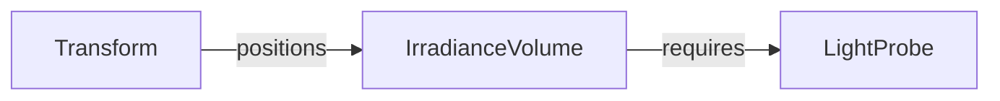

+++
title = "#19621 Make `IrradianceVolume` require `LightProbe` (and document this)."
date = "2025-06-13T00:00:00"
draft = false
template = "pull_request_page.html"
in_search_index = true

[taxonomies]
list_display = ["show"]

[extra]
current_language = "en"
available_languages = {"en" = { name = "English", url = "/pull_request/bevy/2025-06/pr-19621-en-20250613" }, "zh-cn" = { name = "中文", url = "/pull_request/bevy/2025-06/pr-19621-zh-cn-20250613" }}
labels = ["A-Rendering", "C-Usability"]
+++

# Technical Analysis of PR #19621: Make `IrradianceVolume` require `LightProbe`

## Basic Information
- **Title**: Make `IrradianceVolume` require `LightProbe` (and document this).
- **PR Link**: https://github.com/bevyengine/bevy/pull/19621
- **Author**: kpreid
- **Status**: MERGED
- **Labels**: A-Rendering, C-Usability, S-Ready-For-Final-Review
- **Created**: 2025-06-13T16:31:07Z
- **Merged**: 2025-06-13T17:28:38Z
- **Merged By**: alice-i-cecile

## Description Translation
### Objective

Make it easier to use `IrradianceVolume` with fewer ways to silently fail. Fix #19614.

### Solution

* Add `#[require(LightProbe)]` to `struct IrradianceVolume`.
* Document this fact.
* Also document the volume being centered on the origin by default (this was the other thing that was unclear when getting started).

I also looked at the other implementor of `LightProbeComponent`, `EnvironmentMapLight`, but it has a use which is *not* as a light probe, so it should not require `LightProbe`.

### Testing

* Confirmed that `examples/3d/irradiance_volumes.rs` still works after removing `LightProbe`.
* Reviewed generated documentation.

## The Story of This Pull Request

### Problem Identification
This PR addresses issue #19614 where users could add `IrradianceVolume` to entities without the required `LightProbe` component, resulting in silent failures. The irradiance volume wouldn't function as expected, but there was no clear error or warning to indicate the missing dependency. Additionally, the documentation didn't explicitly state that irradiance volumes are centered on the origin by default, leading to potential placement confusion.

### Implementation Strategy
The solution uses Bevy's reflection system to enforce component requirements at the type level. By adding `#[require(LightProbe)]` to the `IrradianceVolume` struct, the engine now automatically validates that any entity with an `IrradianceVolume` must also have a `LightProbe` component. This prevents the silent failure scenario by making the dependency explicit and enforced.

The documentation was updated in two key areas:
1. Added clear statements about the `LightProbe` requirement
2. Clarified the default center point behavior

The approach preserves flexibility for `EnvironmentMapLight`, which implements `LightProbeComponent` but isn't exclusively used as a light probe. This demonstrates good component boundary design by only enforcing requirements where they're semantically appropriate.

### Code Changes
The implementation required minimal but targeted changes:

1. Added the requirement attribute to `IrradianceVolume`:
   ```rust
   #[derive(Clone, Reflect, Component, Debug)]
   #[reflect(Component, Default, Debug, Clone)]
   #[require(LightProbe)]
   pub struct IrradianceVolume {
   ```

2. Documented the requirement and default center behavior:
   ```rust
   /// This component requires the [`LightProbe`] component, and is typically used with
   /// [`bevy_transform::components::Transform`] to place the volume appropriately.
   ```

3. Clarified the default center in module-level docs:
   ```rust
   //! Like all light probes in Bevy, irradiance volumes are 1×1×1 cubes, centered
   //! on the origin, that can be arbitrarily scaled, rotated, and positioned
   ```

4. Removed the explicit `LightProbe` from the example since it's now required:
   ```rust
   commands.spawn((
       PbrBundle { ... },
       irradiance_volume,
   ));
   ```

### Technical Validation
The author verified correctness through:
1. Functional testing: Confirmed the irradiance volumes example still worked after removing the explicit `LightProbe` component
2. Documentation review: Checked generated docs to ensure requirement and placement details were properly displayed
3. Component boundary analysis: Validated that `EnvironmentMapLight` shouldn't have the same requirement

### Impact and Benefits
This change improves the developer experience by:
- Preventing a common pitfall through compile-time enforcement
- Reducing cognitive load with clearer documentation
- Maintaining backward compatibility
- Preserving rendering performance (no runtime overhead)

The solution demonstrates effective use of Bevy's reflection system for component validation and shows how small documentation improvements can significantly enhance usability.

## Visual Representation



## Key Files Changed

1. **crates/bevy_pbr/src/light_probe/irradiance_volume.rs**:
   - Added component requirement attribute
   - Improved documentation about requirements and positioning

```rust
// Before:
#[derive(Clone, Reflect, Component, Debug)]
#[reflect(Component, Default, Debug, Clone)]
pub struct IrradianceVolume {

// After:
#[derive(Clone, Reflect, Component, Debug)]
#[reflect(Component, Default, Debug, Clone)]
#[require(LightProbe)]
pub struct IrradianceVolume {
```

```rust
// Documentation additions:
/// This component requires the [`LightProbe`] component, and is typically used with
/// [`bevy_transform::components::Transform`] to place the volume appropriately.
```

2. **examples/3d/irradiance_volumes.rs**:
   - Removed explicit `LightProbe` component since it's now required

```rust
// Before:
commands.spawn((
    PbrBundle { ... },
    irradiance_volume,
    LightProbe,
));

// After:
commands.spawn((
    PbrBundle { ... },
    irradiance_volume,
));
```

## Further Reading
- [Bevy Reflection System](https://bevyengine.org/learn/book/features/reflection/)
- [Component Relationships in ECS](https://bevy-cheatbook.github.io/programming/component-deps.html)
- [Light Probes Technical Overview](https://github.com/bevyengine/bevy/blob/main/crates/bevy_pbr/src/light_probe/mod.rs)