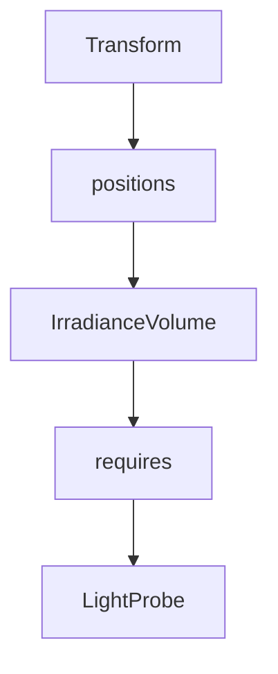

+++
title = "#19621 Make `IrradianceVolume` require `LightProbe` (and document this)."
date = "2025-06-13T00:00:00"
draft = false
template = "pull_request_page.html"
in_search_index = false

[extra]
current_language = "zh-cn"
available_languages = {"en" = { name = "English", url = "/pull_request/bevy/2025-06/pr-19621-en-20250613" }, "zh-cn" = { name = "中文", url = "/pull_request/bevy/2025-06/pr-19621-zh-cn-20250613" }}
+++

# PR分析报告：让 IrradianceVolume 要求 LightProbe 组件（并更新文档）

## 基本信息
- **标题**: Make `IrradianceVolume` require `LightProbe` (and document this).
- **PR链接**: https://github.com/bevyengine/bevy/pull/19621
- **作者**: kpreid
- **状态**: 已合并
- **标签**: A-Rendering, C-Usability, S-Ready-For-Final-Review
- **创建时间**: 2025-06-13T16:31:07Z
- **合并时间**: 2025-06-13T17:28:38Z
- **合并者**: alice-i-cecile

## 描述翻译
### 目标
简化 `IrradianceVolume` 的使用，减少静默失败的可能性。修复 #19614。

### 解决方案
* 在 `struct IrradianceVolume` 上添加 `#[require(LightProbe)]` 属性
* 在文档中明确说明此要求
* 同时在文档中说明体积默认以原点为中心（这是另一个初次使用时不够清晰的点）

我还查看了另一个实现了 `LightProbeComponent` 的组件 `EnvironmentMapLight`，但它有并非作为光照探针(light probe)的用途，因此不应要求 `LightProbe`。

### 测试
* 确认在移除 `LightProbe` 后 `examples/3d/irradiance_volumes.rs` 仍能正常工作
* 检查了生成的文档

## 本次PR的故事

### 问题与背景
在 Bevy 渲染系统中，`IrradianceVolume` 是用于全局光照的重要组件，它依赖于 `LightProbe` 组件才能正常工作。然而，现有实现存在两个问题：
1. **静默失败风险**：开发者可能忘记添加必需的 `LightProbe` 组件，导致 `IrradianceVolume` 无法正常工作且无错误提示
2. **文档不清晰**：现有文档未明确说明：
   - `IrradianceVolume` 必须与 `LightProbe` 组件配合使用
   - 体积默认以原点为中心，需通过 `Transform` 调整位置

这些问题在 issue #19614 中被报告，影响了组件的易用性和可靠性。特别是静默失败问题会增加调试难度，降低开发效率。

### 解决方案
采用直接而高效的方法解决上述问题：
1. **组件依赖强制**：使用 Bevy 的 `#[require]` 属性宏确保添加 `IrradianceVolume` 时自动包含 `LightProbe` 组件
2. **文档完善**：
   - 明确说明组件依赖关系
   - 澄清默认位置行为
   - 保持与其他光照探针组件的一致性

特别考虑了 `EnvironmentMapLight` 组件的特殊情况：它实现了 `LightProbeComponent` 但有时不作为光照探针使用，因此不应对其添加相同要求，避免破坏现有用例。

### 实现细节
核心修改在 `irradiance_volume.rs` 文件：
1. 添加组件依赖声明：
   ```rust
   #[derive(Clone, Reflect, Component, Debug)]
   #[reflect(Component, Default, Debug, Clone)]
   #[require(LightProbe)]  // 新增属性
   pub struct IrradianceVolume {
   ```
   这确保了任何包含 `IrradianceVolume` 的实体都会自动获得 `LightProbe` 组件

2. 更新文档注释：
   ```rust
   /// This component requires the [`LightProbe`] component, and is typically used with
   /// [`bevy_transform::components::Transform`] to place the volume appropriately.
   ```
   清晰说明了组件依赖关系和典型用法

3. 澄清默认位置行为：
   ```rust
   //! Like all light probes in Bevy, irradiance volumes are 1×1×1 cubes, centered
   //! on the origin, that can be arbitrarily scaled, rotated, and positioned...
   ```
   强调体积默认中心位置，避免使用时的误解

在示例文件 `irradiance_volumes.rs` 中移除了冗余代码：
```rust
// 修改前：
commands.spawn((
    IrradianceVolume { /* ... */ },
    LightProbe,  // 手动添加的组件
));

// 修改后：
commands.spawn((
    IrradianceVolume { /* ... */ },  // 自动获得LightProbe
));
```

### 技术洞察
1. **`#[require]` 机制**：Bevy ECS 的特性，在组件层面声明依赖关系，确保系统正确性
2. **光照探针系统**：`IrradianceVolume` 作为光照探针，必须通过 `LightProbe` 组件被渲染系统识别
3. **向后兼容**：修改后不影响现有正确使用 `IrradianceVolume` 的代码，仅修复错误用法

### 影响
1. **可靠性提升**：消除静默失败风险，确保组件始终正确配置
2. **开发体验改善**：
   - 文档更清晰，降低学习曲线
   - 示例代码更简洁
   - 错误预防优于事后调试
3. **维护性增强**：明确组件依赖关系，减少未来开发中的错误

## 可视化表示



## 关键文件变更

1. **crates/bevy_pbr/src/light_probe/irradiance_volume.rs** (+11/-6)
   - 添加组件依赖声明和文档更新
   - 关键代码片段：
     ```rust
     // 修改后：
     #[derive(Clone, Reflect, Component, Debug)]
     #[reflect(Component, Default, Debug, Clone)]
     #[require(LightProbe)]
     pub struct IrradianceVolume {
         // ...
     }
     
     /// This component requires the [`LightProbe`] component...
     ```

2. **examples/3d/irradiance_volumes.rs** (+0/-1)
   - 移除冗余的 `LightProbe` 组件添加
   - 关键代码片段：
     ```rust
     // 修改前：
     commands.spawn((
         IrradianceVolume { /* ... */ },
         LightProbe,
     ));
     
     // 修改后：
     commands.spawn((
         IrradianceVolume { /* ... */ },
     ));
     ```

## 扩展阅读
1. [Bevy光照探针系统文档](https://docs.rs/bevy/latest/bevy/pbr/light_probe/index.html)
2. [Bevy组件属性宏参考](https://github.com/bevyengine/bevy/blob/main/crates/bevy_ecs/src/query/README.md#query-filters)
3. [全局光照技术背景](https://en.wikipedia.org/wiki/Global_illumination)