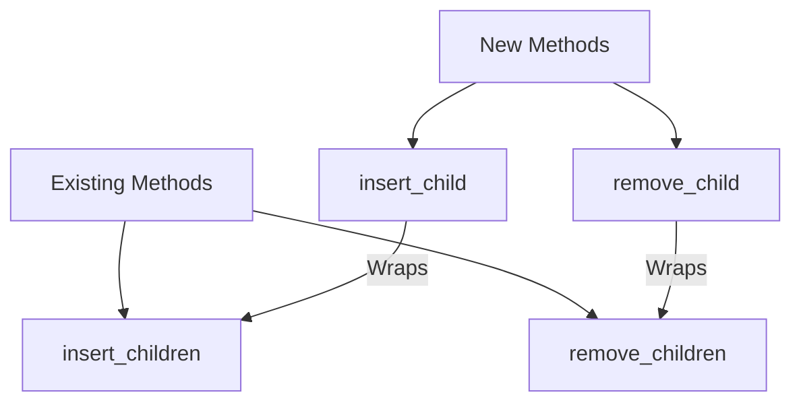

+++
title = "#19622 Adding Convenience Methods `insert_child` and `remove_child` to Bevy ECS"
date = "2025-06-15T00:00:00"
draft = false
template = "pull_request_page.html"
in_search_index = true

[taxonomies]
list_display = ["show"]

[extra]
current_language = "en"
available_languages = {"en" = { name = "English", url = "/pull_request/bevy/2025-06/pr-19622-en-20250615" }, "zh-cn" = { name = "中文", url = "/pull_request/bevy/2025-06/pr-19622-zh-cn-20250615" }}
labels = ["D-Trivial", "A-ECS", "C-Usability"]
+++

## Title: Adding Convenience Methods `insert_child` and `remove_child` to Bevy ECS

### Basic Information
- **Title**: Add insert_child and remove_child methods
- **PR Link**: https://github.com/bevyengine/bevy/pull/19622
- **Author**: Joel-Singh
- **Status**: MERGED
- **Labels**: D-Trivial, A-ECS, C-Usability, S-Ready-For-Final-Review, X-Uncontroversial
- **Created**: 2025-06-13T17:06:50Z
- **Merged**: 2025-06-15T17:16:46Z
- **Merged By**: alice-i-cecile

### Description Translation
**Objective**

- `remove_child` was mentioned missing in #19556 and I realized that `insert_child` was also missing.
- Removes the need to wrap a single entity with `&[]` with `remove_children` and `insert_children`
- Would have also added `despawn_children` but #19283 does so. 

**Solution**

- Simple wrapper around `remove_related`

**Testing**

- Added `insert_child` and `remove_child` tests analogous to `insert_children` and `remove_children` and then ran `cargo run -p ci -- test`

---

### The Story of This Pull Request

#### The Problem
In Bevy's Entity Component System (ECS), developers working with entity hierarchies needed to manipulate child relationships. While methods like `insert_children` and `remove_children` existed, they required passing a slice of entities even when operating on a single child. This created unnecessary boilerplate:

```rust
// Before: Had to wrap single entity in slice
entity.add_children(&[child_entity]);
entity.remove_children(&[child_entity]);
```

This ergonomic issue was noted in issue #19556 where `remove_child` was specifically requested. The author recognized that `insert_child` was similarly missing, creating inconsistent API patterns.

#### The Solution Approach
The solution implemented direct wrappers around existing methods:
1. Created `insert_child` as a thin wrapper around `insert_related::<ChildOf>`
2. Created `remove_child` as a thin wrapper around `remove_related::<ChildOf>`
3. Maintained the existing relationship system's behavior
4. Avoided duplicating `despawn_children` since it was handled in #19283

The implementation respected Bevy's established patterns by:
- Maintaining the `ChildOf` relation type
- Preserving the builder pattern return type (`&mut Self`)
- Using the same parameter order as existing methods

#### Implementation Details
The changes were applied consistently to both `EntityWorldMut` and `EntityCommands` APIs. For `EntityWorldMut`:

```rust
pub fn insert_child(&mut self, index: usize, child: Entity) -> &mut Self {
    self.insert_related::<ChildOf>(index, &[child])
}

pub fn remove_child(&mut self, child: Entity) -> &mut Self {
    self.remove_related::<ChildOf>(&[child])
}
```

The same pattern was mirrored in `EntityCommands`:
```rust
pub fn insert_child(&mut self, index: usize, child: Entity) -> &mut Self {
    self.insert_related::<ChildOf>(index, &[child])
}

pub fn remove_child(&mut self, child: Entity) -> &mut Self {
    self.remove_related::<ChildOf>(&[child])
}
```

#### Testing
Comprehensive tests were added to verify correct behavior:
1. `insert_child` test validates proper ordering when inserting at specific indices
2. `remove_child` test verifies correct removal from middle positions
3. Tests mirror existing `insert_children`/`remove_children` test patterns

Example test case:
```rust
#[test]
fn remove_child() {
    let mut world = World::new();
    let children = [child1, child2, child3];
    let mut root = world.spawn_empty();
    root.add_children(&children);
    root.remove_child(child2);  // Remove middle child
    // Verify remaining children
}
```

#### Impact
These changes improve API ergonomics by:
1. Eliminating the need to wrap single entities in slices
2. Reducing boilerplate for common single-child operations
3. Maintaining consistency with existing plural methods
4. Providing discoverable single-child variants

The changes are backward-compatible and don't affect existing code. The implementation avoids performance overhead since it directly wraps existing optimized methods.

---

### Visual Representation



---

### Key Files Changed

#### `crates/bevy_ecs/src/hierarchy.rs`
Added convenience methods to eliminate slice wrapping for single-child operations.

**Changes:**
```rust
// Before: Only plural methods available
pub fn insert_children(&mut self, index: usize, children: &[Entity]) -> &mut Self {
    self.insert_related::<ChildOf>(index, children)
}

pub fn remove_children(&mut self, children: &[Entity]) -> &mut Self {
    self.remove_related::<ChildOf>(children)
}

// After: Added singular variants
pub fn insert_child(&mut self, index: usize, child: Entity) -> &mut Self {
    self.insert_related::<ChildOf>(index, &[child])
}

pub fn remove_child(&mut self, child: Entity) -> &mut Self {
    self.remove_related::<ChildOf>(&[child])
}
```

**Test additions:**
```rust
#[test]
fn insert_child() {
    // Setup hierarchy
    root.insert_child(1, child3);
    // Verify insertion order
}

#[test]
fn remove_child() {
    // Setup 3 children
    root.remove_child(child2);
    // Verify removal
}
```

---

### Further Reading
1. [Bevy ECS Hierarchy Documentation](https://bevyengine.org/learn/book/ecs/hierarchy/)
2. [Related PR: Add despawn_children](https://github.com/bevyengine/bevy/pull/19283)
3. [Original Issue Mentioning remove_child](https://github.com/bevyengine/bevy/issues/19556)
4. [EntityCommands API Reference](https://docs.rs/bevy_ecs/latest/bevy_ecs/system/struct.EntityCommands.html)