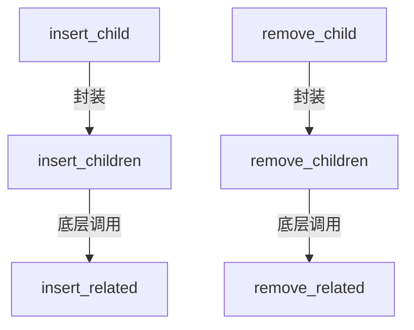

+++
title = "#19622 Add insert_child and remove_child methods"
date = "2025-06-15T00:00:00"
draft = false
template = "pull_request_page.html"
in_search_index = false

[extra]
current_language = "zh-cn"
available_languages = {"en" = { name = "English", url = "/pull_request/bevy/2025-06/pr-19622-en-20250615" }, "zh-cn" = { name = "中文", url = "/pull_request/bevy/2025-06/pr-19622-zh-cn-20250615" }}
+++

## 添加 `insert_child` 和 `remove_child` 方法

### 基本信息
- **标题**: Add insert_child and remove_child methods
- **PR链接**: https://github.com/bevyengine/bevy/pull/19622
- **作者**: Joel-Singh
- **状态**: MERGED
- **标签**: D-Trivial, A-ECS, C-Usability, S-Ready-For-Final-Review, X-Uncontroversial
- **创建时间**: 2025-06-13T17:06:50Z
- **合并时间**: 2025-06-15T17:16:46Z
- **合并人**: alice-i-cecile

### 描述翻译
#### Objective
- 在 issue #19556 中提到缺失 `remove_child` 方法，同时发现 `insert_child` 方法也缺失
- 消除在单个实体操作时需要包裹 `&[]` 的冗余操作（例如 `remove_children` 和 `insert_children`）
- 原计划添加 `despawn_children` 方法，但 #19283 已实现该功能

#### Solution
- 围绕 `remove_related` 方法创建简单封装

#### Testing
- 添加了与 `insert_children` 和 `remove_children` 类似的 `insert_child` 和 `remove_child` 测试
- 运行 `cargo run -p ci -- test` 验证

### PR 技术分析

#### 问题背景
在 Bevy ECS 的实体层级管理 API 中，开发者操作单个子实体时需要额外处理语法冗余。现有方法 `insert_children` 和 `remove_children` 设计用于处理多个实体（接收 `&[Entity]` 切片参数）。当开发者仅需操作单个子实体时，必须将实体包裹在切片中（例如 `&[child]`），导致代码不直观：
```rust
// 旧方式：操作单个子实体需要额外语法
entity.add_children(&[child_entity]);
entity.remove_children(&[child_entity]);
```
此问题在 issue #19556 中被明确提出，同时发现对称的 `insert_child` 方法同样缺失。这种设计增加了代码噪音，尤其在频繁操作单个子实体的场景下（如动态 UI 更新或游戏对象层级调整）。

#### 解决方案
作者采用最小侵入式方案，在现有 API 基础上添加两个新方法：
1. **`insert_child`**：在指定索引插入单个子实体
2. **`remove_child`**：移除与指定实体的父子关系

两个方法均为现有方法的语法糖封装：
```rust
// 新增方法实现原理
pub fn insert_child(&mut self, index: usize, child: Entity) -> &mut Self {
    self.insert_related::<ChildOf>(index, &[child]) // 复用 insert_related
}

pub fn remove_child(&mut self, child: Entity) -> &mut Self {
    self.remove_related::<ChildOf>(&[child]) // 复用 remove_related
}
```
这种实现具有以下技术优势：
- **零运行时开销**：编译期会内联函数调用
- **API 一致性**：保持与 `insert_children/remove_children` 相同的参数顺序
- **向后兼容**：完全不影响现有代码

#### 实现验证
为保障功能正确性，作者添加了针对性单元测试：
```rust
#[test]
fn insert_child() {
    // 创建测试实体
    let child1 = world.spawn_empty().id();
    let child2 = world.spawn_empty().id();
    
    // 验证插入顺序
    root.insert_child(1, child2);
    assert_eq!(hierarchy, vec![child1, child2]);
}

#[test]
fn remove_child() {
    // 初始化父子关系
    root.add_children(&[child1, child2, child3]);
    
    // 验证移除操作
    root.remove_child(child2);
    assert_eq!(hierarchy, vec![child1, child3]);
}
```
测试覆盖了关键场景：
- 在链表不同位置插入子实体
- 移除中间/首尾子实体
- 验证层级关系更新正确性

#### 技术影响
1. **开发体验提升**：操作单个子实体的代码更简洁：
```rust
// 新方式：直接操作单个实体
entity.insert_child(0, new_child);
entity.remove_child(old_child);
```
2. **API 对称性完善**：补齐了 ECS 层级操作的方法矩阵：
   - `add_child` ↔ `remove_child`
   - `insert_children` ↔ `insert_child`
3. **认知负荷降低**：消除开发者对 "children" 复数方法的困惑（明确区分单/复数操作）

#### 工程考量
- **修改范围最小化**：仅扩展 API 不修改底层逻辑
- **文档延续性**：通过 `See also` 注释保持方法关联性
- **错误处理延续**：继承 `insert_related` 的索引越界检查机制

### 组件关系


### 关键文件变更

#### crates/bevy_ecs/src/hierarchy.rs
**变更说明**：在 `EntityWorldMut` 和 `EntityCommands` 两个结构体中新增单实体操作方法

```rust
// 在 EntityWorldMut 的实现中
pub fn insert_child(&mut self, index: usize, child: Entity) -> &mut Self {
    self.insert_related::<ChildOf>(index, &[child])
}

pub fn remove_child(&mut self, child: Entity) -> &mut Self {
    self.remove_related::<ChildOf>(&[child])
}

// 在 EntityCommands 的实现中
pub fn insert_child(&mut self, index: usize, child: Entity) -> &mut Self {
    self.insert_related::<ChildOf>(index, &[child])
}

pub fn remove_child(&mut self, child: Entity) -> &mut Self {
    self.remove_related::<ChildOf>(&[child])
}
```

**测试用例新增**：
```rust
#[test]
fn insert_child() { /* 验证插入顺序逻辑 */ }

#[test]
fn remove_child() { /* 验证移除逻辑 */ }
```

### 延伸阅读
1. [ECS 层级设计原理解析](https://bevyengine.org/learn/book/getting-started/ecs/#hierarchy)
2. [相关 PR #19283: 添加 despawn_children 方法](https://github.com/bevyengine/bevy/pull/19283)
3. [问题溯源 #19556: remove_child 缺失报告](https://github.com/bevyengine/bevy/issues/19556)