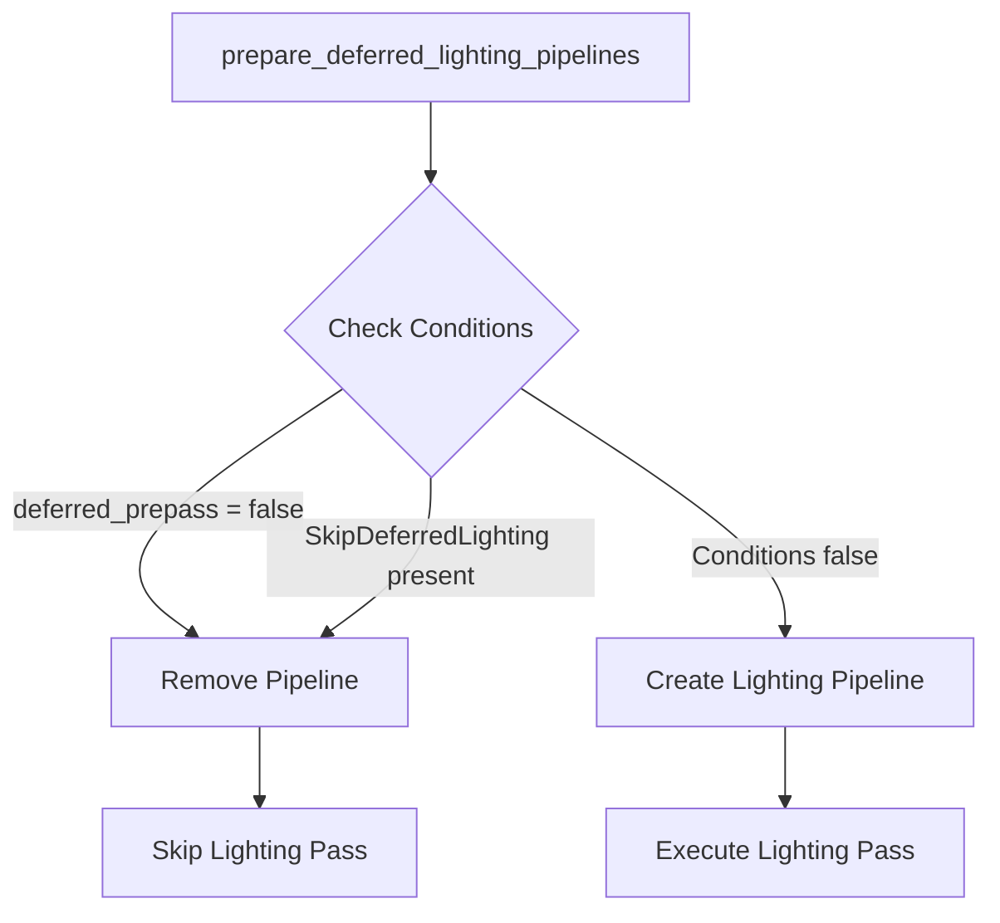

+++
title = "#19628 Add SkipDeferredLighting component"
date = "2025-06-15T00:00:00"
draft = false
template = "pull_request_page.html"
in_search_index = true

[taxonomies]
list_display = ["show"]

[extra]
current_language = "en"
available_languages = {"en" = { name = "English", url = "/pull_request/bevy/2025-06/pr-19628-en-20250615" }, "zh-cn" = { name = "中文", url = "/pull_request/bevy/2025-06/pr-19628-zh-cn-20250615" }}
labels = ["A-Rendering", "C-Usability"]
+++

### Title  
**Add SkipDeferredLighting component**  

---

### Basic Information  
- **Title**: Add SkipDeferredLighting component  
- **PR Link**: https://github.com/bevyengine/bevy/pull/19628  
- **Author**: JMS55  
- **Status**: MERGED  
- **Labels**: A-Rendering, C-Usability, S-Ready-For-Final-Review  
- **Created**: 2025-06-13T17:50:42Z  
- **Merged**: 2025-06-15T16:51:24Z  
- **Merged By**: alice-i-cecile  

---

### Description Translation  
Adds a new component for when you want to run the deferred gbuffer prepass, but not the lighting pass.  

This will be used by bevy_solari in the future, as it'll do it's own shading pass, but still wants the gbuffer.  

---

### The Story of This Pull Request  

#### The Problem and Context  
Bevy's deferred rendering pipeline executes two critical phases: the **gbuffer prepass** (which writes geometry data like normals and depth to textures) and the **lighting pass** (which computes final lighting using the gbuffer). However, some use cases—such as custom lighting systems like `bevy_solari`—require the gbuffer data but need to bypass Bevy's built-in lighting pass to apply custom shading logic. Previously, there was no granular control to decouple these phases per view.  

#### The Solution Approach  
The solution introduces a new component, `SkipDeferredLighting`, which allows views to opt out of the deferred lighting pass while retaining gbuffer generation. This is implemented by modifying the pipeline preparation logic to check for the component’s presence. If detected, the pipeline skips lighting pass setup for that specific view. The approach avoids intrusive changes by leveraging Bevy’s existing query-based pipeline management.  

#### The Implementation  
The core change occurs in `prepare_deferred_lighting_pipelines` (within `deferred/mod.rs`). Originally, this function removed the `DeferredLightingPipeline` only if `deferred_prepass` was disabled:  

```rust
if !deferred_prepass {
    commands.entity(entity).remove::<DeferredLightingPipeline>();
    continue;
}
```  

The updated logic also checks for the `SkipDeferredLighting` component:  

```rust
if !deferred_prepass || skip_deferred_lighting {
    commands.entity(entity).remove::<DeferredLightingPipeline>();
    continue;
}
```  

This condition now skips lighting if either:  
1. The view lacks a deferred prepass (`!deferred_prepass`), or  
2. The view explicitly requests lighting skip (`skip_deferred_lighting`).  

Additionally, the PR defines the component itself:  

```rust
#[derive(Component, Clone, Copy, Default)]
pub struct SkipDeferredLighting;
```  

#### Technical Insights  
- **Per-View Control**: Unlike global render configuration, this component operates at the view level, enabling mixed rendering strategies (e.g., some views use built-in lighting, others use custom passes).  
- **Pipeline Efficiency**: The check occurs during pipeline preparation, avoiding runtime overhead. Removing `DeferredLightingPipeline` prevents subsequent nodes from executing the lighting pass.  
- **Backward Compatibility**: Existing workflows remain unaffected since the component is opt-in.  

#### The Impact  
- **Custom Shading Workflows**: Projects like `bevy_solari` can now reuse Bevy’s gbuffer generation while injecting custom lighting.  
- **Minimal Overhead**: The change adds a single component check without altering core rendering logic.  
- **Pattern for Extensibility**: Demonstrates how to conditionally disable pipeline stages via components, a reusable pattern for similar future features.  

---

### Visual Representation  


---

### Key Files Changed  
#### `crates/bevy_pbr/src/deferred/mod.rs`  
**Changes**:  
1. Modified pipeline preparation to skip lighting when `SkipDeferredLighting` is present.  
2. Added the `SkipDeferredLighting` component definition.  

**Code Snippets**:  
```rust
// Before (line 461-464):
if !deferred_prepass {
    commands.entity(entity).remove::<DeferredLightingPipeline>();
    continue;
}

// After:
if !deferred_prepass || skip_deferred_lighting {
    commands.entity(entity).remove::<DeferredLightingPipeline>();
    continue;
}
```

```rust
// New component (added at end of file):
#[derive(Component, Clone, Copy, Default)]
pub struct SkipDeferredLighting;
```  

**Relation to PR Purpose**:  
The component allows selective disabling of the deferred lighting pass while preserving gbuffer generation, fulfilling the PR’s goal of enabling custom shading workflows.  

---

### Further Reading  
1. [Bevy Deferred Rendering Documentation](https://github.com/bevyengine/bevy/blob/main/docs/plugins_guidelines.md#deferred-rendering): Details on Bevy’s deferred pipeline.  
2. [Component-Based Rendering Patterns](https://github.com/bevyengine/bevy/blob/main/examples/ecs/component_change_detection.rs): Examples of using components to control rendering behavior.  
3. [PBR Pipeline Customization](https://bevyengine.org/learn/book/migration-guides/0.12-to-0.13/#pbr-rework): Context on Bevy’s physically based rendering.  

--- 

### Full Code Diff  
```diff
diff --git a/crates/bevy_pbr/src/deferred/mod.rs b/crates/bevy_pbr/src/deferred/mod.rs
index 65be474e65470..28edd38c52fb0 100644
--- a/crates/bevy_pbr/src/deferred/mod.rs
+++ b/crates/bevy_pbr/src/deferred/mod.rs
@@ -449,6 +449,7 @@ pub fn prepare_deferred_lighting_pipelines(
         ),
         Has<RenderViewLightProbes<EnvironmentMapLight>>,
         Has<RenderViewLightProbes<IrradianceVolume>>,
+        Has<SkipDeferredLighting>,
     )>,
 ) {
     for (
@@ -461,12 +462,13 @@ pub fn prepare_deferred_lighting_pipelines(
         (normal_prepass, depth_prepass, motion_vector_prepass, deferred_prepass),
         has_environment_maps,
         has_irradiance_volumes,
+        skip_deferred_lighting,
     ) in &views
     {
-        // If there is no deferred prepass, remove the old pipeline if there was
-        // one. This handles the case in which a view using deferred stops using
-        // it.
-        if !deferred_prepass {
+        // If there is no deferred prepass or we want to skip the deferred lighting pass,
+        // remove the old pipeline if there was one. This handles the case in which a
+        // view using deferred stops using it.
+        if !deferred_prepass || skip_deferred_lighting {
             commands.entity(entity).remove::<DeferredLightingPipeline>();
             continue;
         }
@@ -552,3 +554,14 @@ pub fn prepare_deferred_lighting_pipelines(
             .insert(DeferredLightingPipeline { pipeline_id });
     }
 }
+
+/// Component to skip running the deferred lighting pass in [`DeferredOpaquePass3dPbrLightingNode`] for a specific view.
+///
+/// This works like [`crate::PbrPlugin::add_default_deferred_lighting_plugin`], but is per-view instead of global.
+///
+/// Useful for cases where you want to generate a gbuffer, but skip the built-in deferred lighting pass
+/// to run your own custom lighting pass instead.
+///
+/// Insert this component in the render world only.
+#[derive(Component, Clone, Copy, Default)]
+pub struct SkipDeferredLighting;
```