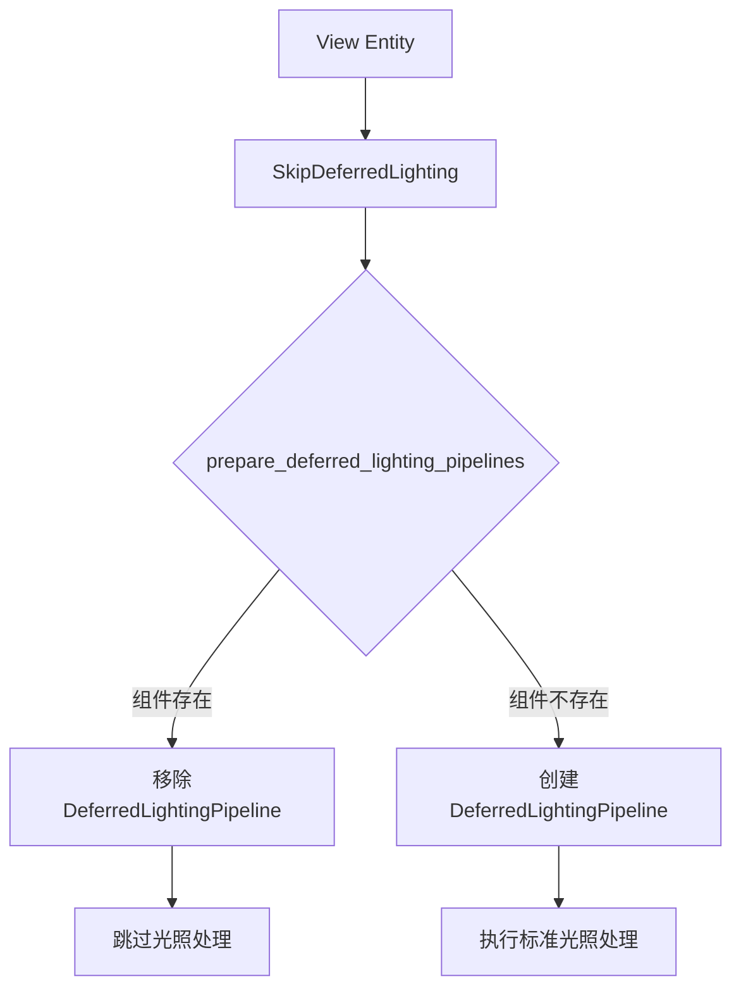

+++
title = "#19628 Add SkipDeferredLighting component"
date = "2025-06-15T00:00:00"
draft = false
template = "pull_request_page.html"
in_search_index = false

[extra]
current_language = "zh-cn"
available_languages = {"en" = { name = "English", url = "/pull_request/bevy/2025-06/pr-19628-en-20250615" }, "zh-cn" = { name = "中文", url = "/pull_request/bevy/2025-06/pr-19628-zh-cn-20250615" }}
labels = ["A-Rendering", "C-Usability"]
+++

# Add SkipDeferredLighting component

## Basic Information
- **Title**: Add SkipDeferredLighting component
- **PR Link**: https://github.com/bevyengine/bevy/pull/19628
- **Author**: JMS55
- **Status**: MERGED
- **Labels**: A-Rendering, C-Usability, S-Ready-For-Final-Review
- **Created**: 2025-06-13T17:50:42Z
- **Merged**: 2025-06-15T16:51:24Z
- **Merged By**: alice-i-cecile

## Description Translation
添加一个新的组件，用于当你想运行延迟 gbuffer 预处理（prepass）但跳过光照处理（lighting pass）的情况。

这将用于 bevy_solari，因为它会执行自己的着色处理（shading pass），但仍需要 gbuffer。

## The Story of This Pull Request

### 问题背景
在 Bevy 的延迟渲染管线中，gbuffer 预处理（prepass）和光照处理（lighting pass）通常是紧密耦合的。当启用延迟渲染时，系统会自动执行完整的 gbuffer 生成和光照计算流程。然而，某些特定用例需要更精细的控制 - 特别是需要生成 gbuffer 但使用自定义光照实现的场景。bevy_solari 项目就是一个典型案例，它需要利用 gbuffer 数据但完全替换内置的光照处理流程。

### 解决方案设计
为了解决这个需求，我们引入了一个新的组件 `SkipDeferredLighting`。这个组件采用组件化设计（component-based design），允许按视图（per-view）控制光照处理的执行，与 Bevy 的 ECS 架构保持一致。核心思路是：当视图实体（view entity）拥有这个组件时，系统会跳过该视图的延迟光照处理管线准备，同时保留 gbuffer 生成功能。

替代方案考虑过全局配置开关，但组件化方案更灵活：
1. 允许不同视图使用不同配置（例如主视图用内置光照，画中画视图用自定义光照）
2. 避免增加全局状态管理复杂度
3. 与现有条件查询系统（conditional query system）自然集成

### 实现细节
主要修改集中在延迟光照管线的准备系统 `prepare_deferred_lighting_pipelines`。关键变更是在原有条件判断中增加对 `SkipDeferredLighting` 组件的检测：

```rust
// Before: 仅检查是否启用了延迟预处理
if !deferred_prepass {
    commands.entity(entity).remove::<DeferredLightingPipeline>();
    continue;
}

// After: 增加对 SkipDeferredLighting 组件的检查
if !deferred_prepass || skip_deferred_lighting {
    commands.entity(entity).remove::<DeferredLightingPipeline>();
    continue;
}
```

查询参数也相应扩展，增加了 `Has<SkipDeferredLighting>` 过滤器：
```rust
views: Query<(
    // ...其他字段不变...
    Has<SkipDeferredLighting>,  // 新增过滤器
)>
```

新增的组件定义简洁明了：
```rust
#[derive(Component, Clone, Copy, Default)]
pub struct SkipDeferredLighting;
```

文档注释明确说明了使用场景：
```rust
/// Component to skip running the deferred lighting pass [...]
/// Useful for cases where you want to generate a gbuffer, but skip the built-in deferred lighting pass
/// to run your own custom lighting pass instead.
```

### 技术要点
1. **向后兼容**：默认行为完全不变，只有显式添加组件的视图会跳过光照处理
2. **渲染世界专属**：文档强调该组件仅在渲染世界（render world）中使用
3. **轻量级设计**：组件是零大小的（zero-sized），仅作为标记使用，无运行时开销
4. **精确控制**：与 `deferred_prepass` 标志协同工作，提供细粒度的控制逻辑

### 实际影响
1. 为 bevy_solari 等需要自定义光照的项目提供必要的扩展点
2. 使延迟渲染管线更灵活，不影响核心渲染性能
3. 示范了如何通过组件扩展渲染管线控制逻辑
4. 保持架构简洁 - 仅增加 17 行代码，修改 4 行

## Visual Representation



## Key Files Changed

### `crates/bevy_pbr/src/deferred/mod.rs`
**变更说明**：新增 `SkipDeferredLighting` 组件并修改管线准备逻辑，允许按视图跳过延迟光照处理。

**关键代码变更**：
```rust
// 修改后的条件判断（第462行）
if !deferred_prepass || skip_deferred_lighting {
    commands.entity(entity).remove::<DeferredLightingPipeline>();
    continue;
}

// 新增的组件定义（第554行）
#[derive(Component, Clone, Copy, Default)]
pub struct SkipDeferredLighting;
```

**完整上下文**：
```diff
@@ -449,6 +449,7 @@ pub fn prepare_deferred_lighting_pipelines(
         ),
         Has<RenderViewLightProbes<EnvironmentMapLight>>,
         Has<RenderViewLightProbes<IrradianceVolume>>,
+        Has<SkipDeferredLighting>,
     )>,
 ) {
     for (
@@ -461,12 +462,13 @@ pub fn prepare_deferred_lighting_pipelines(
         (normal_prepass, depth_prepass, motion_vector_prepass, deferred_prepass),
         has_environment_maps,
         has_irradiance_volumes,
+        skip_deferred_lighting,
     ) in &views
     {
-        // If there is no deferred prepass, remove the old pipeline if there was
-        // one. This handles the case in which a view using deferred stops using
-        // it.
-        if !deferred_prepass {
+        // If there is no deferred prepass or we want to skip the deferred lighting pass,
+        // remove the old pipeline if there was one. This handles the case in which a
+        // view using deferred stops using it.
+        if !deferred_prepass || skip_deferred_lighting {
             commands.entity(entity).remove::<DeferredLightingPipeline>();
             continue;
         }
@@ -552,3 +554,14 @@ pub fn prepare_deferred_lighting_pipelines(
             .insert(DeferredLightingPipeline { pipeline_id });
     }
 }
+
+/// Component to skip running the deferred lighting pass in [`DeferredOpaquePass3dPbrLightingNode`] for a specific view.
+///
+/// This works like [`crate::PbrPlugin::add_default_deferred_lighting_plugin`], but is per-view instead of global.
+///
+/// Useful for cases where you want to generate a gbuffer, but skip the built-in deferred lighting pass
+/// to run your own custom lighting pass instead.
+///
+/// Insert this component in the render world only.
+#[derive(Component, Clone, Copy, Default)]
+pub struct SkipDeferredLighting;
```

## Further Reading
1. [Bevy Render Graph 文档](https://bevyengine.org/learn/book/getting-started/rendering/)
2. [ECS 组件系统设计模式](https://github.com/SanderMertens/ecs-faq#component)
3. [延迟渲染管线原理](https://learnopengl.com/Advanced-Lighting/Deferred-Shading)