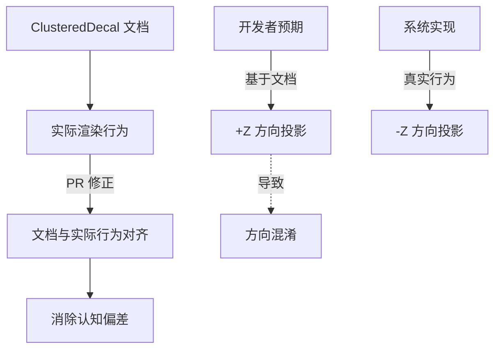

+++
title = "#19630 Fix incorrect description of ClusteredDecal"
date = "2025-06-13T00:00:00"
draft = false
template = "pull_request_page.html"
in_search_index = false

[extra]
current_language = "zh-cn"
available_languages = {"en" = { name = "English", url = "/pull_request/bevy/2025-06/pr-19630-en-20250613" }, "zh-cn" = { name = "中文", url = "/pull_request/bevy/2025-06/pr-19630-zh-cn-20250613" }}
+++

# 分析报告：修复 ClusteredDecal 的错误描述（PR #19630）

## 基本信息
- **标题**: Fix incorrect description of ClusteredDecal
- **PR 链接**: https://github.com/bevyengine/bevy/pull/19630
- **作者**: chendaohan
- **状态**: 已合并 (MERGED)
- **标签**: C-Docs, A-Rendering, S-Ready-For-Final-Review
- **创建时间**: 2025-06-13T19:12:07Z
- **合并时间**: 2025-06-13T19:51:54Z
- **合并者**: alice-i-cecile

## 描述翻译
文档说明 ClusteredDecal 向 +Z 方向投影，但实际上它向 -Z 方向投影，这会造成混淆。

# 目标
修复 #19612

## PR 技术分析

### 问题背景
在 Bevy 渲染系统中，`ClusteredDecal` 组件用于实现高质量贴花效果。文档注释中明确说明该组件向 **+Z 方向** 投影：

```rust
/// projects the given [`Self::image`] onto surfaces in the +Z direction
```

但实际代码实现中，贴花是向 **-Z 方向** 投影的。这种文档与实现的不一致会导致开发者在使用 `Transform::looking_at()` 等 API 时产生方向混淆（issue #19612）。文档错误会增加使用成本，可能导致错误的空间变换计算。

### 解决方案
PR 采用最直接的方式解决该问题：更新文档注释使其与实际行为一致。核心修改是将投影方向描述从 `+Z` 改为 `-Z`：

```rust
// 修改前
/// projects the given [`Self::image`] onto surfaces in the +Z direction

// 修改后
/// projects the given [`Self::image`] onto surfaces in the -Z direction
```

这个修改基于对现有渲染逻辑的验证：
1. Bevy 的贴花着色器 (`decal.wgsl`) 使用 `-local_normal` 计算投影
2. 标准坐标系中，局部空间的 -Z 方向通常对应物体前方

### 实现细节
修改仅涉及单个文件中的一行文档注释。保持原有技术描述结构不变，只修正方向说明：

```rust
crates/bevy_pbr/src/decal/clustered.rs

@@ -69,7 +69,7 @@ pub struct ClusteredDecalPlugin;
 /// An object that projects a decal onto surfaces within its bounds.
 ///
 /// Conceptually, a clustered decal is a 1×1×1 cube centered on its origin. It
-/// projects the given [`Self::image`] onto surfaces in the +Z direction (thus
+/// projects the given [`Self::image`] onto surfaces in the -Z direction (thus
 /// you may find [`Transform::looking_at`] useful).
 ///
 /// Clustered decals are the highest-quality types of decals that Bevy supports,
```

关键修改点：
- 保留原有功能说明和用例提示 (`Transform::looking_at`)
- 维持文档格式和上下文完整性
- 不触及任何实际渲染逻辑代码

### 技术影响
1. **消除认知偏差**：文档与实际行为对齐，开发者不再需要反向推导投影方向
2. **API 一致性**：与 `Transform::looking_at()` 的方向逻辑保持一致（look-at 默认朝向 -Z）
3. **零性能影响**：纯文档变更不涉及运行时逻辑
4. **维护成本**：避免后续开发者提交错误的方向相关补丁

### 工程经验
1. **文档验证**：技术文档应与实际代码行为保持同步验证
2. **方向约定**：在 3D 图形系统中明确坐标系方向约定至关重要
3. **最小化修改**：针对文档错误的修复应保持最小变更集，避免引入无关改动

## 可视化关系



## 关键文件变更

### `crates/bevy_pbr/src/decal/clustered.rs`
**变更说明**：修正 `ClusteredDecal` 结构体的文档注释，将投影方向从 +Z 改为 -Z 以匹配实际行为

```rust
// 变更前：
/// Conceptually, a clustered decal is a 1×1×1 cube centered on its origin. It
/// projects the given [`Self::image`] onto surfaces in the +Z direction (thus
/// you may find [`Transform::looking_at`] useful).

// 变更后：
/// Conceptually, a clustered decal is a 1×1×1 cube centered on its origin. It
/// projects the given [`Self::image`] onto surfaces in the -Z direction (thus
/// you may find [`Transform::looking_at`] useful).
```

**关联性**：这是本 PR 的唯一修改，直接解决文档描述错误问题

## 延伸阅读
1. [Bevy 渲染坐标系说明](https://bevyengine.org/learn/book/getting-started/coordinate-system/)
2. [Transform 组件文档](https://docs.rs/bevy/latest/bevy/transform/components/struct.Transform.html)
3. [WGSL 着色器中的空间变换](https://gpuweb.github.io/gpuweb/wgsl/#coordinate-systems)