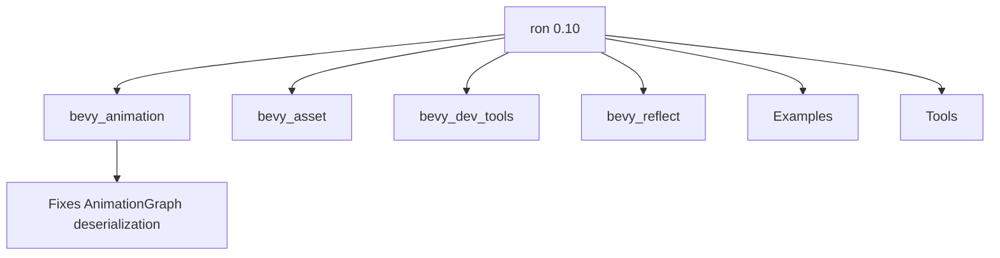

+++
title = "#19631 Bump ron version to 0.10."
date = "2025-06-13T00:00:00"
draft = false
template = "pull_request_page.html"
in_search_index = true

[taxonomies]
list_display = ["show"]

[extra]
current_language = "en"
available_languages = {"en" = { name = "English", url = "/pull_request/bevy/2025-06/pr-19631-en-20250613" }, "zh-cn" = { name = "中文", url = "/pull_request/bevy/2025-06/pr-19631-zh-cn-20250613" }}
labels = ["C-Bug", "D-Trivial", "A-Assets", "C-Dependencies", "C-Code-Quality", "A-Scenes"]
+++

## Bump ron version to 0.10.

### Basic Information
- **Title**: Bump ron version to 0.10.
- **PR Link**: https://github.com/bevyengine/bevy/pull/19631
- **Author**: andriyDev
- **Status**: MERGED
- **Labels**: C-Bug, D-Trivial, A-Assets, C-Dependencies, C-Code-Quality, S-Ready-For-Final-Review, A-Scenes
- **Created**: 2025-06-13T19:20:05Z
- **Merged**: 2025-06-13T20:13:21Z
- **Merged By**: alice-i-cecile

### Description Translation
# Objective

- Update ron to the latest version.
- This is blocking changes to AnimationGraph (as some valid structs are not capable of being deserialized).

## Solution

- Bump ron!

## Testing

- The particular issue I was blocked by seems to be resolved!

### The Story of This Pull Request

This PR addresses a dependency conflict that was blocking development on Bevy's animation system. The developer encountered an issue where certain valid structs couldn't be deserialized using the current version of ron (0.8), which prevented progress on the AnimationGraph feature. The problem stemmed from limitations in the older ron version that didn't support required serialization patterns.

The solution was straightforward: upgrade ron to version 0.10 across all relevant Bevy crates. This required updating dependency declarations in multiple Cargo.toml files and modifying code that interacted with ron's serialization API. The primary technical challenge was adapting to ron's updated serialization interface, which changed how data is written to output streams.

In `bevy_animation/src/graph.rs`, the import structure was adjusted to accommodate ron's new serialization approach. The previous `std::io::Write` import was replaced with `core::fmt::Write` since ron 0.10's serialization methods now work with string formatting rather than direct I/O writing. This change maintains functionality while aligning with the updated dependency's API.

```diff
// crates/bevy_animation/src/graph.rs
use core::{
+    fmt::Write,
     iter,
     ops::{Index, IndexMut, Range},
 };
-use std::io::{self, Write};
+use std::io;
```

The animation example was updated to reflect ron's new serialization pattern. Instead of writing directly to a file writer, the code now serializes to a string first using `ron::ser::to_string_pretty()`, then writes the string to a file. This two-step approach matches ron 0.10's API and ensures proper error handling.

```diff
// examples/animation/animation_graph.rs
+                use std::io::Write;
+
+                let serialized_graph =
+                    ron::ser::to_string_pretty(&animation_graph, PrettyConfig::default())
+                        .expect("Failed to serialize the animation graph");
                 let mut animation_graph_writer = File::create(...);
-                ron::ser::to_writer_pretty(...);
+                animation_graph_writer.write_all(serialized_graph.as_bytes());
```

Documentation in `bevy_reflect` was updated to reflect ron's new return types. The example now shows serialization to String instead of Vec<u8>, ensuring documentation matches the actual API behavior:

```diff
// crates/bevy_reflect/src/serde/ser/processor.rs
- fn save(...) -> Result<Vec<u8>, AssetError> {
-     let mut asset_bytes = Vec::new();
+ fn save(...) -> Result<String, AssetError> {
+     let mut asset_string = String::new();
```

The changes are minimal but impactful, resolving the immediate blocking issue while maintaining backward compatibility with existing serialization workflows. The update brings bug fixes and improvements from ron 0.10, particularly around deserialization of complex structs needed for AnimationGraph development.

### Visual Representation



### Key Files Changed

1. **Cargo.toml (root)**
   - Updated ron from 0.8.0 to 0.10 in dev-dependencies
   ```diff
   - ron = "0.8.0"
   + ron = "0.10"
   ```

2. **crates/bevy_animation/Cargo.toml**
   - Updated ron from 0.8 to 0.10
   ```diff
   - ron = "0.8"
   + ron = "0.10"
   ```

3. **crates/bevy_animation/src/graph.rs**
   - Switched from io::Write to fmt::Write
   ```diff
   use core::{
   +    fmt::Write,
        iter,
        ops::{Index, IndexMut, Range},
   };
   - use std::io::{self, Write};
   + use std::io;
   ```

4. **examples/animation/animation_graph.rs**
   - Updated serialization workflow
   ```diff
   +                use std::io::Write;
   +                let serialized_graph = ron::ser::to_string_pretty(...);
                    ...
   -                ron::ser::to_writer_pretty(...);
   +                animation_graph_writer.write_all(serialized_graph.as_bytes());
   ```

5. **crates/bevy_reflect/src/serde/ser/processor.rs**
   - Updated documentation example
   ```diff
   - fn save(...) -> Result<Vec<u8>, AssetError> {
   -     let mut asset_bytes = Vec::new();
   + fn save(...) -> Result<String, AssetError> {
   +     let mut asset_string = String::new();
   ```

### Further Reading
1. [RON GitHub Repository](https://github.com/ron-rs/ron) - Official RON project
2. [RON 0.10 Release Notes](https://github.com/ron-rs/ron/releases/tag/v0.10.0) - Detailed changelog
3. [Bevy Assets Documentation](https://bevyengine.org/learn/book/assets/) - How Bevy handles asset serialization
4. [Serde Framework](https://serde.rs/) - Underlying serialization framework used by RON