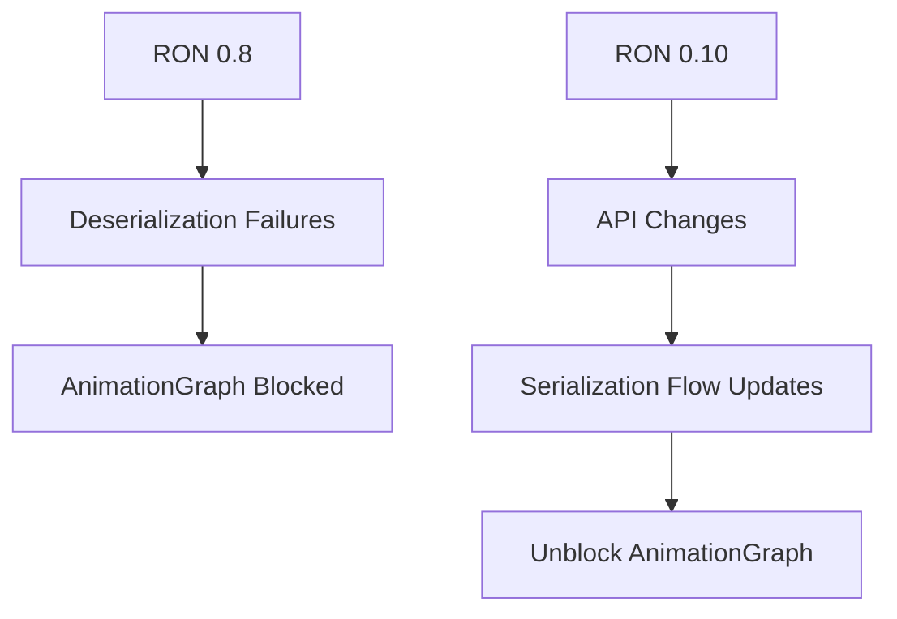

+++
title = "#19631 Bump ron version to 0.10."
date = "2025-06-13T00:00:00"
draft = false
template = "pull_request_page.html"
in_search_index = false

[extra]
current_language = "zh-cn"
available_languages = {"en" = { name = "English", url = "/pull_request/bevy/2025-06/pr-19631-en-20250613" }, "zh-cn" = { name = "中文", url = "/pull_request/bevy/2025-06/pr-19631-zh-cn-20250613" }}
labels = ["C-Bug", "D-Trivial", "A-Assets", "C-Dependencies", "C-Code-Quality", "A-Scenes"]
+++

# Bump ron version to 0.10.

## Basic Information
- **Title**: Bump ron version to 0.10.
- **PR Link**: https://github.com/bevyengine/bevy/pull/19631
- **Author**: andriyDev
- **Status**: MERGED
- **Labels**: C-Bug, D-Trivial, A-Assets, C-Dependencies, C-Code-Quality, S-Ready-For-Final-Review, A-Scenes
- **Created**: 2025-06-13T19:20:05Z
- **Merged**: 2025-06-13T20:13:21Z
- **Merged By**: alice-i-cecile

## Description Translation
### Objective (目标)

- 将 ron 更新至最新版本
- 此更新阻塞了 AnimationGraph 的改动（因为某些有效的结构体无法被反序列化）

### Solution (解决方案)

- 升级 ron 版本！

### Testing (测试)

- 我遇到的特定阻塞问题似乎已解决！

## The Story of This Pull Request

该 PR 解决了因 RON 序列化库版本过旧导致 AnimationGraph 功能开发受阻的问题。开发者在尝试修改动画图功能时，发现某些有效结构体无法被反序列化，经排查确认问题源自 RON 0.8 版本的限制。

解决方案直接明了：将 RON 依赖从 0.8 升级至 0.10 版本。这个改动涉及多个 Cargo.toml 文件，需要同步更新根目录和五个子模块（bevy_animation, bevy_asset, bevy_dev_tools, bevy_reflect, example-showcase）的依赖声明。

升级过程中发现了 RON 0.10 的 API 变化：
1. 在 `bevy_animation/src/graph.rs` 中，序列化接口从字节流转向字符串操作，因此将 `std::io::Write` 替换为 `core::fmt::Write`
   
2. `bevy_reflect` 的文档示例需要适配新 API，从直接序列化到字节流改为先序列化成字符串再写入：
   ```rust
   // 更新前
   let mut asset_bytes = Vec::new();
   ron::ser::to_writer_pretty(&mut asset_bytes, ...)
   
   // 更新后
   let mut asset_string = String::new();
   let serialized = ron::ser::to_string_pretty(...);
   writer.write_all(serialized.as_bytes())
   ```

3. 动画示例 `animation_graph.rs` 的资产保存逻辑重构：
   - 先通过 `ron::ser::to_string_pretty` 生成序列化字符串
   - 再通过标准文件写入操作保存字符串内容
   - 避免了直接使用 RON 的 writer 接口

这些改动解决了原始阻塞问题，同时保持了代码的向前兼容性。依赖升级后验证确认 AnimationGraph 的相关结构体可以正常序列化/反序列化。

## Visual Representation



## Key Files Changed

### 1. `Cargo.toml`
```diff
[dev-dependencies]
 rand = "0.8.0"
 rand_chacha = "0.3.1"
-ron = "0.8.0"
+ron = "0.10"
 flate2 = "1.0"
```
更新根项目的开发依赖版本

### 2. `crates/bevy_animation/Cargo.toml`
```diff
[dependencies]
 petgraph = { version = "0.7", features = ["serde-1"] }
-ron = "0.8"
+ron = "0.10"
 serde = "1"
```
更新动画模块的运行时依赖

### 3. `crates/bevy_animation/src/graph.rs`
```diff
 use core::{
+    fmt::Write,
     iter,
     ops::{Index, IndexMut, Range},
 };
-use std::io::{self, Write};
+use std::io;
```
适配 RON 0.10 的序列化接口变化

### 4. `examples/animation/animation_graph.rs`
```diff
 IoTaskPool::get()
     .spawn(async move {
+        use std::io::Write;
+
+        let serialized_graph =
+            ron::ser::to_string_pretty(&animation_graph, PrettyConfig::default())
+                .expect("Failed to serialize the animation graph");
         let mut animation_graph_writer = File::create(...);
-        ron::ser::to_writer_pretty(
-            &mut animation_graph_writer,
-            &animation_graph,
-            PrettyConfig::default(),
-        )
-        .expect("Failed to serialize the animation graph");
+        animation_graph_writer
+            .write_all(serialized_graph.as_bytes())
+            .expect("Failed to write the animation graph");
     })
```
重构资产保存逻辑以适应新序列化流程

## Further Reading
1. [RON 官方文档](https://github.com/ron-rs/ron) - Rusty Object Notation 序列化格式
2. [Semantic Versioning 规范](https://semver.org/) - 依赖版本管理规范
3. [Bevy 资产系统指南](https://bevyengine.org/learn/book/assets/) - Bevy 资产加载机制