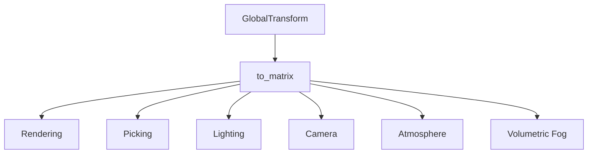

+++
title = "#19643 rename GlobalTransform::compute_matrix to to_matrix"
date = "2025-06-17T00:00:00"
draft = false
template = "pull_request_page.html"
in_search_index = true

[taxonomies]
list_display = ["show"]

[extra]
current_language = "en"
available_languages = {"en" = { name = "English", url = "/pull_request/bevy/2025-06/pr-19643-en-20250617" }, "zh-cn" = { name = "中文", url = "/pull_request/bevy/2025-06/pr-19643-zh-cn-20250617" }}
labels = ["A-Math", "D-Straightforward"]
+++

# PR Analysis: rename GlobalTransform::compute_matrix to to_matrix

## Basic Information
- **Title**: rename GlobalTransform::compute_matrix to to_matrix
- **PR Link**: https://github.com/bevyengine/bevy/pull/19643
- **Author**: atlv24
- **Status**: MERGED
- **Labels**: S-Ready-For-Final-Review, A-Math, M-Needs-Migration-Guide, D-Straightforward
- **Created**: 2025-06-14T19:23:24Z
- **Merged**: 2025-06-17T18:59:07Z
- **Merged By**: alice-i-cecile

## Description Translation
# Objective

- compute_matrix doesn't compute anything, it just puts an Affine3A into a Mat4. the name is inaccurate

## Solution

- rename it to conform with to_isometry (which, ironically, does compute a decomposition which is rather expensive)

## Testing

- Its a rename. If it compiles, its good to go

## The Story of This Pull Request

The core issue addressed in this PR was a misleading method name in Bevy's transform API. The `GlobalTransform::compute_matrix` method implied computational work was being performed when in reality it was simply converting the existing affine transform representation into a matrix format. This naming discrepancy could lead to incorrect assumptions about performance characteristics.

The solution implemented was a straightforward rename of `compute_matrix` to `to_matrix` throughout the codebase. This change aligns with common Rust conversion naming conventions (like `to_string` or `to_vec`) and accurately reflects the method's purpose as a simple type conversion rather than a computational operation. The new name also creates a clearer contrast with `to_isometry`, which does perform actual computation.

The implementation required updates across 13 files in the codebase where `compute_matrix` was called. Each change followed the same pattern:
1. Locate all references to `compute_matrix`
2. Replace with `to_matrix`
3. Verify compilation and functionality

An important aspect of this change was ensuring consistency across Bevy's various subsystems that use transforms, including rendering, picking, lighting, and camera systems. The PR also added a migration guide to help users update their code.

The key technical insight here is that naming matters for API clarity. While `compute_matrix` suggested an expensive operation, the actual work is minimal - it's essentially a zero-cost abstraction over the underlying affine transform data. The new name `to_matrix` more accurately communicates this behavior.

```rust
// Before: misleading name implies computation
let matrix = transform.compute_matrix();

// After: clear conversion semantics
let matrix = transform.to_matrix();
```

This change improves API consistency and reduces cognitive load for developers working with Bevy's transform system. The migration is straightforward but widespread, affecting multiple engine subsystems that rely on transform data.

## Visual Representation



## Key Files Changed

### crates/bevy_transform/src/components/global_transform.rs
**Change**: Renamed method in GlobalTransform implementation  
**Reason**: Core API change to fix misleading method name  
**Code**:  
```rust
// Before:
pub fn compute_matrix(&self) -> Mat4 {
    Mat4::from(self.0)
}

// After:
pub fn to_matrix(&self) -> Mat4 {
    Mat4::from(self.0)
}
```

### crates/bevy_picking/src/mesh_picking/ray_cast/intersections.rs
**Change**: Updated test cases to use new method name  
**Reason**: Maintain test functionality after API change  
**Code**:  
```rust
// Before:
let mesh_transform = GlobalTransform::IDENTITY.compute_matrix();

// After:
let mesh_transform = GlobalTransform::IDENTITY.to_matrix();
```

### crates/bevy_render/src/camera/camera.rs
**Change**: Updated camera projection calculations  
**Reason**: Camera systems rely on transform matrices  
**Code**:  
```rust
// Before:
let ndc_to_world = camera_transform.compute_matrix() * self.computed.clip_from_view.inverse();

// After:
let ndc_to_world = camera_transform.to_matrix() * self.computed.clip_from_view.inverse();
```

### release-content/migration-guides/rename_global_transform_compute_matrix.md
**Change**: Added migration documentation  
**Reason**: Document breaking API change for users  
**Code**:  
```markdown
---
title: GlobalTransform::compute_matrix rename
pull_requests: [19643]
---

`GlobalTransform::compute_matrix` has been renamed to `GlobalTransform::to_matrix` because it does not compute anything, it simply moves data into a different type.
```

### crates/bevy_pbr/src/light/mod.rs
**Change**: Updated directional light cascade calculations  
**Reason**: Lighting systems depend on transform matrices  
**Code**:  
```rust
// Before:
Some((entity, projection, transform.compute_matrix()))

// After:
Some((entity, projection, transform.to_matrix()))
```

## Further Reading
1. [Bevy Transform System Documentation](https://bevyengine.org/learn/book/getting-started/transform/)
2. [Rust API Guidelines on Naming](https://rust-lang.github.io/api-guidelines/naming.html)
3. [Affine Transformations Explained](https://en.wikipedia.org/wiki/Affine_transformation)
4. [Matrix vs Affine Representations](https://www.scratchapixel.com/lessons/mathematics-physics-for-computer-graphics/geometry)