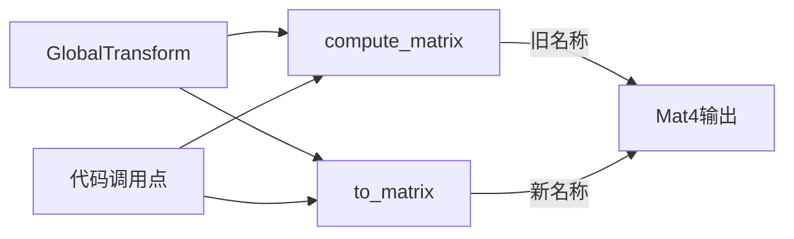

+++
title = "#19643 rename GlobalTransform::compute_matrix to to_matrix"
date = "2025-06-17T00:00:00"
draft = false
template = "pull_request_page.html"
in_search_index = false

[extra]
current_language = "zh-cn"
available_languages = {"en" = { name = "English", url = "/pull_request/bevy/2025-06/pr-19643-en-20250617" }, "zh-cn" = { name = "中文", url = "/pull_request/bevy/2025-06/pr-19643-zh-cn-20250617" }}
labels = ["A-Math", "D-Straightforward"]
+++

# rename GlobalTransform::compute_matrix to to_matrix

## Basic Information
- **Title**: rename GlobalTransform::compute_matrix to to_matrix
- **PR Link**: https://github.com/bevyengine/bevy/pull/19643
- **Author**: atlv24
- **Status**: MERGED
- **Labels**: S-Ready-For-Final-Review, A-Math, M-Needs-Migration-Guide, D-Straightforward
- **Created**: 2025-06-14T19:23:24Z
- **Merged**: 2025-06-17T18:59:07Z
- **Merged By**: alice-i-cecile

## Description Translation
# Objective
- `compute_matrix` 方法名不准确，因为它没有进行实际计算，只是将 `Affine3A` 转换为 `Mat4`

## Solution
- 重命名为 `to_matrix` 以符合 `to_isometry` 的命名风格（后者实际执行了昂贵的分解计算）

## Testing
- 纯重命名操作，编译通过即可验证正确性

## The Story of This Pull Request

### 问题背景
在 Bevy 引擎的 `GlobalTransform` 组件中，`compute_matrix` 方法名存在误导性。该方法实际执行的操作是将存储的 `Affine3A` 类型数据转换为 `Mat4` 矩阵格式。问题在于：
1. 方法名中的 "compute" 暗示存在计算开销，但实际上这是廉价的数据转换
2. 这与 `to_isometry` 方法形成反差 - 后者执行了实际的数学分解计算，但命名更准确
3. 错误命名可能导致开发者误判性能特征，或误解方法行为

### 解决方案
PR 采用最直接的修复方式：将 `compute_matrix` 重命名为 `to_matrix`。这个新名称：
1. 准确反映方法行为（类型转换）
2. 与现有 API `to_isometry` 保持命名一致性
3. 避免开发者产生性能误判

修改方案完全向后兼容，因为方法签名保持不变：
```rust
// 重命名前
pub fn compute_matrix(&self) -> Mat4 { ... }

// 重命名后
pub fn to_matrix(&self) -> Mat4 { ... }
```

### 技术实现
重命名操作涉及整个代码库的联动修改，主要影响三类场景：
1. **渲染管线**：相机、光照、阴影等系统需要获取世界变换矩阵
2. **物理计算**：射线检测、碰撞计算等需要变换矩阵
3. **工具类**：坐标转换、视锥体计算等辅助功能

典型修改模式如下：
```rust
// 修改前
let matrix = transform.compute_matrix();

// 修改后
let matrix = transform.to_matrix();
```

### 影响分析
1. **API 清晰度**：消除命名歧义，准确反映方法行为
2. **性能认知**：避免开发者误认为此操作有显著开销
3. **迁移成本**：通过 migration guide 提供升级路径
4. **代码一致性**：与 `to_isometry` 等转换方法保持命名统一

## Visual Representation


## Key Files Changed

### `crates/bevy_transform/src/components/global_transform.rs`
方法重命名的核心修改：
```rust
// 修改前:
pub fn compute_matrix(&self) -> Mat4 {
    Mat4::from(self.0)
}

// 修改后:
pub fn to_matrix(&self) -> Mat4 {
    Mat4::from(self.0)
}
```

### `crates/bevy_picking/src/mesh_picking/ray_cast/intersections.rs`
测试用例更新，展示典型调用点修改：
```rust
// 修改前:
let mesh_transform = GlobalTransform::IDENTITY.compute_matrix();

// 修改后:
let mesh_transform = GlobalTransform::IDENTITY.to_matrix();
```

### `crates/bevy_render/src/camera/camera.rs`
相机系统使用示例：
```rust
// 修改前:
let ndc_to_world = camera_transform.compute_matrix() * self.computed.clip_from_view.inverse();

// 修改后:
let ndc_to_world = camera_transform.to_matrix() * self.computed.clip_from_view.inverse();
```

### `crates/bevy_pbr/src/light/mod.rs`
光照系统使用示例：
```rust
// 修改前:
Some((entity, projection, transform.compute_matrix()))

// 修改后:
Some((entity, projection, transform.to_matrix()))
```

### `release-content/migration-guides/rename_global_transform_compute_matrix.md`
新增迁移指南：
```markdown
---
title: GlobalTransform::compute_matrix rename
pull_requests: [19643]
---

`GlobalTransform::compute_matrix` 已重命名为 `GlobalTransform::to_matrix`，
因为该方法不执行计算，仅将数据转换为不同类型。
```

## Further Reading
1. [Affine3A 文档](https://docs.rs/glam/latest/glam/struct.Affine3A.html)
2. [Mat4 文档](https://docs.rs/glam/latest/glam/struct.Mat4.html)
3. [Rust API 命名指南](https://rust-lang.github.io/api-guidelines/naming.html)