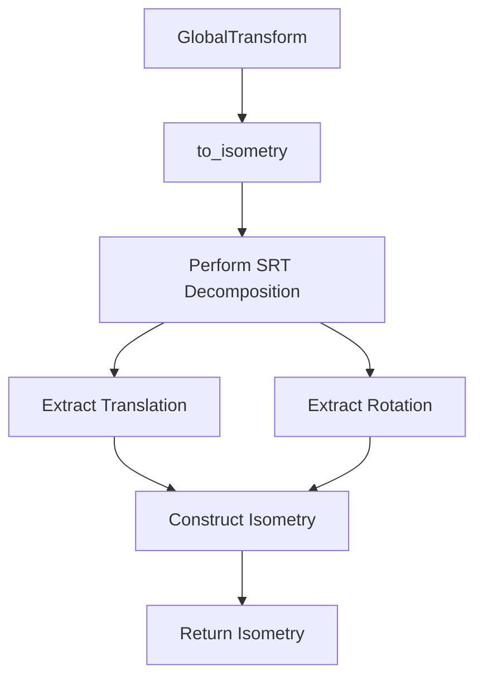

+++
title = "#19645 Clarify GlobalTransform::to_isometry doc"
date = "2025-06-16T00:00:00"
draft = false
template = "pull_request_page.html"
in_search_index = true

[taxonomies]
list_display = ["show"]

[extra]
current_language = "en"
available_languages = {"en" = { name = "English", url = "/pull_request/bevy/2025-06/pr-19645-en-20250616" }, "zh-cn" = { name = "中文", url = "/pull_request/bevy/2025-06/pr-19645-zh-cn-20250616" }}
labels = ["C-Docs", "D-Trivial", "A-Math"]
+++

# Documentation Clarification for GlobalTransform::to_isometry

## Basic Information
- **Title**: Clarify GlobalTransform::to_isometry doc
- **PR Link**: https://github.com/bevyengine/bevy/pull/19645
- **Author**: atlv24
- **Status**: MERGED
- **Labels**: C-Docs, D-Trivial, S-Ready-For-Final-Review, A-Math
- **Created**: 2025-06-14T19:36:41Z
- **Merged**: 2025-06-16T22:20:39Z
- **Merged By**: alice-i-cecile

## Description Translation
# Objective

- to_isometry is not a direct conversion, it involves computation. the docs could be clearer

## Solution

- Improve docs

## Testing

- its docs

## The Story of This Pull Request

### The Problem
The `GlobalTransform::to_isometry` method in Bevy's transform system had documentation that didn't fully convey the computational characteristics of the operation. While the existing docs mentioned that scaling would be ignored, they didn't explicitly state that the method performs a non-trivial decomposition calculation. This could lead to misunderstandings about performance implications, as users might assume it was a simple accessor rather than an operation with computational cost.

### The Solution Approach
The author identified that the documentation needed to more accurately describe:
1. The specific computation being performed (Scale-Rotation-Translation decomposition)
2. The performance characteristics (costly operation)
3. The data implications (lossy conversion)

Instead of changing the implementation, the solution focused on improving documentation clarity. The approach maintains backward compatibility while setting clearer expectations for users.

### Implementation Details
The changes are localized to the method's documentation comments. The key improvements are:
- Replaced "Returns" with "Computes" to emphasize the active operation
- Added explicit mention of Scale-Rotation-Translation decomposition
- Included a note about computational cost and data loss

### Technical Insights
The `to_isometry` method converts a 3D transformation (which may include scale) into an isometry (translation + rotation without scale). This requires:
1. Decomposing the transformation matrix
2. Discarding scale components
3. Reconstructing the isometry

The operation is considered costly because matrix decomposition involves numerical operations that are more expensive than simple field access. The "lossy" aspect refers to the deliberate discarding of scale information during the conversion.

### Impact
These documentation changes:
- Help users make informed decisions about performance-sensitive code
- Prevent potential misuse by clarifying the method's behavior
- Improve API discoverability by better describing the operation
- Maintain full backward compatibility as no runtime behavior changes

## Visual Representation



## Key Files Changed

### `crates/bevy_transform/src/components/global_transform.rs` (+3/-2)

**What changed and why:**  
Updated documentation for `to_isometry` method to clarify computational characteristics and data transformation.

**Code diff:**
```diff
diff --git a/crates/bevy_transform/src/components/global_transform.rs b/crates/bevy_transform/src/components/global_transform.rs
index b10d5a9d1aba3..d9fcf80737f8b 100644
--- a/crates/bevy_transform/src/components/global_transform.rs
+++ b/crates/bevy_transform/src/components/global_transform.rs
@@ -139,8 +139,9 @@ impl GlobalTransform {
         }
     }
 
-    /// Returns the isometric part of the transformation as an [isometry]. Any scaling done by the
-    /// transformation will be ignored.
+    /// Computes a Scale-Rotation-Translation decomposition of the transformation and returns
+    /// the isometric part as an [isometry]. Any scaling done by the transformation will be ignored.
+    /// Note: this is a somewhat costly and lossy conversion.
     ///
     /// The transform is expected to be non-degenerate and without shearing, or the output
     /// will be invalid.
```

**Relationship to PR purpose:**  
This is the sole change that implements the documentation improvements described in the PR objectives.

## Further Reading
1. [Bevy Transform Documentation](https://docs.rs/bevy_transform/latest/bevy_transform/)
2. [Affine transformations in computer graphics](https://en.wikipedia.org/wiki/Affine_transformation)
3. [Matrix Decomposition Techniques](https://www.scratchapixel.com/lessons/mathematics-physics-for-computer-graphics/geometry)
4. [glam crate Isometry implementation](https://docs.rs/glam/latest/glam/)